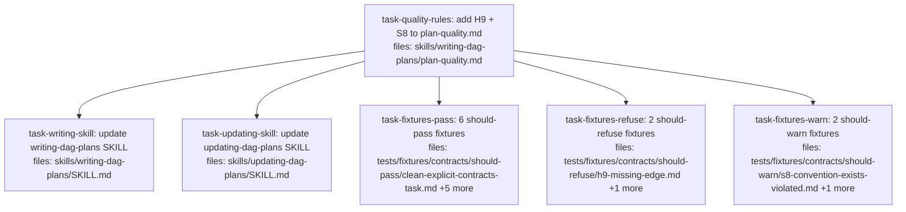
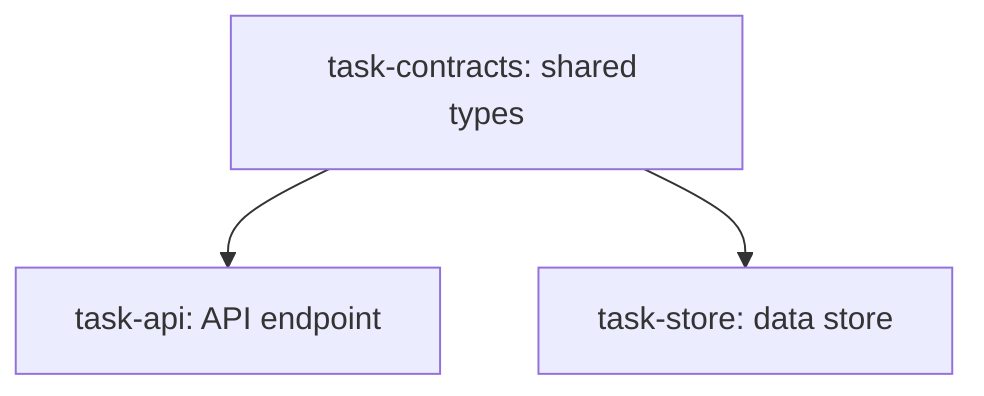
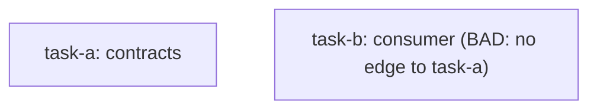

## Context

This plan implements the DAG plan contract-first rules design at `docs/superpowers/specs/2026-05-04-dag-plan-contract-rules-design.md` (commit `e51da08`). It adds two new validation rules to the DAG plan quality taxonomy: **H9** (hard, refuse on missing contract dependency) and **S8** (soft, warn on contract co-location issues). It also wires those rules into the `writing-dag-plans` and `updating-dag-plans` SKILL flows and creates fixtures for hand-validated testing.

**Driving spec sections:**
- Goal, Why, Non-goals — overall framing.
- Detection mechanics — Pass 1 (definer index) and Pass 2 (consumer index) shared by both rules.
- H9 — Contract-sequencing — hard rule definition, detection algorithm, refusal output, edge cases.
- S8 — Contract co-location — soft heuristic definition, contracts-dir auto-detection, two-branch logic, warning output, edge cases.
- SKILL.md flow changes — exact edits to `writing-dag-plans/SKILL.md` and `updating-dag-plans/SKILL.md`.
- Testing — 6 should-pass + 2 should-refuse + 2 should-warn fixtures, hand-validated via manual checklist.

**Scope notes:**
- All edits are documentation/spec content. There is no novel algorithmic implementation — the rules are interpreted by the LLM at validation time per the rule-text written into `plan-quality.md`. Each task uses content-presence verification (`grep`/`test -f`) as its TDD anchor: assertions fail before the edit (or before file creation) and pass after.
- The fixture tasks produce static markdown plan files. The fixtures' "expected behavior" is documented inline within each fixture (front-matter or body comment) so the manual checklist can run without an external expectations file.
- No automated eval harness is in scope per the spec's Non-goals.

**Hand-off after execution:** run the manual fixture checklist from spec §Testing to validate that the new rules behave as documented. Three pre-existing risks flagged in the spec (false positives in direct-usage detection, monorepo handling, schema-file extension list) remain open for follow-up after first real-world use.

## Tasks

## Task: add contract-rule definitions to plan-quality.md

```yaml
id: task-quality-rules
depends_on: []
files:
  - skills/writing-dag-plans/plan-quality.md
status: pending
```

Add H9 (Contract-sequencing, hard, refuse) and S8 (Contract co-location, soft, warn) to the rule taxonomy in `plan-quality.md`. Bump the detection-algorithm step list to reference H1-H9 and S1-S8. Add the H9 example to the Refusal output format section and the S8 example to the Warning output format section. The rule text and example outputs come directly from spec §H9, §S8, and §"SKILL.md flow changes" → `plan-quality.md` detection-algorithm section.

## Implementation

Add a new H9 row to the **Hard rules table** (after the existing H8 row):

```markdown
| H9 | **Contract-sequencing — consumer must depend on definer** | Build a definer index by parsing fenced code blocks under `## Implementation` for every task and extracting defined contract symbols per language: TS/JS `export (interface\|type\|class\|function\|const) <Name>` and `export default ...`; Python top-level `class <Name>`, `def <Name>(`, `<Name>: TypeAlias`, `@dataclass class <Name>`, `class <Name>(Protocol)`, `class <Name>(TypedDict)`; Rust `pub (struct\|enum\|trait\|fn\|type) <Name>`; Go top-level `(type\|func) <Name>` with capitalized first letter; JSON Schema top-level `definitions:` / `$defs:` keys; OpenAPI `components.schemas:` keys; protobuf `message`/`enum`/`service <Name>`; GraphQL `type`/`interface`/`enum`/`input <Name>`. Build map `(file_path, symbol_name) → defining_task_id`. Then build a consumer index by scanning each task's code blocks for references to definer-index symbols (imports per H8 extraction + direct usage in code). For each `(consumer_task_id, defined_symbol_name, definer_task_id)` triple where consumer ≠ definer: compute the transitive `depends_on:` closure of consumer (DFS). If `definer_task_id ∉ closure` → violation. Skip pre-existing files (per H8's classification), external package imports, and same-task references. Wiring tasks (`is_wiring_task: true`) apply normally — they should already `depends_on:` their parents by convention. |
```

Add a new S8 row to the **Soft heuristics table** (after the existing S7 row):

```markdown
| S8 | **Contract co-location** | At validation start, glob the repo for `**/contracts/**`, `**/types/**`, `**/schemas/**`, `**/models/**`, `**/proto/**`, `**/openapi/**`, `src/types/**`, `src/schemas/**`, `src/contracts/**`. Filter to dirs with ≥3 files (`detected_dirs`). **Branch A — `detected_dirs` non-empty:** for each task with defined contract symbols, warn when symbol's file path doesn't start with one of `detected_dirs`. **Branch B — `detected_dirs` empty:** warn when contract symbols are defined alongside non-contract code in the same file (function bodies with side effects, top-level statements like `console.log` / `fetch` / `db.query` / runtime expressions outside type contexts). Schema-as-code files (`.proto`, `.openapi.yaml`, `.openapi.yml`, `.graphql`) and test files (paths under `tests/` or `test/`) are exempt from Branch B. Wiring tasks (`is_wiring_task: true`) exempt from S8 entirely. Warns at the definer site only — never on consumers. |
```

Update the **Detection algorithm** numbered list (currently lines 70-78) to bump rule ranges:

```markdown
1. Run `plan-format.md` structural validation (cycles, undefined deps, required fields, file-disjoint parallel branches). Any failure → refuse, exit.
2. Run hard rules H1-H9. Any failure → refuse, explain which rule and which task, exit.
3. Run soft heuristics S1-S8. Collect warnings.
4. Run **decomposition-principles audit** (see `SKILL.md` step 11.5): re-read the plan against DRY / SRP / SoC / industry-standard hygiene with fresh eyes. This is judgment-based, LLM-driven, and complements the mechanical rules above. Collect warnings.
5. If warnings exist (from step 3 or step 4): present grouped list, ask "save anyway? (y/N)" (default N).
6. On user confirm OR no warnings: save plan file.
```

Append an H9 example to the **Refusal output format** section (after the existing H1/H3/H7 examples, inside the same fenced code block):

```
  task-claims-processor violates H9 (missing contract dependency)
    Symbol: ClaimRecord
    Defined by: task-claims-contracts (file: src/contracts/claim.ts)
    Issue: task-claims-processor references ClaimRecord but does not depends_on task-claims-contracts (transitively)
    Fix:   add "task-claims-contracts" to task-claims-processor.depends_on
```

Append an S8 example to the **Warning output format** section (after the existing S2/S5 examples, inside the same fenced code block):

```
  S8 — task-claims-processor contract co-location
    Symbol: ClaimRecord
    File:   src/claims/processor.ts
    Concern: project uses src/contracts/ for shared types, but ClaimRecord is defined here
    Suggestion: move ClaimRecord to src/contracts/claim.ts
```

Verification commands (each must exit 0 after the edit and would have exited non-zero before — these are the "failing tests" required by H7):

```bash
grep -q "^| H9 |" skills/writing-dag-plans/plan-quality.md
grep -q "^| S8 |" skills/writing-dag-plans/plan-quality.md
grep -q "Run hard rules H1-H9" skills/writing-dag-plans/plan-quality.md
grep -q "Run soft heuristics S1-S8" skills/writing-dag-plans/plan-quality.md
grep -q "violates H9 (missing contract dependency)" skills/writing-dag-plans/plan-quality.md
grep -q "S8 — task-claims-processor contract co-location" skills/writing-dag-plans/plan-quality.md
```

## Acceptance criteria

- Hard rules table contains exactly one new row for H9, positioned immediately after H8, with the rule text covering definer-index extraction (per-language symbol patterns), consumer-side reference detection (imports + direct usage), and the transitive-closure check that triggers refusal.
- Soft heuristics table contains exactly one new row for S8, positioned immediately after S7, covering both Branch A (convention dir present) and Branch B (mixed-concerns fallback), the schema-as-code/test-file exemptions, and the wiring-task exemption.
- Detection algorithm numbered list (steps 1-6) reads `H1-H9` and `S1-S8` in steps 2 and 3 respectively. No reference to `H1-H8` or `S1-S7` remains in that list.
- Refusal output format example block contains the H9 sample exactly as shown above (claim-processor / ClaimRecord wording).
- Warning output format example block contains the S8 sample exactly as shown above.
- All six grep verification commands exit 0 when run from the repo root.
- File parses as well-formed markdown: tables remain valid (no broken `|` columns), no orphaned headings, no malformed code fences.
- Existing H1-H8 and S1-S7 rule rows are unchanged. The "Why this exists", "Principles", "Examples", and "Refusal/Warning output format" sections retain all pre-existing content.

Test file: `skills/writing-dag-plans/plan-quality.md` (verification via the six `grep` commands above; this is a doc-edit task with no separate test file).

## Task: update writing-dag-plans SKILL.md flow

```yaml
id: task-writing-skill
depends_on: [task-quality-rules]
files:
  - skills/writing-dag-plans/SKILL.md
status: pending
```

Wire H9 and S8 into the `writing-dag-plans` SKILL flow per spec §"SKILL.md flow changes" → `writing-dag-plans/SKILL.md`. Insert a new step 6.5 (planner-side contract surface walk), update step 8's rule-range references, add a "Contract clarity" bullet to step 9's decomposition-principles audit, and add one new anti-pattern entry. Depends on `task-quality-rules` because the new step text references H9 and S8 by name and these must exist in `plan-quality.md` first for cross-references to be coherent.

## Implementation

Insert a new **step 6.5** between the existing step 6 (file-scope conflict detection) and step 7 (structural validation) in the `### Step-by-step` section. The Process flowchart (`digraph writing_dag_plans`) should also gain a new node "Identify contract surface" between "Detect file-scope conflicts" (clean branch) and "Validate DAG":

```markdown
6.5. **Identify contract surface.** Walk each task's `## Implementation` block and extract defined contract symbols (interfaces, types, exported function signatures, schema definitions) per the H9 detection patterns in `plan-quality.md`. For each consumer task, identify which other tasks define symbols it imports or references. If any consumer task references a contract from a non-dependency, surface as a planner-level decision: either add the `depends_on:` edge or refactor to remove the cross-task reference. Loop until clean. (This is the planner-side mirror of H9 — catch the issue before it becomes a refusal at validation time.)
```

Update the **step 7 (Run quality validation)** description (currently at lines 92-96 of the existing SKILL.md, the bullet listing hard rules and soft heuristics):

```markdown
   - Hard rules H1-H9 (compound titles, single acceptance group, single subsystem in `files:`, acceptance criteria present, no anti-pattern phrases, consistent id naming, `## Implementation` subsection presence, import resolution, contract-sequencing). Any failure → refuse, name the rule + task + fix, exit.
   - Soft heuristics S1-S8 (DRY across siblings, oversized tasks, undersized stubs, vague criteria, overly linear DAGs, premature abstraction signals, test-helper hoisting, contract co-location). Collect as warnings.
```

Append a new bullet to **step 8 (Decomposition-principles audit)**'s principle list (after "Industry-standard hygiene"):

```markdown
   - **Contract clarity.** Beyond H9/S8: are there contracts that *should* exist but don't? E.g., two tasks both define a `User` type independently — they should share one. Surface as a decomposition concern with the suggested fix (add a contracts-defining task that both depend on).
```

Append a new entry to the **`## Anti-patterns`** list at the bottom of the SKILL:

```markdown
- ❌ Burying type definitions inside business-logic files when the codebase has a dedicated `contracts/` or `types/` dir — produces silent drift between two parallel implementers' invented type shapes.
```

Verification commands (each must exit 0 after the edit, non-zero before):

```bash
grep -q "6.5\. \*\*Identify contract surface" skills/writing-dag-plans/SKILL.md
grep -q "Hard rules H1-H9" skills/writing-dag-plans/SKILL.md
grep -q "Soft heuristics S1-S8" skills/writing-dag-plans/SKILL.md
grep -q "\*\*Contract clarity\.\*\*" skills/writing-dag-plans/SKILL.md
grep -q "Burying type definitions inside business-logic files" skills/writing-dag-plans/SKILL.md
```

## Acceptance criteria

- A new numbered step 6.5 exists in the `### Step-by-step` section, positioned between current steps 6 and 7, with the exact text described above.
- The mermaid `digraph writing_dag_plans` flowchart contains a new node "Identify contract surface" with edges from "Detect file-scope conflicts" (clean branch) to it, and from it to "Validate DAG (cycles, undefined deps, required fields)".
- Step 7's hard-rules bullet reads `H1-H9` (was `H1-H8`) and includes "contract-sequencing" in the parenthetical descriptor list.
- Step 7's soft-heuristics bullet reads `S1-S8` (was `S1-S7`) and includes "contract co-location" in the parenthetical descriptor list.
- Step 8's principles list ends with the new "Contract clarity" bullet exactly as shown.
- The `## Anti-patterns` list contains the new "Burying type definitions" entry as a top-level bullet.
- All five grep verifications exit 0.
- No pre-existing step content is removed or reordered. Steps 1-6, 9-12 retain their original text.
- File parses as well-formed markdown.

Test file: `skills/writing-dag-plans/SKILL.md` (verification via the five `grep` commands above).

## Task: update updating-dag-plans SKILL.md flow

```yaml
id: task-updating-skill
depends_on: [task-quality-rules]
files:
  - skills/updating-dag-plans/SKILL.md
status: pending
```

Apply the three surgical edits to `updating-dag-plans/SKILL.md` per spec §"SKILL.md flow changes" → `updating-dag-plans/SKILL.md`. (1) Add a new bullet to `## Hard rules` enforcing H9 against new tasks consuming `done`-task contracts. (2) Update step 6's per-operation rule lists to add H9 to "add task" and "modify body" (and S8 to the soft-heuristic batches). (3) Update `## Required reading` to cite H1-H9 / S1-S8 (also fixes pre-existing staleness — the file currently says H1-H6 / S1-S6 even though H7 and H8 already exist). Depends on `task-quality-rules` for the same reason as the writing-skill task: cross-references need to be coherent against the rules table.

## Implementation

Add a new bullet to the **`## Hard rules`** section (currently lines 93-100), inserted before the final bullet (or at the end, adjacent to the immutable-history rules):

```markdown
- When adding a new task that consumes a contract defined by an already-`done` task, the new task must `depends_on:` that done task. The done task's status doesn't exempt it from H9 — sequencing rules apply for plan-coherence reasons (so a future re-execution or a reader of the plan can see the dependency). When adding a new contract-defining task, check whether existing `pending`/`ready` consumer tasks should now `depends_on:` it; if yes, mutate their `depends_on:` to include the new definer (allowed because they are `pending`/`ready`, not `done`).
```

Update **step 6 (Re-run quality validation)** sub-bullets per operation. The existing per-operation rules (currently lines 76-83) become:

```markdown
   - On **add task**: run hard rules H1-H9 (was H1-H6) on the new task. Run soft heuristics S1, S5, S8 on the updated DAG.
   - On **modify body**: run H1, H2, H4, H5, H9 (was H1, H2, H4, H5) on the modified task. Run S2-S4, S6, S8 on it.
   - On **modify `files:`**: run H3 on the modified task. Run S2 on it.
   - On **rewire `depends_on:`**: run S1, S5, H9 on the updated DAG.
   - On **remove task**: no quality re-validation needed (removing tasks doesn't introduce new quality issues).
```

Update the **`## Required reading`** section (currently lines 22-27). Replace the existing rule-range citation:

```markdown
- `../writing-dag-plans/plan-format.md` — canonical *structural* contract and validation rules.
- `../writing-dag-plans/plan-quality.md` — canonical *decomposition-quality* contract (DRY, Single Responsibility, SoC, best-practice signals). Hard rules H1-H9 and soft heuristics S1-S8.

Updates that add new tasks or modify task bodies/scope must pass BOTH validations, same as fresh authoring.
```

Verification commands (each must exit 0 after the edit, non-zero before):

```bash
grep -q "consumes a contract defined by an already-\`done\` task" skills/updating-dag-plans/SKILL.md
grep -q "run hard rules H1-H9" skills/updating-dag-plans/SKILL.md
grep -q "run H1, H2, H4, H5, H9" skills/updating-dag-plans/SKILL.md
grep -q "Hard rules H1-H9 and soft heuristics S1-S8" skills/updating-dag-plans/SKILL.md
! grep -q "Hard rules H1-H6 and soft heuristics S1-S6" skills/updating-dag-plans/SKILL.md
```

(The final command negates: the stale H1-H6/S1-S6 reference must be gone.)

## Acceptance criteria

- `## Hard rules` section contains the new "consumes a contract defined by an already-`done` task" bullet exactly as shown above.
- Step 6's per-operation rule list updates "add task" and "modify body" to include H9 (and S8 in the soft-heuristic batches), and "rewire `depends_on:`" gains H9 in its list.
- `## Required reading` section reads "Hard rules H1-H9 and soft heuristics S1-S8" — the previous "H1-H6 and S1-S6" reference no longer appears anywhere in the file.
- All five grep verifications exit 0 (note the fifth uses `!` to require the stale reference is absent).
- No other content in the file is modified — pre-existing operations table, immutable-history invariant, example refusals all retain their original text.
- File parses as well-formed markdown.

Test file: `skills/updating-dag-plans/SKILL.md` (verification via the five `grep` commands above).

## Task: create should-pass fixtures

```yaml
id: task-fixtures-pass
depends_on: [task-quality-rules]
files:
  - tests/fixtures/contracts/should-pass/clean-explicit-contracts-task.md
  - tests/fixtures/contracts/should-pass/clean-implicit-sequencing.md
  - tests/fixtures/contracts/should-pass/clean-no-shared-contracts.md
  - tests/fixtures/contracts/should-pass/clean-pre-existing-contracts.md
  - tests/fixtures/contracts/should-pass/h9-transitive-ok.md
  - tests/fixtures/contracts/should-pass/s8-schema-file-exempt.md
status: pending
```

Create six DAG plan fixtures that should pass both H9 and S8 validation per spec §Testing → Positive fixtures. Each fixture file is itself a small valid DAG plan demonstrating one positive case. Each fixture begins with an HTML comment block documenting its expected outcome and the case it covers, so the manual checklist can read expectations directly from the file. Depends on `task-quality-rules` because fixture expectations reference H9/S8 rule names that must exist in `plan-quality.md` first.

## Implementation

Each fixture file follows this canonical structure (example shown for `clean-explicit-contracts-task.md`):

```markdown
<!--
FIXTURE: clean-explicit-contracts-task
EXPECTED: pass (no H9 or S8 violations)
COVERS: positive case — plan with a dedicated task-contracts root that other tasks depends_on. Demonstrates the explicit contracts-task pattern with all consumers correctly sequenced.
ASSUMES: repo has a contracts/ dir (Branch A of S8 detection applies)
-->

---
title: clean-explicit-contracts-task
created: 2026-05-04
---



## Context

Positive fixture for H9 + S8. A dedicated contracts task defines `Claim`; both `task-api` and `task-store` import from it and `depends_on:` it.

## Tasks

## Task: shared types

`​`​`yaml
id: task-contracts
depends_on: []
files: [src/contracts/claim.ts]
status: pending
`​`​`

Defines the shared `Claim` type used by API and store layers.

## Implementation

`​`​`typescript
export interface Claim {
  id: string;
  amount: number;
  status: "pending" | "approved" | "denied";
}
`​`​`

`​`​`typescript
// (test imports Claim from the contracts file path declared in this task's files:)
it("Claim type can be constructed", () => {
  const c: Claim = { id: "x", amount: 0, status: "pending" };
  expect(c.id).toBe("x");
});
`​`​`

## Acceptance criteria

- `Claim` interface exported with the three fields shown.

Test file: `tests/contracts/claim.test.ts`.

[... continue with task-api and task-store, each importing from src/contracts/claim and depending on task-contracts ...]
```

Each of the six fixtures has this shape but varies what it demonstrates:

1. **`clean-explicit-contracts-task.md`** — explicit `task-contracts` root with two consumers `depends_on:` it. Both consumers import from `src/contracts/claim`.
2. **`clean-implicit-sequencing.md`** — consumer task directly `depends_on:` the definer task, no separate contracts root. Demonstrates that H9 doesn't *require* an explicit contracts task — implicit sequencing is fine.
3. **`clean-no-shared-contracts.md`** — three independent tasks, each defining its own internal types in its own files. No cross-task contract imports → H9 has nothing to check. S8 also doesn't fire (no co-location issue when there's no sharing).
4. **`clean-pre-existing-contracts.md`** — plan tasks import `Claim` from a file that already exists in the codebase (e.g., a hypothetical `src/legacy/types.ts` documented in the fixture's HTML comment as pre-existing). H9 skips per the pre-existing edge case.
5. **`h9-transitive-ok.md`** — three-task chain `task-c → task-b → task-a`. `task-c` imports a type defined in `task-a`. Direct `depends_on` is only [task-b], but transitive closure includes `task-a`, so H9 passes. Demonstrates that H9 honors transitive deps.
6. **`s8-schema-file-exempt.md`** — plan defines types in `api.proto` alongside RPC definitions in the same file. Branch B's mixed-concerns check is exempted for `.proto` files, so S8 doesn't fire.

Verification commands (each must exit 0 after the task — file existence + minimal content sanity check):

```bash
for f in clean-explicit-contracts-task.md clean-implicit-sequencing.md clean-no-shared-contracts.md clean-pre-existing-contracts.md h9-transitive-ok.md s8-schema-file-exempt.md; do
  test -f "tests/fixtures/contracts/should-pass/$f" || { echo "MISSING: $f"; exit 1; }
  grep -q "EXPECTED: pass" "tests/fixtures/contracts/should-pass/$f" || { echo "NO EXPECTED HEADER: $f"; exit 1; }
  grep -q "^## Tasks$" "tests/fixtures/contracts/should-pass/$f" || { echo "NO TASKS SECTION: $f"; exit 1; }
done
```

## Acceptance criteria

- All six fixture files exist at `tests/fixtures/contracts/should-pass/<name>.md`.
- Each fixture begins with an HTML comment block containing `FIXTURE:`, `EXPECTED: pass`, `COVERS:`, and `ASSUMES:` lines (the manual-checklist reads from these).
- Each fixture is a syntactically valid DAG plan per `plan-format.md`: YAML frontmatter, mermaid block, `## Context`, `## Tasks`, one or more `## Task:` blocks each with valid YAML frontmatter (`id`, `depends_on`, `files`, `status`) and either an `## Implementation` block + `## Acceptance criteria` + test file path OR `is_wiring_task: true`.
- Fixture-specific case demonstrated as documented in the COVERS line (verified by reading each fixture):
  - `clean-explicit-contracts-task.md` has a `task-contracts` root with ≥2 children that depend on it.
  - `clean-implicit-sequencing.md` has a consumer task with `depends_on: [<definer>]` and no separate contracts root.
  - `clean-no-shared-contracts.md` has tasks where no task imports symbols defined in another task.
  - `clean-pre-existing-contracts.md` has at least one task importing from a file path documented (in the HTML comment) as pre-existing.
  - `h9-transitive-ok.md` has a 3-task chain where the leaf imports from the root via a transitive `depends_on:` edge.
  - `s8-schema-file-exempt.md` defines types alongside RPC/non-type definitions in a single `.proto` file.
- The verification bash loop exits 0.

Test file: `tests/fixtures/contracts/should-pass/` (the directory; verification via the file-existence and content-sanity grep loop above).

## Task: create should-refuse fixtures

```yaml
id: task-fixtures-refuse
depends_on: [task-quality-rules]
files:
  - tests/fixtures/contracts/should-refuse/h9-missing-edge.md
  - tests/fixtures/contracts/should-refuse/h9-mutual-reference.md
status: pending
```

Create two DAG plan fixtures that should be refused with H9 violations per spec §Testing → Refuse fixtures. Each fixture demonstrates a distinct H9 failure mode and documents the exact refusal text expected. Depends on `task-quality-rules` because the expected-refusal text needs to match the Refusal output format established there.

## Implementation

Each fixture follows the should-pass canonical structure but documents an `EXPECTED: refuse` outcome with the rule and expected refusal text. Example for `h9-missing-edge.md`:

```markdown
<!--
FIXTURE: h9-missing-edge
EXPECTED: refuse with H9
COVERS: negative case — task-b imports a type defined by task-a but task-b.depends_on is empty (no path to task-a).
EXPECTED REFUSAL TEXT (substring match):
  task-b violates H9 (missing contract dependency)
    Symbol: Claim
    Defined by: task-a
ASSUMES: repo with a contracts/ dir; H9 check fires before S8.
-->

---
title: h9-missing-edge
created: 2026-05-04
---



## Context

Negative fixture: task-b consumes Claim from task-a but is not declared as depending on it. The validator must catch this and refuse.

## Tasks

[... task-a defines Claim; task-b imports Claim but has depends_on: [] ...]
```

The two fixtures:

1. **`h9-missing-edge.md`** — task-b imports a type defined by task-a; `task-b.depends_on: []`. Expected refusal: H9 names the missing edge and suggests the fix.
2. **`h9-mutual-reference.md`** — task-a and task-b each reference symbols defined in the other (e.g., `task-a` defines `Foo` and uses `Bar`; `task-b` defines `Bar` and uses `Foo`). Adding both required edges would create a `depends_on:` cycle (caught by structural validation H1-H6). Expected refusal: H9 names both consumer→definer pairs and suggests extracting the shared symbols into a third task that both depend on.

Verification commands (each must exit 0 after the task):

```bash
for f in h9-missing-edge.md h9-mutual-reference.md; do
  test -f "tests/fixtures/contracts/should-refuse/$f" || { echo "MISSING: $f"; exit 1; }
  grep -q "EXPECTED: refuse with H9" "tests/fixtures/contracts/should-refuse/$f" || { echo "NO EXPECTED HEADER: $f"; exit 1; }
  grep -q "^## Tasks$" "tests/fixtures/contracts/should-refuse/$f" || { echo "NO TASKS SECTION: $f"; exit 1; }
  grep -q "EXPECTED REFUSAL TEXT" "tests/fixtures/contracts/should-refuse/$f" || { echo "NO REFUSAL TEXT BLOCK: $f"; exit 1; }
done
```

## Acceptance criteria

- Both fixture files exist at `tests/fixtures/contracts/should-refuse/<name>.md`.
- Each fixture begins with an HTML comment block containing `FIXTURE:`, `EXPECTED: refuse with H9`, `COVERS:`, `EXPECTED REFUSAL TEXT:` (with substring-match-able refusal lines), and `ASSUMES:`.
- Each fixture is a syntactically valid DAG plan per `plan-format.md` (would parse cleanly through structural validation up to the point H9 catches it).
- `h9-missing-edge.md` has exactly two tasks where the consumer's `depends_on:` is empty and its `## Implementation` imports a symbol from the definer's `## Implementation`.
- `h9-mutual-reference.md` has two tasks each defining a symbol referenced by the other, such that both required edges would create a cycle.
- The verification bash loop exits 0.

Test file: `tests/fixtures/contracts/should-refuse/` (the directory; verification via the file-existence and header-presence loop above).

## Task: create should-warn fixtures

```yaml
id: task-fixtures-warn
depends_on: [task-quality-rules]
files:
  - tests/fixtures/contracts/should-warn/s8-convention-exists-violated.md
  - tests/fixtures/contracts/should-warn/s8-no-convention-mixed-concerns.md
status: pending
```

Create two DAG plan fixtures that should produce S8 warnings (not refusals) per spec §Testing → Warn fixtures. Each fixture demonstrates one S8 branch and documents the exact warning text expected. Depends on `task-quality-rules` because the expected-warning text needs to match the Warning output format established there.

## Implementation

Each fixture follows the same structural conventions as the should-refuse fixtures but documents `EXPECTED: warn with S8 (Branch A or Branch B)` and includes substring-match-able expected warning text. Example for `s8-convention-exists-violated.md`:

```markdown
<!--
FIXTURE: s8-convention-exists-violated
EXPECTED: warn with S8 (Branch A)
COVERS: convention dir present in repo but task defines contract symbol outside it.
EXPECTED WARNING TEXT (substring match):
  S8 — task-processor contract co-location
    Symbol: ClaimRecord
    File:   src/business/processor.ts
    Concern: project uses src/contracts/ for shared types, but ClaimRecord is defined here
    Suggestion: move ClaimRecord to src/contracts/claim.ts
ASSUMES: repo has src/contracts/ dir with ≥3 files (detected_dirs non-empty → Branch A applies).
-->

[... rest of plan ...]
```

The two fixtures:

1. **`s8-convention-exists-violated.md`** — `detected_dirs` is non-empty (assumes repo has `src/contracts/` per the ASSUMES line); plan defines `ClaimRecord` in `src/business/processor.ts` (outside convention). Expected: S8 Branch A warning.
2. **`s8-no-convention-mixed-concerns.md`** — `detected_dirs` is empty (assumes greenfield repo); plan defines a type alongside a function with `fetch()` calls in the same file. Expected: S8 Branch B warning naming the file and suggesting extraction.

Verification commands (each must exit 0 after the task):

```bash
for f in s8-convention-exists-violated.md s8-no-convention-mixed-concerns.md; do
  test -f "tests/fixtures/contracts/should-warn/$f" || { echo "MISSING: $f"; exit 1; }
  grep -q "EXPECTED: warn with S8" "tests/fixtures/contracts/should-warn/$f" || { echo "NO EXPECTED HEADER: $f"; exit 1; }
  grep -q "^## Tasks$" "tests/fixtures/contracts/should-warn/$f" || { echo "NO TASKS SECTION: $f"; exit 1; }
  grep -q "EXPECTED WARNING TEXT" "tests/fixtures/contracts/should-warn/$f" || { echo "NO WARNING TEXT BLOCK: $f"; exit 1; }
done
```

## Acceptance criteria

- Both fixture files exist at `tests/fixtures/contracts/should-warn/<name>.md`.
- Each fixture begins with an HTML comment block containing `FIXTURE:`, `EXPECTED: warn with S8 (Branch A or Branch B)`, `COVERS:`, `EXPECTED WARNING TEXT:` (with substring-match-able warning lines), and `ASSUMES:`.
- Each fixture is a syntactically valid DAG plan per `plan-format.md` (would parse cleanly through structural validation and H1-H9 hard rules; only S8 warning fires).
- `s8-convention-exists-violated.md`'s ASSUMES line documents that the repo has a convention dir (so Branch A applies) and the plan defines a type outside it.
- `s8-no-convention-mixed-concerns.md`'s ASSUMES line documents that the repo has no convention dir (so Branch B applies) and the plan defines a type in the same file as side-effecting code.
- The verification bash loop exits 0.

Test file: `tests/fixtures/contracts/should-warn/` (the directory; verification via the file-existence and header-presence loop above).
