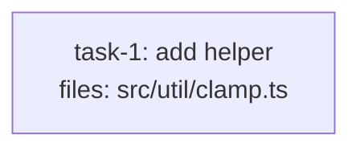

# Merged Review for Small Tasks — Implementation Plan

> **For agentic workers:** REQUIRED SUB-SKILL: Use superpowers:subagent-driven-development (recommended) or superpowers:executing-plans to implement this plan task-by-task. Steps use checkbox (`- [ ]`) syntax for tracking.

**Goal:** Add an opt-in `review_mode: merged` that collapses the two-call spec→quality review chain into one `dag-merged-reviewer` call for small/mechanical tasks, defaulting to today's two-call `split` behavior.

**Architecture:** A `review_mode` field + `default_review_mode` + a `resolve_review_mode` resolver land in `plan-format.md` first (everything references them); soft heuristic S10 suggests `merged` for clearly-mechanical low-risk tasks; a new `dag-merged-reviewer` agent + fused dispatch template do both checks and return both verdicts; the executor branches the review chain on the resolved mode. Builds on the already-merged tier system (`resolve_tier`/`resolve_model`, rules #7/#8, S9).

**Tech Stack:** Markdown skill/agent files. No runner — "tests" are conformance fixtures (markdown plans with `<!-- EXPECTED: ... -->` comments) validated by applying the skill procedure, mirroring `tests/fixtures/tiers/` and `tests/fixtures/contracts/`.

## Global Constraints

- `review_mode` enum is exactly `merged | split`; default `split` (= today's two-call chain). (Spec §Schema.)
- Resolver: `resolve_review_mode(task) = task["review_mode"] if present else plan_frontmatter["default_review_mode"] if present else "split"`. (Spec §Review-mode resolution.)
- A **merged** review resolves its model via the **`quality_reviewer`** tier — `resolve_model(resolve_tier(task, "quality_reviewer"))` (the more demanding role; don't under-power). `spec_reviewer_hint` is simply unused when a task is `merged` (documented, not an error). (Spec §Review-mode resolution, §Executor flow.)
- Rigor preserved: the merged reviewer runs BOTH Part 1 (spec) and Part 2 (quality) and returns BOTH verdicts; task is `done` only when both APPROVE; either-ISSUES re-dispatches the implementer then a merged **re-review** on the corrected diff. (Spec §The merged reviewer.)
- All changes additive: a plan with no `review_mode` anywhere validates/dispatches/reviews exactly as today (`split` everywhere). (Spec §Migration.)
- No silent fallback on bad `review_mode`: refuse/halt naming task id (or `plan-level`) + field + value. (Spec §Error handling.)
- Agent `model:` fallback lines stay `sonnet` (new agent included). No diff-size safety threshold (YAGNI). BLOCKED ladder untouched. (Spec §Non-goals.)

## How tests work here

No runner. A fixture is a markdown plan + an `<!-- EXPECTED: ... -->` verdict comment. Verification per task = `grep`/read-through to confirm edits are present + well-formed, AND a conformance read-through: re-read the edited rule against each fixture and confirm the documented verdict is what the procedure produces. Same pattern as `tests/fixtures/tiers/`.

## Canonical fixture skeleton (referenced by Tasks 1 & 2)

Structurally-valid base plan passing all hard rules H1–H9, so only `review_mode` behavior differs. "base skeleton + «change»" means start from this and apply only the listed change.

````markdown
---
title: review-mode-fixture
created: 2026-06-22
---



## Context

Fixture for review-mode validation. Single mechanical task; structurally valid.

## Tasks

## Task: add helper

```yaml
id: task-1
depends_on: []
files: [src/util/clamp.ts]
status: pending
```

Pure clamp helper. Bounds a number to an inclusive range.

## Implementation

```typescript
// src/util/clamp.ts
export function clamp(n: number, lo: number, hi: number): number {
  return Math.min(hi, Math.max(lo, n));
}
```

```typescript
// tests/unit/clamp.test.ts
import { clamp } from "../../src/util/clamp.js";
it("clamps above the max", () => { expect(clamp(10, 0, 5)).toBe(5); });
```

## Acceptance criteria

- `clamp(10, 0, 5) === 5`.
- `clamp(-3, 0, 5) === 0`.

Test file: `tests/unit/clamp.test.ts`.
````

---

## File Structure

| File | Responsibility | Task |
|---|---|---|
| `skills/writing-dag-plans/plan-format.md` | `review_mode`/`default_review_mode` schema; §Review-mode resolution; validation rules #9/#10 | 1 |
| `tests/fixtures/review-mode/should-pass/*.md` (4) + `should-refuse/*.md` (2) | Conformance: valid plans; #9/#10 violations | 1 |
| `skills/writing-dag-plans/plan-quality.md` | S10 heuristic; detection step S1-S9→S1-S10 | 2 |
| `tests/fixtures/review-mode/should-warn/*.md` (3) | Conformance: S10 fires / suppressed | 2 |
| `agents/dag-merged-reviewer.md` (NEW) + `skills/executing-dag-plans/merged-reviewer-prompt.md` (NEW) | The merged reviewer agent + fused dispatch template | 3 |
| `skills/executing-dag-plans/SKILL.md` | Branch review chain on `review_mode`; pre-flight for `review_mode` + `dag-merged-reviewer` registry | 4 |
| `skills/writing-dag-plans/SKILL.md` | §Required reading + S-range references | 5 |
| `skills/updating-dag-plans/SKILL.md` | "Modify review mode" + plan-level ops | 6 |

---

### Task 1: `plan-format.md` — review-mode schema, resolution, rules #9/#10

**Files:**
- Modify: `skills/writing-dag-plans/plan-format.md` (plan-level frontmatter note ~line 77; §Per-task frontmatter schema ~line 92; §Tier resolution ~line 103-125; §Validation rules — currently ends at #8)
- Create: `tests/fixtures/review-mode/should-pass/clean-no-review-mode.md`
- Create: `tests/fixtures/review-mode/should-pass/clean-plan-level-merged.md`
- Create: `tests/fixtures/review-mode/should-pass/clean-per-task-merged.md`
- Create: `tests/fixtures/review-mode/should-pass/clean-hybrid.md`
- Create: `tests/fixtures/review-mode/should-refuse/bad-task-review-mode-typo.md`
- Create: `tests/fixtures/review-mode/should-refuse/bad-plan-default-typo.md`

**Interfaces:**
- Consumes: existing §Tier resolution (`resolve_tier`/`resolve_model`), validation rules #7/#8.
- Produces: `review_mode` (per-task) + `default_review_mode` (plan-level) fields, `resolve_review_mode(task)`, the "merged uses quality_reviewer tier" rule, and validation rules #9/#10 — all referenced by Tasks 2–6.

- [ ] **Step 1: Write the should-refuse fixtures (failing tests)**

`tests/fixtures/review-mode/should-refuse/bad-task-review-mode-typo.md` — base skeleton, task YAML adds `review_mode: combined`. Line 1:
```markdown
<!-- EXPECTED: REFUSE — rule #9 (per-task review-mode enum). task-1.review_mode = "combined" is not in {merged,split}. -->
```
`tests/fixtures/review-mode/should-refuse/bad-plan-default-typo.md` — base skeleton, frontmatter adds `default_review_mode: both`. Line 1:
```markdown
<!-- EXPECTED: REFUSE — rule #10 (plan-level review-mode enum). default_review_mode = "both" is not in {merged,split}. -->
```

- [ ] **Step 2: Verify they fail under today's spec (RED)**

Run: `grep -nE "review_mode|rule #9|rule #10" skills/writing-dag-plans/plan-format.md`
Expected: no matches (no review-mode rules yet). Confirm nothing currently refuses these two fixtures.

- [ ] **Step 3: Add `default_review_mode` to plan-level frontmatter**

In `plan-format.md`, near the existing note about `default_model_hint`/`default_spec_reviewer_hint`/`default_quality_reviewer_hint` (~line 77), add `default_review_mode` to the plan-level frontmatter example and note:
```markdown
`default_review_mode: split` (OPTIONAL, `merged | split`, default `split`) sets the review mode for tasks lacking a per-task `review_mode`. Omitting it keeps `split` (today's two-call spec→quality chain).
```

- [ ] **Step 4: Add `review_mode` to §Per-task frontmatter schema**

In the per-task YAML schema block (after the `quality_reviewer_hint` line ~92), add:
```yaml
review_mode: merged    # OPTIONAL. merged | split. Falls back to default_review_mode, then `split`. `merged` runs one combined spec+quality reviewer instead of the two-call chain.
```

- [ ] **Step 5: Add §Review-mode resolution (after §Tier resolution)**

Add a new `## Review-mode resolution` section immediately after the §Tier resolution section (~after line 125):
```markdown
## Review-mode resolution

The executor resolves each task's review mode:

\```
resolve_review_mode(task) =
    task["review_mode"]                        if present
    else plan_frontmatter["default_review_mode"] if present
    else "split"
\```

- `split` (default) → the two-call chain: `dag-spec-reviewer` then `dag-quality-reviewer`.
- `merged` → ONE `dag-merged-reviewer` call doing both spec compliance and code quality, returning both verdicts.

A **merged** review resolves its model via the `quality_reviewer` tier — `resolve_model(resolve_tier(task, "quality_reviewer"))` — because it does both jobs and quality is the more demanding one. When a task is `merged`, `spec_reviewer_hint` is unused (not an error). A per-task `review_mode` inconsistent with `default_review_mode` is not an error — the per-task value wins.
```
(Replace the `\``` ` fences above with real triple-backticks when writing the file.)

- [ ] **Step 6: Add validation rules #9 and #10**

Append to the §Validation rules numbered list (currently ends at #8):
```markdown
9. **Per-task review-mode enum** — `review_mode`, when present on any task, MUST be `merged | split`. Any other value → refuse naming the task id, field, and bad value.
10. **Plan-level review-mode enum** — `default_review_mode`, when present in frontmatter, MUST be `merged | split`. Any other value → refuse naming the field and bad value.
```

- [ ] **Step 7: Write the should-pass fixtures**

`clean-no-review-mode.md` — canonical skeleton verbatim. Comment:
```markdown
<!-- EXPECTED: PASS — no review_mode anywhere; resolves to split (regression / no-migration). -->
```
`clean-plan-level-merged.md` — base skeleton + frontmatter `default_review_mode: merged`. Comment: `<!-- EXPECTED: PASS — task-1 inherits merged review from plan-level default. -->`
`clean-per-task-merged.md` — base skeleton + task YAML `review_mode: merged`, no plan-level default. Comment: `<!-- EXPECTED: PASS — per-task review_mode=merged used directly. -->`
`clean-hybrid.md` — base skeleton + frontmatter `default_review_mode: merged` AND task YAML `review_mode: split`. Comment: `<!-- EXPECTED: PASS — per-task review_mode=split overrides default_review_mode=merged. -->`

- [ ] **Step 8: Verify — conformance read-through (GREEN)**

Run: `grep -rn "EXPECTED:" tests/fixtures/review-mode/` → 6 fixtures (4 pass, 2 refuse).
Conformance: the 2 refuse fixtures now hit rule #9/#10 → REFUSE; the 4 pass fixtures violate nothing → PASS; each fixture's EXPECTED matches the edited rules. Confirm `clean-no-review-mode` resolves to `split`.

- [ ] **Step 9: Commit**

```bash
git add skills/writing-dag-plans/plan-format.md tests/fixtures/review-mode/should-pass/ tests/fixtures/review-mode/should-refuse/
git commit -m "feat(plan-format): add review_mode schema, resolution, and rules #9/#10"
```

---

### Task 2: `plan-quality.md` — S10 heuristic + detection step

**Files:**
- Modify: `skills/writing-dag-plans/plan-quality.md` (§Soft heuristics table — after S9; §Detection algorithm step — `S1-S9`→`S1-S10`)
- Create: `tests/fixtures/review-mode/should-warn/s10-docs-only-no-merged.md`
- Create: `tests/fixtures/review-mode/should-warn/s10-fixture-only-no-merged.md`
- Create: `tests/fixtures/review-mode/should-warn/s10-mechanical-but-security.md`

**Interfaces:**
- Consumes: `review_mode`/`resolve_review_mode` (Task 1); reuses S9's mechanical + risk signal definitions.
- Produces: S10 (referenced by Tasks 5 & 6 for S-range citations).

- [ ] **Step 1: Write the should-warn fixtures (failing tests)**

`s10-docs-only-no-merged.md` — base skeleton, task is docs-only: `files: [docs/usage.md]`, title "update usage docs", body <200 words, no `review_mode`, adjust the `## Implementation` to a docs edit while keeping H1–H9 valid. Comment:
```markdown
<!-- EXPECTED: WARN S10 — files all docs-only, no risk signal, review_mode resolves to split. Suggest review_mode: merged. -->
```
`s10-fixture-only-no-merged.md` — base skeleton, `files: [tests/fixtures/data/sample.json]` (matches fixture/test-data glob), no `review_mode`. Comment:
```markdown
<!-- EXPECTED: WARN S10 — fixture-only files, no risk signal, resolves to split. Suggest review_mode: merged. -->
```
`s10-mechanical-but-security.md` — base skeleton, mechanical title "rename session field" BUT `files: [src/auth/session.ts]` (security-path glob → risk signal). Comment:
```markdown
<!-- EXPECTED: no S10 suggestion (security risk signal suppresses S10). S9 may independently warn (security path → tier upshift); the assertion here is specifically that NO review_mode: merged suggestion appears. -->
```

- [ ] **Step 2: Verify S10 absent today (RED)**

Run: `grep -nE "S10|review.mode" skills/writing-dag-plans/plan-quality.md`
Expected: no S10 row (no review-mode suggestion produced for any fixture yet).

- [ ] **Step 3: Add S10 to the §Soft heuristics table**

Append row S10 after S9:
```markdown
| S10 | **Review-mode suggestion (merged)** | Suggest `review_mode: merged` for a task when ALL hold: (a) clearly mechanical — reuses S9's mechanical signals (`files:` all match docs/fixture/test-data globs `**/*.md`, `**/test/fixtures/**`, `**/tests/data/**`, `**/CHANGELOG*`, `**/README*`, OR title/body matches `\b(rename\|format\|move\|copy\|extract\|inline\|docs?[-_]only\|test[-_]data\|fixture[-_]only)\b`); (b) trips NONE of S9's risk signals (novelty regex `\b(algorithm\|protocol\|state machine\|consensus\|concurrency\|race\|lock\|transaction\|cryptograph\|atomicity)\b`, `## Why this abstraction` heading, or security-path globs `**/auth/**`, `**/security/**`, `**/crypto/**`, `**/payments/**`, `**/session*`); (c) `resolve_review_mode(task)` resolves to `split`. Suggested action: `review_mode: merged`. Single-direction — only nudges clearly-safe tasks toward merging, never the reverse; a risk signal suppresses the suggestion. S10 reuses S9's signal vocabulary deliberately (S9 governs *tier*, S10 governs *review mode*) — the two are not duplicates and should not be reconciled. |
```

- [ ] **Step 4: Wire S10 into the §Detection algorithm**

In §Detection algorithm, update the soft-heuristics step from "S1-S9" to "S1-S10". No other change.

- [ ] **Step 5: Verify — conformance read-through (GREEN)**

Run: `grep -rn "EXPECTED:" tests/fixtures/review-mode/should-warn/` → 3 fixtures.
Conformance: `s10-docs-only` and `s10-fixture-only` fire S10 (suggest `merged`) as the review-mode finding; `s10-mechanical-but-security` produces NO S10 suggestion (risk signal suppresses it). Confirm each is otherwise H1–H9 valid.

- [ ] **Step 6: Commit**

```bash
git add skills/writing-dag-plans/plan-quality.md tests/fixtures/review-mode/should-warn/
git commit -m "feat(plan-quality): add S10 review-mode-suggestion heuristic"
```

---

### Task 3: `dag-merged-reviewer` agent + fused dispatch template

**Files:**
- Create: `agents/dag-merged-reviewer.md`
- Create: `skills/executing-dag-plans/merged-reviewer-prompt.md`

**Interfaces:**
- Consumes: `resolve_tier`/`resolve_model` (Task 1).
- Produces: the `dag-merged-reviewer` subagent + its dispatch template (consumed by Task 4's executor branch).

- [ ] **Step 1: Create the agent `agents/dag-merged-reviewer.md`**

```markdown
---
name: dag-merged-reviewer
description: Combined spec-compliance + code-quality review of one small/mechanical DAG-plan task in a single pass. Used when a task resolves to review_mode merged. Returns BOTH verdicts. Auto-loads superpowers:requesting-code-review.
model: sonnet
tools: [Read, Bash, Glob, Grep]
skills: [requesting-code-review]
---

You review one completed DAG-plan task in a single pass: BOTH whether it matches its spec (bidirectional under/over-build) AND whether it is well-built (correctness, clarity, maintainability, test quality). This merged review replaces the separate spec and quality reviews for small/mechanical tasks.

You receive:

1. The task spec (binding for spec compliance; context for quality).
2. The git commit SHA.
3. The list of files in the task's `files:` declaration.

## Process

For the quality half, use `superpowers:requesting-code-review` (auto-loaded). For the spec half, check bidirectionally: under-build (spec requires X, missing) and over-build (unrequested Y present). Acceptance criteria in the task body ARE the spec.

## Report format

Return TWO verdicts:

- **Spec compliance:** APPROVED, or ISSUES (each: "Requirement: ... | Actual: ... | Fix: ...").
- **Code quality:** APPROVED, or ISSUES (each: "Severity: Important | Location: file:line | Issue: ... | Fix: ..."). Suggestion-severity does not block.

The task passes only if BOTH verdicts are APPROVED.

## Hard rules

- Read only files in the task's `files:` list.
- Do not propose unrelated refactoring. Stay scoped to what was changed.
- Both halves are required — never return only one verdict.
```

- [ ] **Step 2: Create the dispatch template `skills/executing-dag-plans/merged-reviewer-prompt.md`**

```markdown
# dag-merged-reviewer dispatch template

This is the prompt template for dispatching the `dag-merged-reviewer` subagent when a task resolves to `review_mode: merged` (see `../writing-dag-plans/plan-format.md` §Review-mode resolution). It fuses the spec-reviewer and quality-reviewer templates into one pass returning both verdicts.

## Context construction rules

The merged reviewer must NOT receive: other tasks' content, the full plan file, conversation history.
The merged reviewer MUST receive: this task's body, its `files:` list, the git commit SHA produced by the implementer.

## Prompt template

<!-- Section order (cache-friendly: stable content leads, volatile content trails):
     (1) stable preamble; (2) project conventions (if any); (3) output spec (BOTH verdicts);
     (4) task spec (id, files); (5) task body; (6) implementation under review; (7) re-dispatch addenda.
     If the Agent tool later exposes `cache_control`, the breakpoint goes after section 3 — no re-architecture needed. -->

\```
You are dispatched to review one DAG-plan task in a single pass: BOTH whether it matches its spec AND whether it is well-built. This merged review replaces the separate spec and quality reviews for this (small/mechanical) task.

Use `superpowers:requesting-code-review` (auto-loaded for you via the `skills:` frontmatter field) for the quality half.

## Output

Report TWO verdicts; the task passes only if BOTH are APPROVED.

### Spec compliance (bidirectional)
- **APPROVED** — all requirements met, no over-build.
- **ISSUES** — list each as: "Requirement: ... | Actual: ... | Fix: ...".
Under-build (spec requires X, impl lacks X) and over-build (spec doesn't ask for Y, impl includes Y) are equally serious. Acceptance criteria in the task body ARE the spec.

### Code quality
- **APPROVED** — quality solid; suggestion-severity issues do NOT block, flag but APPROVE.
- **ISSUES** — list each as: "Severity: Important | Location: file:line | Issue: ... | Fix: ...".
Focus: correctness (subtle bugs, edge cases), clarity (names, intent), maintainability (magic numbers, hidden coupling), test quality (verify behavior not mocks).

## Task spec (binding for spec compliance; context for quality)

ID: {task.id}
Files reviewed (read ONLY these):
{for each path in task.files: "  - " + path}

### Body

{task.body}

## Implementation under review

Commit SHA: {commit_sha}

Inspect the diff with: `git show {commit_sha} -- {space-separated task.files}`
\```

## Agent invocation example

The controller LLM dispatches each merged review using the Agent tool. A merged review uses the `quality_reviewer` tier (it does both jobs):

\```javascript
Agent({
  description: "Merged-review task-3",
  subagent_type: "dag-merged-reviewer",
  model: resolve_model(resolve_tier(task, "quality_reviewer")),
  prompt: <constructed-from-template-above>
})
\```

## Re-dispatch on implementer fix

When EITHER verdict reports ISSUES, the implementer fixes them and re-commits; re-dispatch the merged reviewer with the new commit SHA. Fresh review on the new diff.

## Approval criteria

- Spec: every requirement implemented, no over-build, tests cover requirements.
- Quality: no correctness bugs, no Important-severity issues open, tests verify behavior, no surprising coupling.

Once the merged reviewer reports BOTH verdicts APPROVED, the executor marks the task `done`, regenerates the mermaid block, re-renders the ASCII tree, and recomputes the `ready` set.
```
(Replace `\``` ` with real triple-backticks when writing the file.)

- [ ] **Step 3: Verify**

Run: `grep -nE "dag-merged-reviewer|resolve_tier\(task, \"quality_reviewer\"\)|TWO verdicts" agents/dag-merged-reviewer.md skills/executing-dag-plans/merged-reviewer-prompt.md`
Expected: agent declares the persona + `skills: [requesting-code-review]` + `model: sonnet`; the template fuses both verdicts and uses the quality_reviewer tier in the Agent example. Read-through: confirm both spec (bidirectional) and quality (severity) output specs are present and the "both APPROVED to pass" rule is stated.

- [ ] **Step 4: Commit**

```bash
git add agents/dag-merged-reviewer.md skills/executing-dag-plans/merged-reviewer-prompt.md
git commit -m "feat(executing-dag-plans): add dag-merged-reviewer agent + dispatch template"
```

---

### Task 4: `executing-dag-plans/SKILL.md` — branch the review chain on review_mode

**Files:**
- Modify: `skills/executing-dag-plans/SKILL.md` (§Per-task review chain ~line 44-57; §Execution model step-4 pre-flight ~line 38)

**Interfaces:**
- Consumes: `resolve_review_mode` (Task 1), the `dag-merged-reviewer` agent + template (Task 3).

- [ ] **Step 1: Branch §Per-task review chain on resolved review_mode**

In §Per-task review chain, replace the single chain diagram + tier sentence so it branches on `resolve_review_mode(task)`. New content:
```markdown
Once an implementer reports DONE, branch on `resolve_review_mode(task)` (resolver in `../writing-dag-plans/plan-format.md` §Review-mode resolution):

`split` (default) — the two-call chain:
\```
implementer DONE
  → dispatch dag-spec-reviewer  (model: resolve_model(resolve_tier(task, 'spec_reviewer')))
      → APPROVED → dispatch dag-quality-reviewer  (model: resolve_model(resolve_tier(task, 'quality_reviewer')))
          → APPROVED → mark task `done`, persist status
          → ISSUES → re-dispatch implementer with quality feedback → loop
      → ISSUES → re-dispatch implementer with spec feedback → loop
\```

`merged` — one combined call:
\```
implementer DONE
  → dispatch dag-merged-reviewer  (model: resolve_model(resolve_tier(task, 'quality_reviewer')))
      → BOTH verdicts APPROVED → mark task `done`, persist status
      → EITHER verdict ISSUES → re-dispatch implementer with the combined feedback → merged re-review → loop
\```

Reviewer tiers fall back per-task → plan-level default → `standard`. Review-issue re-dispatch of the **implementer** uses the original resolved implementer tier (NOT the BLOCKED-upgraded one). Spec-before-quality ordering only matters for `split`; `merged` is gated (by S10 / author choice) to small low-risk tasks where it doesn't.
```
(Replace `\``` ` with real triple-backticks when writing the file.)

- [ ] **Step 2: Extend the pre-flight (step 4) for review_mode + the merged-reviewer agent**

In §Execution model step 4's pre-flight paragraph (the one already validating `*_hint` values and the implementer registry), append:
```markdown
Also validate every `review_mode` / `default_review_mode` is in `{merged, split}` (halt naming the offending task id or `plan-level`, field, and value — no silent fallback). And if any task resolves to `merged`, require `dag-merged-reviewer` in the agent registry (same registry pre-flight as `implementer:` values); halt with the deploy-the-agent message if missing.
```

- [ ] **Step 3: Verify**

Run: `grep -nE "resolve_review_mode|dag-merged-reviewer|BOTH verdicts|merged re-review" skills/executing-dag-plans/SKILL.md`
Expected: the branch on `resolve_review_mode`, the merged dispatch at the quality_reviewer tier, the both-APPROVED gate, and the pre-flight additions. Read-through: confirm the `split` path is byte-for-behavior identical to today and the `merged` path requires both verdicts.

- [ ] **Step 4: Commit**

```bash
git add skills/executing-dag-plans/SKILL.md
git commit -m "feat(executing-dag-plans): branch review chain on review_mode (merged path)"
```

---

### Task 5: `writing-dag-plans/SKILL.md` — references

**Files:**
- Modify: `skills/writing-dag-plans/SKILL.md` (§Two reference docs / §Required reading; step 7 / soft-heuristic range)

**Interfaces:**
- Consumes: `review_mode` + §Review-mode resolution (Task 1), S10 (Task 2).

- [ ] **Step 1: Update the plan-format reference bullet**

In §"Two reference docs you MUST read first", extend the `plan-format.md` bullet's schema list to include `review_mode` / `default_review_mode` and "§Review-mode resolution".

- [ ] **Step 2: Update soft-heuristic range references**

In the `plan-quality.md` reference bullet and in step 7 (quality validation), change "S1-S9" to "S1-S10".

- [ ] **Step 3: Verify**

Run: `grep -nE "review_mode|Review-mode resolution|S1-S10" skills/writing-dag-plans/SKILL.md`
Expected: matches for the schema additions and the S1-S10 updates. Confirm no stale "S1-S9" remains where it should now read S1-S10.

- [ ] **Step 4: Commit**

```bash
git add skills/writing-dag-plans/SKILL.md
git commit -m "docs(writing-dag-plans): reference review_mode + S10"
```

---

### Task 6: `updating-dag-plans/SKILL.md` — review-mode mutation ops

**Files:**
- Modify: `skills/updating-dag-plans/SKILL.md` (§Required reading; §Operations supported table; §Process step 6)

**Interfaces:**
- Consumes: `review_mode`/`default_review_mode` + rules #9/#10 (Task 1), S10 (Task 2).

- [ ] **Step 1: Update §Required reading**

Change the `plan-quality.md` bullet's "S1-S9" to "S1-S10".

- [ ] **Step 2: Add two operation rows to §Operations supported**

Append:
```markdown
| **Modify review mode** (`review_mode`) | Target's status is `pending` or `ready` | Update YAML field. Re-validate enum (`merged | split`, rule #9). No mermaid re-render (label doesn't show review mode). |
| **Modify plan-level default review mode** (`default_review_mode`) | At least one task is `pending`/`ready` | Update frontmatter. Re-validate enum (rule #10). Affects all tasks lacking a per-task override and not yet immutable. Refuse if every task is immutable. |
```
After the table, add: "`ready` is mutable for `review_mode` for the same reason as tier hints — it doesn't interact with the parallelism contract; the next tick reads fresh state and dispatches the resolved review mode. `running`/`done`/`failed`/`skipped` remain immutable."

- [ ] **Step 3: Wire into §Process step 6**

Add a bullet: "On **modify review mode** / **modify plan-level default review mode**: re-validate the enum (rules #9/#10). Run S10 on the affected task(s). No structural re-validation needed (review mode doesn't affect the DAG)."

- [ ] **Step 4: Verify**

Run: `grep -nE "Modify review mode|default_review_mode|S1-S10" skills/updating-dag-plans/SKILL.md`
Expected: both new op rows + the S1-S10 update. Read-through: confirm `ready` is permitted for `review_mode` while immutable-history (running/done/failed/skipped) is preserved.

- [ ] **Step 5: Commit**

```bash
git add skills/updating-dag-plans/SKILL.md
git commit -m "feat(updating-dag-plans): support review-mode mutation ops"
```

---

## Self-Review (completed by plan author)

**Spec coverage** — every spec §Architecture row maps to a task: plan-format schema+resolution+rules → T1; plan-quality S10 → T2; dag-merged-reviewer agent + merged-reviewer-prompt → T3; executing SKILL branch + pre-flight → T4; writing-dag SKILL refs → T5; updating-dag ops → T6; all fixture dirs → T1 (pass/refuse) + T2 (warn). Spec §Error handling (no silent fallback, registry pre-flight for merged) → T4. Spec §Migration "no-review-mode = today" → `clean-no-review-mode` fixture (T1). Non-goals (agent model stays sonnet; merged uses quality_reviewer tier; no diff-size threshold) → Global Constraints + T3/T4.

**Placeholder scan** — fixtures are "canonical skeleton + exact change" (skeleton given in full); resolver, S10, rules #9/#10, agent, and dispatch template are full literal content. The `\``` ` escapes in Steps are flagged to be replaced with real triple-backticks when writing files (necessary because the plan itself is fenced markdown). No TBD/TODO.

**Type/contract consistency** — `review_mode`/`default_review_mode`, enum `merged | split`, `resolve_review_mode(task)`, the merged-reviewer subagent_type `dag-merged-reviewer`, and the "merged uses `resolve_tier(task, "quality_reviewer")`" rule are used identically across T1, T3, T4, T6.

**Known overlap** — none with open PRs (token-opt + commit-race already merged to master, which this branch is rebased on). The merged-reviewer fuses the *current* (reordered) spec/quality templates; T3 reproduces that structure rather than importing them.
