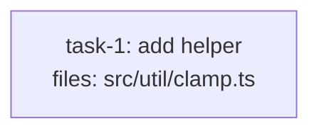

# Token-Use Optimization Implementation Plan

> **For agentic workers:** REQUIRED SUB-SKILL: Use superpowers:subagent-driven-development (recommended) or superpowers:executing-plans to implement this plan task-by-task. Steps use checkbox (`- [ ]`) syntax for tracking.

**Goal:** Wire the three token-cost levers from `docs/superpowers/specs/2026-05-05-token-optimization-design.md` into the plugin's skill files — per-task implementer tiering, opt-in reviewer tiering, and prompt-cache-friendly dispatch ordering — all behind defaults that preserve today's behavior.

**Architecture:** Every change is additive markdown-spec editing across the plugin's skill files plus new conformance fixtures. The foundational contract (new frontmatter schema, the `resolve_tier`/`resolve_model` resolver, and structural validation rules #7/#8) lands in `plan-format.md` first (Task 1); everything else references it. Reviewer tiering surfaces as soft heuristic S9 in `plan-quality.md` (Task 2). The three SKILLs and three dispatch templates then consume the resolver (Tasks 3–8). A final consistency + behavioral sweep closes it out (Task 9).

**Tech Stack:** Markdown skill specs (no compiler, no runtime). Validation/dispatch logic is *executed by an LLM reading the skill* — there is no automated test harness. "Tests" are conformance fixtures under `tests/fixtures/tiers/{should-pass,should-warn,should-refuse}/`, mirroring the existing `tests/fixtures/contracts/` pattern.

## Global Constraints

- **First-pass parity is the accuracy bar.** No change may regress first implementer-dispatch success. All new tiering defaults to `standard` (= `sonnet`) = today's behavior. (Spec §Goal, §Summary.)
- **Tier enum is exactly `cheap | standard | opus`** everywhere. (Spec §Schema.)
- **Tier→model mapping:** `cheap→haiku`, `standard→sonnet`, `opus→opus`. (Spec §Tier resolution.)
- **Agent model declarations stay untouched.** `agents/dag-implementer.md:4`, `agents/dag-spec-reviewer.md:4`, `agents/dag-quality-reviewer.md:4` keep `model: sonnet` as the safe fallback when the executor passes nothing. (Spec §Non-goals.)
- **No silent fallbacks on bad tier values** — refuse/halt naming the offending task id + field. (Spec §Error handling.)
- **All changes additive:** a plan with zero new fields must validate, dispatch, and execute identically to today. (Spec §Migration.)
- **Naming asymmetry is intentional:** the implementer's per-task field is the *existing* `model_hint`; its plan-level default is `default_model_hint`. Reviewer fields are `spec_reviewer_hint` / `quality_reviewer_hint` with `default_*` counterparts. The resolver handles the asymmetry explicitly. (Spec §Tier resolution.)

## How "tests" work in this repo (read before Task 1)

There is no `pytest`/`vitest`. A fixture is a markdown plan file plus an *expected verdict*:
- `should-pass/` — applying the skill's validation procedure yields **save / no refusal**.
- `should-refuse/` — yields a **hard refusal** naming the specific rule.
- `should-warn/` — yields a **soft warning** (the named S-rule) and a "save anyway? (y/N)" prompt.

The verification step for each task is therefore: (a) `grep`/read to confirm the skill edit is present and well-formed, and (b) a **conformance read-through** — re-read the edited skill section against each fixture and confirm the fixture's documented expected verdict is what the procedure produces. This is the same way the existing `tests/fixtures/contracts/` fixtures are exercised. State the expected verdict as a comment at the top of every fixture file.

## Canonical fixture skeleton (referenced by Tasks 1 & 2)

Several fixtures need a structurally-valid base plan that passes all existing hard rules (H1–H9) so that *only* the tier behavior under test differs. This is that base. Where a fixture says "base skeleton with «X»", start from this exact content and apply only the listed change.

````markdown
---
title: tier-fixture
created: 2026-06-22
---



## Context

Fixture for tier-hint validation. Single mechanical task; structurally valid.

## Tasks

## Task: add helper

```yaml
id: task-1
depends_on: []
files: [src/util/clamp.ts]
status: pending
```

Pure clamp helper. Bounds a number to an inclusive range.

## Implementation

```typescript
// src/util/clamp.ts
export function clamp(n: number, lo: number, hi: number): number {
  return Math.min(hi, Math.max(lo, n));
}
```

```typescript
// tests/unit/clamp.test.ts
import { clamp } from "../../src/util/clamp.js";
it("clamps above the max", () => { expect(clamp(10, 0, 5)).toBe(5); });
```

## Acceptance criteria

- `clamp(10, 0, 5) === 5`.
- `clamp(-3, 0, 5) === 0`.

Test file: `tests/unit/clamp.test.ts`.
````

---

## File Structure

| File | Responsibility | Task |
|---|---|---|
| `skills/writing-dag-plans/plan-format.md` | Schema for new frontmatter; §Tier resolution; structural validation rules #7/#8 | 1 |
| `tests/fixtures/tiers/should-pass/*.md` (5) | Conformance: plans that must validate | 1 |
| `tests/fixtures/tiers/should-refuse/*.md` (3) | Conformance: enum violations must refuse | 1 |
| `skills/writing-dag-plans/plan-quality.md` | Soft heuristic S9; detection-algorithm step | 2 |
| `tests/fixtures/tiers/should-warn/*.md` (4) | Conformance: S9 must warn | 2 |
| `skills/writing-dag-plans/SKILL.md` | "Optional plan-level tier prompt" step; required-reading + step-ref updates | 3 |
| `skills/updating-dag-plans/SKILL.md` | Two new operation rows; `running` refusal example; required-reading update | 4 |
| `skills/executing-dag-plans/SKILL.md` | Tier resolution at 3 dispatch sites; `model:` param; pre-flight tier validation | 5 |
| `skills/executing-dag-plans/implementer-prompt.md` | Template reorder; literal Agent invocation w/ `model:` | 6 |
| `skills/executing-dag-plans/spec-reviewer-prompt.md` | Template reorder; literal Agent invocation w/ `model:` | 7 |
| `skills/executing-dag-plans/quality-reviewer-prompt.md` | Template reorder; literal Agent invocation w/ `model:` | 8 |
| (sweep only) | Cross-reference consistency + behavioral checklist | 9 |

---

### Task 1: `plan-format.md` — schema, tier resolution, validation rules #7/#8

**Files:**
- Modify: `skills/writing-dag-plans/plan-format.md` (§Top-of-file structure frontmatter, §Per-task frontmatter schema ~line 78, §Validation rules ~line 174)
- Create: `tests/fixtures/tiers/should-pass/clean-no-hints.md`
- Create: `tests/fixtures/tiers/should-pass/clean-plan-level-only.md`
- Create: `tests/fixtures/tiers/should-pass/clean-per-task-only.md`
- Create: `tests/fixtures/tiers/should-pass/clean-hybrid.md`
- Create: `tests/fixtures/tiers/should-pass/clean-mixed-tiers.md`
- Create: `tests/fixtures/tiers/should-refuse/bad-task-hint-typo.md`
- Create: `tests/fixtures/tiers/should-refuse/bad-plan-default-typo.md`
- Create: `tests/fixtures/tiers/should-refuse/bad-hint-type-mismatch.md`

**Interfaces:**
- Produces: the `resolve_tier(task, role)` and `resolve_model(tier)` resolver (referenced by Tasks 5, 6, 7, 8); the per-task fields `spec_reviewer_hint`, `quality_reviewer_hint` and plan-level `default_model_hint`, `default_spec_reviewer_hint`, `default_quality_reviewer_hint` (referenced by Tasks 2, 3, 4, 5); validation rules #7 (per-task hint enum) and #8 (plan-level default enum) (referenced by Tasks 3, 4 for re-validation, and exercised by should-refuse fixtures).
- Consumes: existing `model_hint` field (already documented at `plan-format.md:85`).

- [ ] **Step 1: Write the should-refuse fixtures first (the failing tests)**

Create the three refuse fixtures. Each is the canonical skeleton with one bad value; line 1 is the expected-verdict comment.

`tests/fixtures/tiers/should-refuse/bad-task-hint-typo.md` — base skeleton, but the task YAML adds `model_hint: medium`. Top-of-file comment:
```markdown
<!-- EXPECTED: REFUSE — rule #7 (per-task hint enum). task-1.model_hint = "medium" is not in {cheap,standard,opus}. -->
```

`tests/fixtures/tiers/should-refuse/bad-plan-default-typo.md` — base skeleton, but frontmatter adds `default_spec_reviewer_hint: pro`. Top-of-file comment:
```markdown
<!-- EXPECTED: REFUSE — rule #8 (plan-level default enum). default_spec_reviewer_hint = "pro" is not in {cheap,standard,opus}. -->
```

`tests/fixtures/tiers/should-refuse/bad-hint-type-mismatch.md` — base skeleton, but the task YAML adds `quality_reviewer_hint: 0`. Top-of-file comment:
```markdown
<!-- EXPECTED: REFUSE — rule #7 (per-task hint enum). task-1.quality_reviewer_hint = 0 is an integer, not one of {cheap,standard,opus}. -->
```

- [ ] **Step 2: Verify the fixtures fail under TODAY's spec**

Re-read the current `plan-format.md` §Validation rules (1–6). Confirm there is **no** rule that would refuse these three fixtures today (the enum rules don't exist yet) — i.e., the "test" currently does NOT produce the expected REFUSE verdict. This is the red state.

Run: `grep -nE "^7\.|^8\.|hint enum" skills/writing-dag-plans/plan-format.md`
Expected: no matches (rules #7/#8 absent).

- [ ] **Step 3: Add the plan-level frontmatter keys to §Top-of-file structure**

In the example skeleton frontmatter (the `---` block around `plan-format.md:22-25`), add the three optional keys with the exact comments from spec §Schema:
```yaml
default_model_hint: standard            # OPTIONAL. cheap | standard | opus. Default `standard`. Implementer tier.
default_spec_reviewer_hint: standard    # OPTIONAL. cheap | standard | opus. Default `standard`.
default_quality_reviewer_hint: standard # OPTIONAL. cheap | standard | opus. Default `standard`.
```
Add one sentence: "All three are optional; omitting any (or all) keeps `standard` everywhere = today's behavior."

- [ ] **Step 4: Add the two new per-task fields to §Per-task frontmatter schema**

In the per-task YAML schema block (after the existing `model_hint:` line at `plan-format.md:85`), add:
```yaml
spec_reviewer_hint: standard    # OPTIONAL. Spec reviewer tier. cheap | standard | opus. Falls back to default_spec_reviewer_hint, then `standard`.
quality_reviewer_hint: standard # OPTIONAL. Quality reviewer tier. cheap | standard | opus. Falls back to default_quality_reviewer_hint, then `standard`.
```
Update the existing `model_hint` comment to note its fallback chain: "Falls back to `default_model_hint`, then `standard`."

- [ ] **Step 5: Add the §Tier resolution section**

Add a new `## Tier resolution` section (place it immediately after §Per-task frontmatter schema, before §Per-task body structure). Content verbatim from spec §Tier resolution:
```
resolve_tier(task, role) =
    task[role + "_hint"]                               if present
    else plan_frontmatter["default_" + role + "_hint"] if present
    else "standard"

resolve_model(tier) =
    "haiku"  if tier == "cheap"
    "sonnet" if tier == "standard"
    "opus"   if tier == "opus"
```
Then document the three role values: `model` (implementer — per-task field is the existing `model_hint`, plan-level default is `default_model_hint`; the asymmetry is explicit and intentional), `spec_reviewer`, `quality_reviewer`. Add the note from spec §Error handling #3: "A per-task hint inconsistent with the plan-level default is NOT an error — per-task overrides bypass plan-level defaults entirely."

- [ ] **Step 6: Add validation rules #7 and #8 to §Validation rules**

Append to the numbered §Validation rules list (currently ends at #6, `plan-format.md:181`), verbatim from spec §Validation rules added:
```
7. **Per-task hint enum** — `model_hint`, `spec_reviewer_hint`, `quality_reviewer_hint`, when present on any task, MUST be one of `cheap | standard | opus`. Any other value → refuse save with the offending task id, field name, and the bad value.
8. **Plan-level default enum** — `default_model_hint`, `default_spec_reviewer_hint`, `default_quality_reviewer_hint`, when present in frontmatter, MUST be one of `cheap | standard | opus`. Any other value → refuse with the field name and the bad value.
```
State that both use the existing rules-1-6 refusal-message format.

- [ ] **Step 7: Write the should-pass fixtures**

`tests/fixtures/tiers/should-pass/clean-no-hints.md` — the canonical skeleton verbatim. Comment:
```markdown
<!-- EXPECTED: PASS — no tier hints anywhere; validates and dispatches identically to pre-spec behavior (regression test for the no-migration claim). -->
```
`clean-plan-level-only.md` — base skeleton + frontmatter `default_model_hint: cheap` and `default_spec_reviewer_hint: cheap`. Comment: `<!-- EXPECTED: PASS — task-1 inherits cheap implementer + cheap spec reviewer from plan-level defaults. -->`
`clean-per-task-only.md` — base skeleton + task YAML `model_hint: opus` and `quality_reviewer_hint: opus`, no plan-level defaults. Comment: `<!-- EXPECTED: PASS — per-task hints used directly; no plan-level defaults present. -->`
`clean-hybrid.md` — base skeleton + frontmatter `default_model_hint: standard` AND task YAML `model_hint: cheap`. Comment: `<!-- EXPECTED: PASS — per-task model_hint=cheap overrides default_model_hint=standard. -->`
`clean-mixed-tiers.md` — extend base to two tasks (`task-1` mechanical `model_hint: cheap` on `src/util/clamp.ts`; `task-2` `model_hint: opus` + `quality_reviewer_hint: opus` on `src/core/consensus.ts`, `depends_on: [task-1]`, with its own valid `## Implementation`/`## Acceptance criteria`/test-file line and a matching mermaid node + edge). Comment: `<!-- EXPECTED: PASS — mechanical task at cheap, complex task at opus, realistic mix. -->`

- [ ] **Step 8: Verify — conformance read-through**

Run: `grep -rn "EXPECTED:" tests/fixtures/tiers/` — confirm 8 fixtures present (5 pass, 3 refuse).
Then conformance read-through against the edited `plan-format.md` §Validation rules:
- The 3 should-refuse fixtures now hit rule #7 or #8 → REFUSE (green: they failed before Step 6, refuse after).
- The 5 should-pass fixtures violate no rule → PASS.
Confirm each fixture's documented EXPECTED verdict matches.

- [ ] **Step 9: Commit**

```bash
git add skills/writing-dag-plans/plan-format.md tests/fixtures/tiers/should-pass/ tests/fixtures/tiers/should-refuse/
git commit -m "feat(plan-format): add tier schema, resolver, and enum validation rules #7/#8"
```

---

### Task 2: `plan-quality.md` — soft heuristic S9 + detection-algorithm step

**Files:**
- Modify: `skills/writing-dag-plans/plan-quality.md` (§Soft heuristics table ~line 59-68, §Detection algorithm ~line 72-79)
- Create: `tests/fixtures/tiers/should-warn/s9-mechanical-no-cheap.md`
- Create: `tests/fixtures/tiers/should-warn/s9-security-no-opus.md`
- Create: `tests/fixtures/tiers/should-warn/s9-novelty-phrase.md`
- Create: `tests/fixtures/tiers/should-warn/s9-multi-system-wiring.md`

**Interfaces:**
- Consumes: the per-task/plan-level hint fields and `resolve_tier` from Task 1 (S9 reasons about *resolved* tiers).
- Produces: S9 (referenced by Tasks 3 & 4 — the writing/updating SKILLs cite S9 in their flows).

- [ ] **Step 1: Write the should-warn fixtures first (failing tests)**

`s9-mechanical-no-cheap.md` — base skeleton, task is docs-only: `files: [docs/usage.md]`, body <200 words, no `model_hint`. (Adjust mermaid node + Implementation to a docs edit; keep H-rule validity.) Comment:
```markdown
<!-- EXPECTED: WARN S9 — files all docs-only, body <200 words, model_hint resolves to standard. Suggest model_hint: cheap. -->
```
`s9-security-no-opus.md` — base skeleton, `files: [src/auth/session.ts]`, no `quality_reviewer_hint` (resolves below opus). Comment:
```markdown
<!-- EXPECTED: WARN S9 — files overlap security path globs, quality_reviewer_hint resolves below opus. Suggest quality_reviewer_hint: opus. -->
```
`s9-novelty-phrase.md` — base skeleton, body contains "consensus algorithm", no tier upshift. Comment:
```markdown
<!-- EXPECTED: WARN S9 — novelty-signal regex matches ("consensus algorithm"), model_hint resolves to standard. Suggest model_hint: opus AND quality_reviewer_hint: opus. -->
```
`s9-multi-system-wiring.md` — `is_wiring_task: true` spanning `src/api/x.ts`, `src/ui/x.ts`, `src/jobs/x.ts` (3 subsystems), `depends_on` the producers, no quality upshift. Comment:
```markdown
<!-- EXPECTED: WARN S9 — is_wiring_task spanning >2 subsystem prefixes, quality_reviewer_hint resolves below opus. Suggest quality_reviewer_hint: opus. -->
```

- [ ] **Step 2: Verify the fixtures don't warn under today's spec**

Run: `grep -nE "S9|tier-complexity" skills/writing-dag-plans/plan-quality.md`
Expected: no matches (S9 absent — red state; the fixtures produce no S9 warning yet).

- [ ] **Step 3: Add S9 to the §Soft heuristics table**

Append row S9 to the soft-heuristics table (after S8 at `plan-quality.md:68`). Use the five detection patterns from spec §Soft heuristic S9 (the trigger→suggested-action table). Capture: docs/fixture/test-data files + body <200w + `model_hint` resolves `standard` → suggest `cheap`; novelty-regex match + resolves `standard` → suggest `opus` + `quality_reviewer_hint: opus`; security-path glob + `quality_reviewer_hint` below `opus` → suggest `opus`; `## Why this abstraction` present + resolves `standard` → suggest `opus`; `is_wiring_task: true` spanning >2 subsystems + `quality_reviewer_hint` below `opus` → suggest `opus`. State the single-direction rule: "S9 suggests **upshifts** on elevated-risk signals; suggests **downshifts only for clearly-mechanical tasks**, never ambiguous ones — this protects the first-pass-parity bar."

- [ ] **Step 4: Wire S9 into the detection algorithm**

In §Detection algorithm (`plan-quality.md:72-79`), update step 3 ("Run soft heuristics S1-S8") to read "S1-S9". No other algorithm change.

- [ ] **Step 5: Verify — conformance read-through**

Run: `grep -rn "EXPECTED: WARN S9" tests/fixtures/tiers/should-warn/` — confirm 4 fixtures.
Conformance read-through: apply the updated S9 row to each fixture; confirm each fires S9 with the documented suggestion (green), and that each fixture is otherwise structurally valid so S9 is the *only* finding.

- [ ] **Step 6: Commit**

```bash
git add skills/writing-dag-plans/plan-quality.md tests/fixtures/tiers/should-warn/
git commit -m "feat(plan-quality): add S9 tier-complexity-mismatch soft heuristic"
```

---

### Task 3: `writing-dag-plans/SKILL.md` — optional plan-level tier prompt

**Files:**
- Modify: `skills/writing-dag-plans/SKILL.md` (§Two reference docs ~line 51-54, §Process step list ~line 140-166)

**Interfaces:**
- Consumes: new fields + §Tier resolution from Task 1; S9 from Task 2.

- [ ] **Step 1: Update §Two reference docs you MUST read first**

In the `plan-format.md` bullet (`SKILL.md:53`), extend the parenthetical schema list to include the new fields: add `default_model_hint`, `default_spec_reviewer_hint`, `default_quality_reviewer_hint` (plan-level) and `spec_reviewer_hint`, `quality_reviewer_hint` (per-task), plus "§Tier resolution". In the `plan-quality.md` bullet (`SKILL.md:54`), change "S1-S6" to "S1-S9".

- [ ] **Step 2: Add the "Optional plan-level tier prompt" step**

Insert a new step between current step 6 (structural validation) and step 7 (quality validation), numbered **6.6** to avoid renumbering (6.5 "Identify contract surface" already exists). Content from spec §Optional plan-level tier prompt:
- Compute per-task complexity: **mechanical signals** (title/body matches `\b(rename|format|move|copy|extract|inline|docs?[-_]only|test[-_]data|fixture[-_]only)\b`, OR `files:` all match `**/*.md`/`**/test/fixtures/**`/`**/tests/data/**`/`**/CHANGELOG*`/`**/README*`); **novelty signals** (body matches `\b(algorithm|protocol|state machine|consensus|concurrency|race|lock|transaction|cryptograph|atomicity)\b`, OR `## Why this abstraction` present, OR `files:` overlaps `**/auth/**`/`**/security/**`/`**/crypto/**`/`**/payments/**`/`**/session*`).
- Compute `mechanical_pct` and `novelty_pct` over all tasks. If `mechanical_pct > 70%` AND `novelty_pct < 10%`, prompt: "Most tasks in this plan look mechanical. Set plan-level reviewer default to `default_spec_reviewer_hint: cheap`? (y/N — default N)". Otherwise skip the prompt; S9 handles per-task suggestions.
- State explicitly: "The skill never auto-writes plan-level defaults silently. Author confirms or skips." And "Does not prompt per-task during decomposition — tier choice is a low-priority field."

- [ ] **Step 3: Update step 7's quality-validation reference**

In step 7 (`SKILL.md:152-154`), change "Soft heuristics S1-S8" to "S1-S9".

- [ ] **Step 4: Verify**

Run: `grep -nE "6\.6|default_spec_reviewer_hint|S1-S9|Tier resolution" skills/writing-dag-plans/SKILL.md`
Expected: matches for the new step 6.6, the prompt field, the S1-S9 updates, and the §Tier resolution reference.
Read-through: confirm the new step sits between structural (6) and quality (7) validation and never auto-writes.

- [ ] **Step 5: Commit**

```bash
git add skills/writing-dag-plans/SKILL.md
git commit -m "feat(writing-dag-plans): add optional plan-level tier prompt + S9/schema refs"
```

---

### Task 4: `updating-dag-plans/SKILL.md` — tier-hint mutation ops

**Files:**
- Modify: `skills/updating-dag-plans/SKILL.md` (§Required reading ~line 24-25, §Operations supported table ~line 47-53, §Example refusals ~line 105-119, §Process step 6 ~line 76-83)

**Interfaces:**
- Consumes: new hint fields + validation rules #7/#8 from Task 1.

- [ ] **Step 1: Update §Required reading**

In the `plan-quality.md` bullet (`updating-dag-plans/SKILL.md:25`), change "S1-S8" to "S1-S9".

- [ ] **Step 2: Add two operation rows to §Operations supported**

Append to the operations table (after the `Rewire depends_on:` row at line 53), verbatim behavior from spec §Updating-plans:
```
| **Modify tier hint** (`model_hint`, `spec_reviewer_hint`, `quality_reviewer_hint`) | Target's status is `pending` or `ready` | Update YAML field. Re-validate enum (`cheap | standard | opus`, rule #7). No mermaid re-render (label doesn't show tier). |
| **Modify plan-level default hint** (`default_*_hint` in frontmatter) | At least one task is `pending` or `ready` | Update frontmatter field. Re-validate enum (rule #8). Affects all tasks lacking a per-task override and not yet `running`/`done`/`failed`/`skipped`. Refuse if every task is already immutable. |
```

- [ ] **Step 3: Document why `ready` is mutable for tier hints**

After the table, add the note from spec: "Unlike `files:` (mutable only on `pending`, because a `ready` task queues for the next tick and a file-scope change could conflict with a running sibling), tier hints don't interact with the parallelism contract — mutating a `ready` task's tier between ticks is safe; the next tick reads fresh state and dispatches at the new resolved tier."

- [ ] **Step 4: Add the `running` tier-hint refusal example**

In §Example refusals, add (from spec §Refusal example):
```
✗ Refused: Cannot modify task-3.model_hint (status: running)
   An implementer subagent is currently executing this task at its
   originally-resolved tier. Wait for completion (or BLOCKED), then
   the BLOCKED-retry ladder will pick up the new value if you've
   updated it by then.
```

- [ ] **Step 5: Wire the new ops into §Process step 6 (quality re-validation)**

In step 6 (`updating-dag-plans/SKILL.md:76-83`), add a bullet: "On **modify tier hint** / **modify plan-level default hint**: re-validate the enum (rules #7/#8). Run S9 on the affected task(s). No structural re-validation needed (tier hints don't affect the DAG)."

- [ ] **Step 6: Verify**

Run: `grep -nE "Modify tier hint|default_\*_hint|status: running\)" skills/updating-dag-plans/SKILL.md`
Expected: matches for both new ops and the running refusal.
Read-through: confirm `ready` is permitted for tier hints but the immutable-history invariant (running/done/failed/skipped) is preserved.

- [ ] **Step 7: Commit**

```bash
git add skills/updating-dag-plans/SKILL.md
git commit -m "feat(updating-dag-plans): support tier-hint and plan-default mutations"
```

---

### Task 5: `executing-dag-plans/SKILL.md` — tier resolution at dispatch + pre-flight

**Files:**
- Modify: `skills/executing-dag-plans/SKILL.md` (§Execution model step 4 ~line 33-35, §Per-task review chain ~line 42-53)

**Interfaces:**
- Consumes: `resolve_tier`/`resolve_model` + new fields from Task 1.
- Produces: the dispatch-site contract that Tasks 6/7/8's literal Agent examples illustrate.

- [ ] **Step 1: Wire tier resolution into §Execution model step 4 (implementer dispatch)**

In step 4 (`SKILL.md:33`), after "dispatch a fresh implementer subagent via the Agent tool", add: "Pass `model: resolve_model(resolve_tier(task, 'model'))` (resolver defined in `../writing-dag-plans/plan-format.md` §Tier resolution). The implementer's per-task field is `model_hint`; absent that, `default_model_hint`; absent that, `standard`." Note the BLOCKED-retry ladder still bumps **one tier above the resolved tier** (unchanged).

- [ ] **Step 2: Add the pre-flight tier-validation bullet**

In step 4's existing "Pre-flight check" paragraph (`SKILL.md:35`), add a second pre-flight sentence (spec §Pre-flight tier validation): "Also validate every `*_hint` value across all tasks and every plan-level `default_*_hint` is in `{cheap, standard, opus}`. Halt with a clear error naming the offending field + value if any fails — this catches hand-edits that bypassed the writing-dag-plans validator. No silent fallback to `standard`."

- [ ] **Step 3: Wire reviewer tier resolution into §Per-task review chain**

In §Per-task review chain (`SKILL.md:42-53`), after the chain diagram, add: "Dispatch the spec reviewer with `model: resolve_model(resolve_tier(task, 'spec_reviewer'))` and the quality reviewer with `model: resolve_model(resolve_tier(task, 'quality_reviewer'))`. Reviewer tiers fall back per-task → plan-level default → `standard`. Review-issue re-dispatch of the **implementer** uses the original resolved implementer tier (NOT the BLOCKED-upgraded one) — only BLOCKED upgrades."

- [ ] **Step 4: Verify**

Run: `grep -nE "resolve_model|resolve_tier|spec_reviewer'\)|quality_reviewer'\)|\*_hint" skills/executing-dag-plans/SKILL.md`
Expected: matches at the implementer dispatch site, both reviewer sites, and the pre-flight bullet.
Read-through: confirm all three dispatch sites resolve a tier; confirm BLOCKED-retry and review-issue-re-dispatch semantics are stated correctly (BLOCKED upgrades; review-issue does not).

- [ ] **Step 5: Commit**

```bash
git add skills/executing-dag-plans/SKILL.md
git commit -m "feat(executing-dag-plans): resolve tiers at all 3 dispatch sites + pre-flight"
```

---

### Task 6: `implementer-prompt.md` — cache-friendly reorder + literal Agent invocation

**Files:**
- Modify: `skills/executing-dag-plans/implementer-prompt.md` (§Prompt template ~line 25-70, §Re-dispatch sections ~line 72-113)

**Interfaces:**
- Consumes: `resolve_tier`/`resolve_model` from Task 1; dispatch contract from Task 5.

- [ ] **Step 1: Reorder the §Prompt template body**

Re-order the template so stable content leads (spec §Prompt template re-ordering): (1) stable preamble — one line identifying role + pipeline; (2) project conventions (full CLAUDE.md); (3) output-format spec (DONE / DONE_WITH_CONCERNS / NEEDS_CONTEXT / BLOCKED); (4) task spec (id, files, depends_on); (5) task body; (6) upstream context; (7) re-dispatch addenda last. **Semantic content is unchanged — only section order moves.** Add a one-line note: "If the Agent tool later exposes `cache_control`, the breakpoint goes after section 3 — no re-architecture needed."

- [ ] **Step 2: Add the literal Agent invocation example**

Add an §Agent invocation example block (spec §Literal Agent invocation example):
```
Agent({
  description: "Implement task-3",
  subagent_type: task.implementer ?? "dag-implementer",
  model: resolve_model(resolve_tier(task, "model")),
  prompt: <constructed-from-template-above>
})
```
Note: "This teaches the controller LLM to include `model:` at dispatch — the wiring is in the prompt, since executing-dag-plans is itself executed by an LLM controller."

- [ ] **Step 3: Confirm re-dispatch ordering**

In §Re-dispatch on review issues, add a one-liner: "Review-issue re-dispatch uses the **original resolved tier**, not the BLOCKED-upgraded one." Leave the existing BLOCKED-retry tier table (`implementer-prompt.md:97-101`) unchanged — it already composes correctly.

- [ ] **Step 4: Verify**

Run: `grep -nE "resolve_model\(resolve_tier|Stable preamble|cache_control|original resolved tier" skills/executing-dag-plans/implementer-prompt.md`
Expected: matches for the Agent example, the reordered preamble, the cache note, and the re-dispatch tier clarification.
Read-through: confirm no acceptance/semantic content was dropped in the reorder — every section present in the original still exists, just reordered.

- [ ] **Step 5: Commit**

```bash
git add skills/executing-dag-plans/implementer-prompt.md
git commit -m "perf(implementer-prompt): cache-friendly reorder + literal model: dispatch"
```

---

### Task 7: `spec-reviewer-prompt.md` — cache-friendly reorder + literal Agent invocation

**Files:**
- Modify: `skills/executing-dag-plans/spec-reviewer-prompt.md` (§Prompt template ~line 22-58)

**Interfaces:**
- Consumes: `resolve_tier`/`resolve_model` from Task 1; dispatch contract from Task 5.

- [ ] **Step 1: Reorder the §Prompt template body**

Apply the same ordering as Task 6 Step 1, adapted to the spec reviewer's sections: (1) stable preamble (role: spec compliance, bidirectional); (2) project conventions if any; (3) output spec (APPROVED / ISSUES format); (4) task spec (id, files); (5) task body (the binding spec); (6) implementation-under-review (commit SHA + `git show` command); (7) re-dispatch addenda last. Semantic content unchanged.

- [ ] **Step 2: Add the literal Agent invocation example**

```
Agent({
  description: "Spec-review task-3",
  subagent_type: "dag-spec-reviewer",
  model: resolve_model(resolve_tier(task, "spec_reviewer")),
  prompt: <constructed-from-template-above>
})
```

- [ ] **Step 3: Verify**

Run: `grep -nE "resolve_tier\(task, \"spec_reviewer\"\)|Stable preamble" skills/executing-dag-plans/spec-reviewer-prompt.md`
Expected: matches for the Agent example and reordered preamble.
Read-through: confirm APPROVED/ISSUES output spec and the "spec compliance only — no style" instruction are preserved.

- [ ] **Step 4: Commit**

```bash
git add skills/executing-dag-plans/spec-reviewer-prompt.md
git commit -m "perf(spec-reviewer-prompt): cache-friendly reorder + literal model: dispatch"
```

---

### Task 8: `quality-reviewer-prompt.md` — cache-friendly reorder + literal Agent invocation

**Files:**
- Modify: `skills/executing-dag-plans/quality-reviewer-prompt.md` (§Prompt template ~line 22-57)

**Interfaces:**
- Consumes: `resolve_tier`/`resolve_model` from Task 1; dispatch contract from Task 5.

- [ ] **Step 1: Reorder the §Prompt template body**

Apply the same ordering as Task 6 Step 1, adapted: (1) stable preamble (role: quality review, independent of spec, spec reviewer already approved); (2) project conventions if any; (3) output spec (APPROVED / ISSUES w/ severity format); (4) task spec (id, files); (5) task body (context only); (6) implementation-under-review (commit SHA + `git show`); (7) re-dispatch addenda last. Semantic content unchanged. Preserve the `superpowers:requesting-code-review` auto-load reference.

- [ ] **Step 2: Add the literal Agent invocation example**

```
Agent({
  description: "Quality-review task-3",
  subagent_type: "dag-quality-reviewer",
  model: resolve_model(resolve_tier(task, "quality_reviewer")),
  prompt: <constructed-from-template-above>
})
```

- [ ] **Step 3: Verify**

Run: `grep -nE "resolve_tier\(task, \"quality_reviewer\"\)|Stable preamble|requesting-code-review" skills/executing-dag-plans/quality-reviewer-prompt.md`
Expected: matches for the Agent example, reordered preamble, and the preserved code-review auto-load.
Read-through: confirm the severity output format and "no spec compliance / no unrelated refactoring" instructions survive.

- [ ] **Step 4: Commit**

```bash
git add skills/executing-dag-plans/quality-reviewer-prompt.md
git commit -m "perf(quality-reviewer-prompt): cache-friendly reorder + literal model: dispatch"
```

---

### Task 9: Cross-reference consistency sweep + behavioral checklist

**Files:**
- Modify (only if sweep finds drift): any of the eight files above.
- Create: none (this task verifies; it edits only to fix drift it finds).

**Interfaces:**
- Consumes: all prior tasks.

- [ ] **Step 1: Enum-consistency sweep**

Run: `grep -rnE "cheap|standard|opus|haiku|sonnet" skills/ | grep -iE "hint|tier|resolve_model"`
Confirm every place that names the tier enum uses exactly `cheap | standard | opus` and the model mapping is consistently `cheap→haiku, standard→sonnet, opus→opus`. Fix any drift.

- [ ] **Step 2: Resolver-reference sweep**

Run: `grep -rn "resolve_tier\|resolve_model" skills/`
Confirm: defined once in `plan-format.md`; referenced (not redefined) in `executing-dag-plans/SKILL.md` and the three prompt templates. No divergent re-definitions.

- [ ] **Step 3: Rule-number sweep**

Run: `grep -rnE "S1-S8|S1-S6|rules 1-6|H1-H8" skills/`
Confirm no stale ranges remain — `plan-quality` soft heuristics should read S1-S9 everywhere they're cited; format validation rules now go to #8. Fix any stale "S1-S8"/"S1-S6"/"rules 1-6" references.

- [ ] **Step 4: Non-goal guard**

Run: `grep -n "^model:" agents/*.md`
Confirm all three agents still declare `model: sonnet` (untouched — spec §Non-goals).

- [ ] **Step 5: Behavioral verification checklist (manual — requires a live dispatch)**

These cannot be unit-run (no harness; executing-dag-plans is LLM-executed). Record them as a checklist in the commit body and confirm by reasoning against the edited skills:
- A plan with no hints resolves all three roles to `standard` → identical to today (regression / no-migration claim).
- A `model_hint: cheap` task dispatches at `haiku` on first dispatch; on BLOCKED, retries at `sonnet`; second BLOCKED → `failed`.
- A `cheap` implementer reporting via review-ISSUES re-dispatches at `cheap` (not upgraded).
- Mutating `model_hint` on a `pending`/`ready` task is accepted; on a `running` task is refused with the documented message.

- [ ] **Step 6: Commit (only if Steps 1–4 fixed drift; otherwise skip)**

```bash
git add -A
git commit -m "chore(tiers): cross-reference consistency sweep"
```

---

## Self-Review (completed by plan author)

**Spec coverage** — every row of the spec's §Architecture change table maps to a task: plan-format → T1; plan-quality → T2; writing SKILL → T3; updating SKILL → T4; executing SKILL → T5; the three prompts → T6/T7/T8; all fixture dirs → T1 (pass/refuse) + T2 (warn). Spec §Error handling paths land in T5 (pre-flight) + T1 (resolver "no silent fallback"). Spec §Migration "no-migration" claim is the `clean-no-hints` fixture (T1) + behavioral checklist (T9). Non-goal "agent model lines untouched" is guarded in T9 Step 4.

**Placeholder scan** — fixture content is given as "canonical skeleton + exact listed change" (skeleton defined once, in full, above) rather than re-pasting 12 full plans; every change is a concrete field/value, not a TODO. Resolver, validation rules, S9 patterns, operation rows, and refusal text are quoted verbatim from the spec.

**Type consistency** — resolver name `resolve_tier(task, role)` / `resolve_model(tier)`, role strings `model`/`spec_reviewer`/`quality_reviewer`, field names `model_hint`/`spec_reviewer_hint`/`quality_reviewer_hint` + `default_*`, and tier enum `cheap|standard|opus` are used identically across T1, T5, T6, T7, T8.

**Known divergence from generic writing-plans template** — the "run the test, see it fail/pass" steps are conformance read-throughs + greps, not a test-runner invocation, because the plugin has no executable harness. This is stated up front in §How "tests" work.
