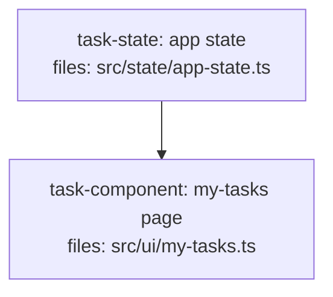

# Closure-Coherence Rules Implementation Plan

> **For agentic workers:** REQUIRED SUB-SKILL: Use superpowers:subagent-driven-development (recommended) or superpowers:executing-plans to implement this plan task-by-task. Steps use checkbox (`- [ ]`) syntax for tracking.

**Goal:** Add three quality rules (H10 missing-producer, H11 bare-spec-pointer, S11 unanchored-contract) plus two step-8 semantic sweeps to the DAG-plan authoring skills, closing the coherence-between-tasks gap H9 cannot see.

**Architecture:** Mechanical rules (H10/H11/S11) live in `skills/writing-dag-plans/plan-quality.md`, reusing the definer/consumer index H9 already builds. Semantic checks (prose-consumption sweep, elided-sibling enumeration, reworded quality lens) extend the SKILL.md step-8 LLM audit. `updating-dag-plans` inherits the new rules through its per-op validation matrix. Verification is by conformance fixtures under `tests/fixtures/contracts/`, traced by reasoning (no automated runner exists).

**Tech Stack:** Markdown skill files; `.md` fixture plans with HTML-comment headers declaring `EXPECTED` / `EXPECTED REFUSAL TEXT (substring match)`.

## Global Constraints

- All changes are **additive**: a plan that closes cleanly today must validate identically (no regression to H1–H9, S1–S10, structural rules #1–#10, file-scope tripwire, tier/review-mode systems).
- **Classification principle:** binary-checkable truth → hard rule (refuse); judgment → soft heuristic (warn). H10/H11 refuse; S11 warns.
- **No duplication of H9's missing-edge check.** H9 owns `(consumer, symbol, definer)` triples where the definer exists. The new rules cover only what H9 cannot see.
- New rules must be reflected in **three coherent places**: `plan-quality.md` (definition), `writing-dag-plans/SKILL.md` (process step references + ranges), `updating-dag-plans/SKILL.md` (per-op matrix + ranges).
- Fixture verdicts are **LLM-executed**, not CI-gated — verification means tracing the detection algorithm against the fixture and matching the declared verdict.
- Refusal/warning text in fixtures must be **substring-matchable** against the rule's documented refusal text.
- Hard-rule range becomes **H1–H11**; soft-heuristic range becomes **S1–S11**. Update every reference to the old ranges.
- Commit message trailer: `Co-Authored-By: Claude Opus 4.8 (1M context) <noreply@anthropic.com>`. Work on branch `feat/closure-coherence-rules`.

---

### Task 1: H10 missing-producer rule + stale cross-ref fix

**Files:**
- Modify: `skills/writing-dag-plans/plan-quality.md` (hard-rules table; §Detection algorithm; refusal-output example; fix stale `step 11.5` → `step 8` at line ~79)
- Create: `tests/fixtures/contracts/should-refuse/h10-missing-producer.md`
- Create: `tests/fixtures/contracts/should-pass/h10-renamed-but-wired.md`

**Interfaces:**
- Consumes: H9's definer/consumer index and file-classification (pre-existing / external / task-owned) from the existing `plan-quality.md` H9 row; H8's import-extraction.
- Produces: H10 detection contract and its refusal-text format (substring `task-<id> violates H10 (consumed capability has no producer)`), referenced by Task 4, Task 5, and the fixtures.

- [ ] **Step 1: Write the failing fixture (the myTasks hole)**

Create `tests/fixtures/contracts/should-refuse/h10-missing-producer.md`. Two tasks: a state-service task that exports a `state` object/class WITHOUT a `myTasks` member, and a component task that imports `state` (declaring the dependency so H9/H8 pass) and calls `state.myTasks()`. No producer defines `myTasks`.

```markdown
<!--
FIXTURE: h10-missing-producer
EXPECTED: refuse with H10
COVERS: negative case — task-component imports `state` from task-state (depends_on
  declared, so H8 + H9 both pass), then calls state.myTasks(). No task defines a
  `myTasks` member on the state object. H10 detects the member gap and refuses.
EXPECTED REFUSAL TEXT (substring match):
  task-component violates H10 (consumed capability has no producer)
    Capability: state.myTasks
    Owner:      task-state (produces state, file: src/state/app-state.ts)
    Issue:      task-component references state.myTasks but task-state defines no myTasks
ASSUMES: H8 + H9 pass (import resolves, no missing edge); H10 fires on the member gap.
-->

---
title: h10-missing-producer
created: 2026-06-24
---



## Context

Demonstrates H10: the my-tasks page consumes `state.myTasks()`, but the state
service defines no such member and no other task produces the capability. H8
passes (the `state` import resolves to task-state's file); H9 passes (`myTasks`
is not in the definer index, so no triple forms). H10 catches the member gap.

## Tasks

## Task: app state

```yaml
id: task-state
depends_on: []
files:
  - src/state/app-state.ts
status: pending
```

Exposes the application state object consumed across the UI.

## Implementation

```typescript
// src/state/app-state.ts
export class AppState {
  lists() { return this._lists; }
  refreshLists() { /* ... */ }
}
export const state = new AppState();
```

```typescript
// tests/state/app-state.test.ts
import { state } from "../../src/state/app-state.js";
it("exposes lists()", () => { expect(typeof state.lists).toBe("function"); });
```

## Acceptance criteria

- `state.lists()` returns the cached list array.
- `state.refreshLists()` re-fetches lists.

Test file: `tests/state/app-state.test.ts`.

## Task: my-tasks page

```yaml
id: task-component
depends_on: [task-state]
files:
  - src/ui/my-tasks.ts
status: pending
```

Default route. Renders the current user's tasks across all lists.

## Implementation

```typescript
// src/ui/my-tasks.ts
import { state } from "../state/app-state.js";

export function renderMyTasks() {
  const tasks = state.myTasks();      // <-- no producer defines myTasks
  state.refreshMyTasks();             // <-- nor refreshMyTasks
  return tasks.map((t) => t.title);
}
```

```typescript
// tests/ui/my-tasks.test.ts
import { renderMyTasks } from "../../src/ui/my-tasks.js";
it("renders task titles", () => { expect(renderMyTasks()).toBeInstanceOf(Array); });
```

## Acceptance criteria

- Renders one row per task returned by `state.myTasks()`.
- Calling the page triggers `state.refreshMyTasks()`.

Test file: `tests/ui/my-tasks.test.ts`.
```

- [ ] **Step 2: Verify the current skill does NOT catch it**

Trace the existing rules against the fixture:
- H8: `import { state } from "../state/app-state.js"` resolves to task-state's `files:` entry → passes.
- H9: builds definer index (task-state exports `state`, `AppState`); scans task-component for definer-index symbols; `state` IS in the index and task-component `depends_on: [task-state]` → edge present → passes. `myTasks` is NOT in the definer index → no triple → not a violation.

Expected: the fixture's hole survives all current rules. This confirms the gap H10 must close.

- [ ] **Step 3: Add the H10 row to the hard-rules table**

In `skills/writing-dag-plans/plan-quality.md`, append after the H9 row:

```markdown
| H10 | **Missing-producer — consumed member has no definer** | Extend H9's per-task defined-symbol index to include members/methods/fields within exported classes/objects (not just top-level exports). For each task, collect member/property/method accesses (and named imports) whose base symbol or import path is owned by ANOTHER task T (per H8's file-classification). For each accessed member `m`: if `m` is absent from T's defined-symbol set (top-level exports ∪ indexed members) → violation. Skip symbols/members resolving to a pre-existing file or external dependency (inherits H9/H8 skips — covers externally/dynamically-produced capabilities), and same-task references. A naming mismatch (consumed `myTasks` vs produced `tasksForUser`) fires by design — the named capability is not wired. **Partition with the prose sweep (step 8):** H10 owns references in code blocks; the prose sweep owns references appearing only in prose/acceptance text. A reference in both yields the H10 finding only. |
```

- [ ] **Step 4: Add H10 to the §Detection algorithm**

In the "Detection algorithm (run on every save)" section, change step 2 to run "hard rules H1-H11" and add an explicit note that H10 requires the member-level index extension over H9.

- [ ] **Step 5: Add the H10 refusal-output example**

In the "Refusal output format" code block, add after the H9 example:

```
  task-component violates H10 (consumed capability has no producer)
    Capability: state.myTasks
    Owner:      task-state (produces state, file: src/state/app-state.ts)
    Issue:      task-component references state.myTasks but task-state defines no myTasks
    Fix:        add a producer for myTasks (state method + its api-client/controller/
                repository data path) OR correct the reference if myTasks was renamed
```

- [ ] **Step 6: Fix the stale cross-reference (polish item 7)**

At `plan-quality.md` line ~79 (the §Detection algorithm step 4), change `see SKILL.md step 11.5` to `see SKILL.md step 8`.

- [ ] **Step 7: Write the renamed-but-wired pass fixture**

Create `tests/fixtures/contracts/should-pass/h10-renamed-but-wired.md`: a component consumes `state.tasksForUser()` and the state task DEFINES `tasksForUser()`. H10 must NOT fire (the member exists on the owner).

```markdown
<!--
FIXTURE: h10-renamed-but-wired
EXPECTED: pass
COVERS: positive case — consumer calls state.tasksForUser(); task-state defines a
  tasksForUser() member. H10 finds the member on the owner's defined-symbol set
  and does not fire. Guards against H10 over-firing on correctly-wired members.
-->
```

(Body mirrors the refuse fixture but task-state's `AppState` declares `tasksForUser() { ... }` and the component calls `state.tasksForUser()`.)

- [ ] **Step 8: Verify H10 fires on the hole and is silent on known-good (acceptance gate)**

Trace the new H10 detection:
- Against `should-refuse/h10-missing-producer.md`: member `myTasks` (and `refreshMyTasks`) accessed on `state` owned by task-state; task-state's defined-symbol set is `{lists, refreshLists}`; `myTasks` absent → **refuse**, text matches the EXPECTED substring.
- Against `should-pass/h10-renamed-but-wired.md`: `tasksForUser` present on owner → **pass**.
- **Acceptance gate:** trace H10 against EVERY existing `should-pass` fixture (`tests/fixtures/contracts/should-pass/*`, `tests/fixtures/tiers/should-pass/*`, `tests/fixtures/review-mode/should-pass/*`). Expected: **zero H10 findings**. If any fires, the member-index extension is too broad — tighten it (or, per the spec, degrade that case to soft) before proceeding.

- [ ] **Step 9: Commit**

```bash
git add skills/writing-dag-plans/plan-quality.md tests/fixtures/contracts/should-refuse/h10-missing-producer.md tests/fixtures/contracts/should-pass/h10-renamed-but-wired.md
git commit -m "feat(plan-quality): add H10 missing-producer rule + fix stale step ref

Co-Authored-By: Claude Opus 4.8 (1M context) <noreply@anthropic.com>"
```

---

### Task 2: H11 bare-spec-pointer rule

**Files:**
- Modify: `skills/writing-dag-plans/plan-quality.md` (hard-rules table; §Detection algorithm step 2 already H1-H11 from Task 1; refusal-output example)
- Create: `tests/fixtures/contracts/should-refuse/h11-bare-spec-pointer.md`
- Create: `tests/fixtures/contracts/should-pass/h11-checksum-criteria.md`

**Interfaces:**
- Consumes: nothing from other tasks (pure text-pattern rule).
- Produces: H11 detection contract + refusal text (substring `task-<id> violates H11 (bare spec pointer in acceptance criteria)`), referenced by Task 4 (elided-sibling coupling) and Task 5.

- [ ] **Step 1: Write the failing fixture**

Create `tests/fixtures/contracts/should-refuse/h11-bare-spec-pointer.md`: a single valid task whose `## Acceptance criteria` bullet is only `- Match the schema exactly per spec §5.1.` (a section pointer, no inlined requirement, no checksum).

```markdown
<!--
FIXTURE: h11-bare-spec-pointer
EXPECTED: refuse with H11
COVERS: negative case — acceptance criterion defers to spec §5.1 with no inlined
  requirement text and no countable checksum. The executor's reviewers never see
  the spec, so the bullet is unverifiable. H11 refuses.
EXPECTED REFUSAL TEXT (substring match):
  task-schema violates H11 (bare spec pointer in acceptance criteria)
    Bullet: "Match the schema exactly per spec §5.1."
ASSUMES: H1-H10 pass; the only defect is the bare pointer.
-->
```

(Body: one well-formed task with `## Implementation` containing an impl block + a failing-test block, but the acceptance bullet is the bare pointer.)

- [ ] **Step 2: Verify the current skill does NOT catch it**

Trace: H4 (criteria present) passes — there is a bullet. S4 (vague single-word) passes — the bullet is a full sentence, not "works"/"done". So the bare pointer survives. Confirms the gap.

- [ ] **Step 3: Add the H11 row**

Append after H10 in the hard-rules table:

```markdown
| H11 | **Bare spec pointer in acceptance criteria** | An acceptance-criteria bullet whose substantive content is ONLY a spec reference: matches a section-pointer pattern (case-insensitive `§`, `per spec`, `see §`, `match spec section`, `as in section`, `follows §`) AND, with the reference removed, carries no concrete requirement text and no countable checksum (a verifiable number/quantity, e.g. "11 schema files", "13 event names"). A bullet that inlines the requirement and ALSO cites the section as provenance passes — provenance is encouraged. Fix: inline the requirement fragment, or add a countable checksum. (Whether a checksum is a good one is judgment — not gated.) |
```

- [ ] **Step 4: Add the H11 refusal-output example**

```
  task-schema violates H11 (bare spec pointer in acceptance criteria)
    Bullet: "Match the schema exactly per spec §5.1."
    Issue:  criterion defers to a spec section the reviewer never sees; no inlined
            requirement and no countable checksum
    Fix:    inline the requirement fragment, or add a countable checksum
            (e.g. "re-exports all 11 schema files"); citing §X as provenance is fine
            once the requirement itself is present
```

- [ ] **Step 5: Write the checksum pass fixture**

Create `tests/fixtures/contracts/should-pass/h11-checksum-criteria.md`: same task but the bullet reads `- Re-exports all 11 schema files (4 entity + 5 input + 2 query) per spec §5.1.` — carries a checksum AND provenance → passes.

```markdown
<!--
FIXTURE: h11-checksum-criteria
EXPECTED: pass
COVERS: positive case — criterion carries a countable checksum (11 schema files)
  plus a provenance cite (§5.1). H11 does not fire. Guards against over-refusal
  when the section is cited as provenance alongside real content.
-->
```

- [ ] **Step 6: Verify H11 fires on the bare pointer, silent on the checksum**

Trace H11:
- `should-refuse/h11-bare-spec-pointer.md`: bullet matches `per spec §`; removing the reference leaves no requirement, no number → **refuse**, text matches.
- `should-pass/h11-checksum-criteria.md`: contains `11` (and field breakdown) → checksum present → **pass**.
- Re-run against existing `should-pass/*` corpus: confirm no existing fixture's criteria trip H11 (their bullets inline observable behaviors). Expected zero H11 findings.

- [ ] **Step 7: Commit**

```bash
git add skills/writing-dag-plans/plan-quality.md tests/fixtures/contracts/should-refuse/h11-bare-spec-pointer.md tests/fixtures/contracts/should-pass/h11-checksum-criteria.md
git commit -m "feat(plan-quality): add H11 bare-spec-pointer rule

Co-Authored-By: Claude Opus 4.8 (1M context) <noreply@anthropic.com>"
```

---

### Task 3: S11 unanchored-contract soft heuristic

**Files:**
- Modify: `skills/writing-dag-plans/plan-quality.md` (soft-heuristics table; §Detection algorithm step 3 range S1-S11; warning-output example)
- Create: `tests/fixtures/contracts/should-warn/s11-unanchored-contract.md`
- Create: `tests/fixtures/contracts/should-pass/s11-shared-named-schema.md`

**Interfaces:**
- Consumes: H8's file-classification (to determine subsystem prefixes).
- Produces: S11 detection contract + warning text (substring `S11 — task-<consumer> / task-<producer> unanchored cross-cut contract`), referenced by Task 5.

- [ ] **Step 1: Write the warn fixture (envelope drift)**

Create `tests/fixtures/contracts/should-warn/s11-unanchored-contract.md`: an `src/api/` task whose service returns a bare array, and an `src/ui/` task whose client pins `{ items, nextCursor }`. No shared schema defines the envelope; the two `files:` prefixes differ (`src/api/` vs `src/ui/`).

```markdown
<!--
FIXTURE: s11-unanchored-contract
EXPECTED: warn with S11
COVERS: a composite { items, nextCursor } envelope crosses src/api ⇄ src/ui with
  no shared schema both sides depend on. S11 warns (composite + unnamed +
  cut-crossing). Author may save anyway.
EXPECTED WARNING TEXT (substring match):
  S11 — task-ui / task-api unanchored cross-cut contract
    Shape:   { items, nextCursor } crossing src/api ⇄ src/ui
ASSUMES: no shared contract artifact; the shape is composite and unnamed.
-->
```

- [ ] **Step 2: Write the suppressor pass fixture**

Create `tests/fixtures/contracts/should-pass/s11-shared-named-schema.md`: same cut, but a third `src/contracts/` task defines `TaskListPage` and BOTH sides `depends_on` it and reference the named type. S11 must be silent (shape is named + shared).

```markdown
<!--
FIXTURE: s11-shared-named-schema
EXPECTED: pass
COVERS: the cut-crossing envelope is a shared named type (TaskListPage) defined by
  task-contracts; both api and ui depend on it. S11's suppressor fires — silent.
  Guards against S11 warning when the contract IS anchored.
-->
```

- [ ] **Step 3: Add the S11 row to the soft-heuristics table**

Append after S10:

```markdown
| S11 | **Unanchored cross-cut contract** | An interface crossing a subsystem cut (two tasks whose `files:` span distinct top-level subsystem prefixes — first two path segments, e.g. `src/api/` vs `src/ui/`, `apps/api/` vs `apps/modules/`) where one side asserts a response/payload shape and no single shared schema both sides `depends_on` defines it. **Suppressor (high-signal):** fire ONLY on a composite, unnamed shape — an object/envelope with ≥2 fields (e.g. `{ items, nextCursor }`). Exempt when the crossing value is a primitive (`number`/`string`/`boolean`) or a shape already named in a shared type both sides reference. Single-direction nudge: suggest adding a shared contract schema as its own task that both sides depend on. |
```

- [ ] **Step 4: Update §Detection algorithm step 3 + add warning example**

Change step 3 to "Run soft heuristics S1-S11." Add to the "Warning output format" block:

```
  S11 — task-ui / task-api unanchored cross-cut contract
    Shape:   { items, nextCursor } crossing src/api ⇄ src/ui
    Concern: consumer asserts this envelope; no shared schema defines it; producer
             free to return an incompatible shape (compiles on both sides)
    Suggestion: add a shared contract schema as its own task; make both sides depends_on it
```

- [ ] **Step 5: Verify S11 warns on drift, silent when anchored**

Trace:
- `should-warn/s11-unanchored-contract.md`: composite `{items, nextCursor}`, unnamed, crosses `src/api`⇄`src/ui`, no shared schema → **warn**, text matches.
- `should-pass/s11-shared-named-schema.md`: named shared `TaskListPage`, both depend on it → suppressor → **pass**.
- Confirm no existing `should-pass` fixture trips S11 (none cross a cut with an unnamed composite envelope). Expected zero S11 findings on the existing corpus.

- [ ] **Step 6: Commit**

```bash
git add skills/writing-dag-plans/plan-quality.md tests/fixtures/contracts/should-warn/s11-unanchored-contract.md tests/fixtures/contracts/should-pass/s11-shared-named-schema.md
git commit -m "feat(plan-quality): add S11 unanchored-contract heuristic

Co-Authored-By: Claude Opus 4.8 (1M context) <noreply@anthropic.com>"
```

---

### Task 4: Step-8 semantic sweeps + range updates in writing-dag-plans SKILL.md

**Files:**
- Modify: `skills/writing-dag-plans/SKILL.md` (step 8 audit bullets; step 7 H/S ranges; §Two reference docs ranges; process digraph node)

**Interfaces:**
- Consumes: H10's code/prose partition (Task 1), H11's checksum contract (Task 2) — the elided-sibling check requires siblings to satisfy H11.
- Produces: the authoritative step-8 audit text that `updating-dag-plans` mirrors (Task 5).

- [ ] **Step 1: Add the prose-consumption sweep to step 8**

In SKILL.md step 8 ("Decomposition-principles audit"), add a bullet:

```markdown
   - **Prose-consumption closure.** For every capability referenced only in a task's
     prose or acceptance criteria (never in a code block — those are H10's domain),
     name the task that produces it. Flag any consumed capability with no producer in
     the consumer's `depends_on`. This is the semantic half H10's static index cannot
     see; partition by consumption site so the two never double-report.
```

- [ ] **Step 2: Add the elided-sibling enumeration to step 8**

```markdown
   - **Elided-sibling completeness.** When a task's `## Implementation` elides siblings
     ("the other three follow the same shape", trailing "etc.", or "per §X" standing in
     for content), enumerate the implied siblings and confirm each one exists AND
     satisfies H11 (carries an inlined fragment or a countable checksum). "It exists"
     must not pass on a hollow stub — the elided sibling needs verifiable content, not
     just a file.
```

- [ ] **Step 3: Reword the quality lens (polish item 6)**

Replace the existing "Industry-standard hygiene" bullet's generic phrasing with repo-anchored, per-layer guidance:

```markdown
   - **Repo-convention adherence.** Check each task against the repo's own convention
     docs and the per-layer named reference implementation (e.g. "mirror `haul/events.ts`",
     "shape of `integrations/` not `miller-paving/`") — not a blanket "industry standard"
     or a generic "see haul". Pin the reference per layer, because the reference itself
     varies across layers.
```

- [ ] **Step 4: Update the hard/soft ranges**

In SKILL.md step 7, change "Hard rules H1-H9" → "Hard rules H1-H11" and "Soft heuristics S1-S10" → "Soft heuristics S1-S11". In the §Two reference docs MUST read first section, update the `plan-quality.md` description's "hard rules (H1-H9 ...)" and "soft heuristics (S1-S10 ...)" ranges identically.

- [ ] **Step 5: Update the process digraph**

In the `digraph writing_dag_plans` block, the "Run quality validation (plan-quality.md)" node already exists; confirm step 6.5 ("Identify contract surface") narrative still reads correctly alongside H10 (it is the planner-side mirror of H9; H10 is new and runs in validation, not 6.5). No new node required, but add a one-line note under step 6.5 that H10 (missing-producer) and the step-8 prose sweep together cover capabilities 6.5's symbol-walk cannot see.

- [ ] **Step 6: Verify references are coherent**

Re-read SKILL.md: every H/S range now reads H1-H11 / S1-S11; step 8 lists prose-consumption, elided-sibling, and repo-convention bullets; no remaining "H1-H9" or "S1-S10" strings. Grep to confirm:

Run: `grep -n "H1-H9\|S1-S10\|H1-H11\|S1-S11" skills/writing-dag-plans/SKILL.md`
Expected: only `H1-H11` and `S1-S11` appear; zero `H1-H9` / `S1-S10`.

- [ ] **Step 7: Commit**

```bash
git add skills/writing-dag-plans/SKILL.md
git commit -m "feat(writing-dag-plans): step-8 prose+elided-sibling sweeps, repo-convention lens, H1-H11/S1-S11 ranges

Co-Authored-By: Claude Opus 4.8 (1M context) <noreply@anthropic.com>"
```

---

### Task 5: Per-op matrix + done-producer note + ranges in updating-dag-plans SKILL.md

**Files:**
- Modify: `skills/updating-dag-plans/SKILL.md` (§Process step 6 per-op matrix; §Hard rules `:111`-style done-task note; §Required reading ranges)

**Interfaces:**
- Consumes: H10/H11 (Tasks 1–2), S11 (Task 3), the step-8 sweeps (Task 4).
- Produces: nothing downstream (terminal integration task).

- [ ] **Step 1: Add H10/H11/S11 to the per-op quality-revalidation matrix**

In §Process step 6, update the op rules:

```markdown
   - On **add task**: run hard rules H1-H11 on the new task. Run soft heuristics S1, S5, S8, S11 on the updated DAG.
   - On **modify body**: run H1, H2, H4, H5, H9, H10, H11 on the modified task. Run S2-S4, S6, S8 on it.
   - On **rewire `depends_on:`**: run S1, S5, H9, H10, S11 on the updated DAG.
```

(Leave **modify `files:`**, **remove task**, tier/review-mode rows unchanged — H10's owner-resolution can shift on a `files:` change, so also add "Run H10 on the modified task and its consumers" to the **modify `files:`** row.)

- [ ] **Step 2: Extend the done-producer note**

In §Hard rules, after the existing note about adding a task that consumes a contract from a `done` task (the `:111` paragraph), append:

```markdown
- H10 (missing-producer) is satisfied by ANY producer in the plan, including
  `done`/`running` tasks — a member defined by an immutable task is a valid
  producer. When adding a consumer of a capability, the producing task need not
  be `pending`; it only needs to exist and define the member. If no task defines
  it, add the producer (a new `pending` task) rather than the consumer alone.
```

- [ ] **Step 3: Update §Required reading ranges**

Change "Hard rules H1-H9 and soft heuristics S1-S10." → "Hard rules H1-H11 and soft heuristics S1-S11."

- [ ] **Step 4: Verify coherence**

Run: `grep -n "H1-H9\|S1-S10\|H1-H11\|S1-S11\|H10\|H11\|S11" skills/updating-dag-plans/SKILL.md`
Expected: ranges read H1-H11 / S1-S11; the matrix references H10/H11/S11; the done-producer note is present. Zero `H1-H9` / `S1-S10`.

- [ ] **Step 5: Commit**

```bash
git add skills/updating-dag-plans/SKILL.md
git commit -m "feat(updating-dag-plans): inherit H10/H11/S11 in per-op matrix + done-producer note

Co-Authored-By: Claude Opus 4.8 (1M context) <noreply@anthropic.com>"
```

---

### Task 6: Full-suite regression trace + plan/spec cross-check

**Files:**
- No source changes (verification + any fixup surfaced).

**Interfaces:**
- Consumes: all prior tasks.
- Produces: the acceptance evidence recorded in the PR description.

- [ ] **Step 1: Acceptance-gate trace (the false-positive guard)**

Trace H10, H11, and S11 against EVERY `should-pass` fixture across all three families (`contracts`, `tiers`, `review-mode`). Record the result per fixture. Expected: **zero new-rule findings on the entire known-good corpus**. Any finding → fix the rule's detection (tighten the H10 member index, the H11 pattern, or the S11 suppressor) and re-trace before merge.

- [ ] **Step 2: True-positive trace**

Trace the three new negative/warn fixtures and confirm each yields its declared verdict with substring-matching text:
- `should-refuse/h10-missing-producer.md` → refuse (H10)
- `should-refuse/h11-bare-spec-pointer.md` → refuse (H11)
- `should-warn/s11-unanchored-contract.md` → warn (S11)

- [ ] **Step 3: Spec-coverage cross-check**

Re-read `docs/superpowers/specs/2026-06-24-closure-coherence-rules-design.md` §Architecture table. Confirm every listed file change landed: plan-quality.md (H10/H11/S11 + algorithm + examples + stale-ref fix), writing SKILL.md (step-8 + ranges), updating SKILL.md (matrix + note + ranges), all six new fixtures. List any gap.

- [ ] **Step 4: No-regression grep**

Run: `grep -rn "H1-H9\|S1-S10" skills/`
Expected: zero matches (every range reference upgraded).

- [ ] **Step 5: Open the PR**

```bash
git push -u origin feat/closure-coherence-rules
"/c/Program Files/GitHub CLI/gh.exe" pr create --title "Closure-coherence rules (H10/H11/S11) for DAG plan authoring" --body "Implements docs/superpowers/specs/2026-06-24-closure-coherence-rules-design.md. Adds H10 missing-producer (hard), H11 bare-spec-pointer (hard), S11 unanchored-contract (soft), plus step-8 prose-consumption + elided-sibling sweeps. Acceptance gate: zero new-rule findings across the should-pass corpus; new fixtures yield declared verdicts.

🤖 Generated with [Claude Code](https://claude.com/claude-code)"
```

---

## Self-Review

**Spec coverage:** Every §Architecture-table row maps to a task — plan-quality.md H10 (T1), H11 (T2), S11 (T3), stale-ref fix (T1 step 6), writing SKILL.md step-8 + ranges (T4), updating SKILL.md matrix + note + ranges (T5), all six fixtures (T1–T3), regression gate (T6). The two §Semantic-checks items (prose-consumption, elided-sibling) and the reworded lens are T4. v2 ledger correctly absent (non-goal).

**Placeholder scan:** Fixture bodies for the renamed-but-wired (T1 S7), bare-pointer body (T2 S1), and checksum body (T2 S5) are described as "mirrors X" with the specific delta stated rather than fully transcribed — acceptable because each delta is exact and the base shape is the adjacent fully-transcribed fixture in the same task; the implementer has the complete reference in-task.

**Type consistency:** Refusal-text substrings are identical between each rule's plan-quality.md example, its fixture's `EXPECTED` header, and the spec (`task-<id> violates H10 (consumed capability has no producer)`, `... H11 (bare spec pointer in acceptance criteria)`, `S11 — ... unanchored cross-cut contract`). Member names (`myTasks`/`refreshMyTasks` absent; `lists`/`refreshLists`/`tasksForUser` present) are consistent across the H10 fixtures. Range strings (H1-H11, S1-S11) consistent across T4/T5/T6.
