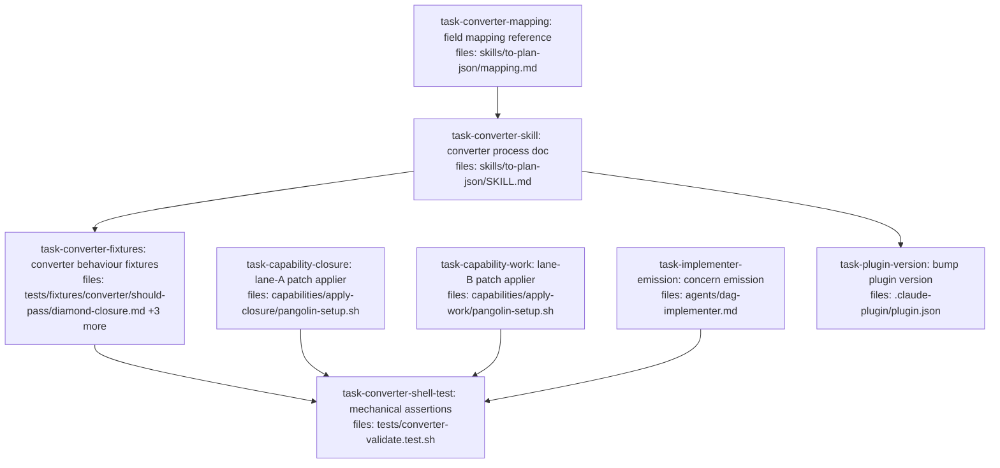

## Context

Child 2 of the **DAG plan → Pangolin orch bridge** charter (order 2 of 2). Charter:
`docs/superpowers/plans/2026-07-29-dag-pangolin-bridge-charter.md`. Driving spec:
`docs/superpowers/specs/2026-07-29-dag-pangolin-bridge-design.md`.

This child builds the plugin half: the `to-plan-json` converter skill, the two
`pangolin-setup.sh` capabilities that apply patches inside a worker, concern
emission from the implementer, and the converter's fixtures plus its hand-run
shell test.

**Repo conventions this plan follows:**
- Everything shipped is markdown or shell — there is no build, runtime, or
  package manifest beyond `.claude-plugin/`. Reference skill structure:
  `skills/writing-dag-plans/{SKILL.md,plan-format.md}` — a process doc plus a
  reference doc, not one monolith.
- There is **no CI** in this repo. Executable tests are hand-run shell scripts;
  reference implementations: `tests/concurrent-commit.test.sh` and
  `tests/stale-lock.test.sh`.
- Rule fixtures live at `tests/fixtures/<family>/should-{pass,refuse,warn}/*.md`
  and are LLM-graded, per `tests/fixtures/contracts/`.
- Because deliverables are prose, each task's H7 "failing test" block is a set of
  `grep -q` / `test -f` assertions that exit non-zero before the edit and zero
  after — the same anchor used by
  `docs/superpowers/plans/2026-05-04-dag-plan-contract-rules-dag.md`.

**Prerequisite:** the `bridge-stoa` child (order 1) should be complete, so the
canonical lock-path form the converter validates against exists as tested code.

**Out of scope here:** everything in the stoa repo, and any change to pangolin.

## Tasks

## Task: lane-A closure patch applier

```yaml
id: task-capability-closure
depends_on: []
files:
  - capabilities/apply-closure/pangolin-setup.sh
status: pending
```

The single static setup script every lane-A worker runs before its agent starts.
It applies the transitive-ancestor patches the converter bound, in topological
order. One script must serve every task in a run, because a worker's
`pangolin-setup.sh` is a single-slot last-write-wins file — synthesizing one per
task would collide and only the last would execute.

## Implementation

```sh
#!/bin/sh
# capabilities/apply-closure/pangolin-setup.sh
# Lane A: apply every bound ancestor patch in topological order.
#
# The converter names each `needs` key `NN-<task-id>` with a zero-padded
# topological index starting at 01, so the shell's lexicographic glob expansion
# IS dependency order. The workspace is a fresh checkout with no .git, so
# `git init` runs first to give `git apply` a repository to work in.
set -e
git init -q
for f in inputs/[0-9][0-9]-*; do
  [ -e "$f" ] || continue
  git apply "$f"
done
```

```bash
# Verification — passes after the edit, fails before the file exists
test -f capabilities/apply-closure/pangolin-setup.sh
grep -q 'git init -q' capabilities/apply-closure/pangolin-setup.sh
grep -q 'inputs/\[0-9\]\[0-9\]-\*' capabilities/apply-closure/pangolin-setup.sh
grep -q 'set -e' capabilities/apply-closure/pangolin-setup.sh
sh -n capabilities/apply-closure/pangolin-setup.sh   # syntax check, no execution
```

## Acceptance criteria

- File exists at `capabilities/apply-closure/pangolin-setup.sh` and passes
  `sh -n` (POSIX syntax check).
- Begins with `set -e` so any failing `git apply` aborts setup rather than
  letting the agent run against a half-applied workspace.
- Runs `git init -q` before any `git apply`, because the worker workspace is a
  fresh directory with no repository.
- Iterates the glob `inputs/[0-9][0-9]-*` exactly — matching the `NN-<task-id>`
  key form per Charter §C3, where `NN` is a zero-padded topological index
  starting at `01`. Lexicographic glob order is therefore dependency order.
- Guards each iteration with an existence test so a run with zero bound
  ancestors (an unexpanded glob) is a no-op rather than an error.
- Applies patches with `git apply` and does **not** commit, stage, or otherwise
  mutate git history — the worker's own patch capture diffs the working tree.
- Contains no task-specific values: this one static script is correct for every
  item in every lane-A run.

Test file: `tests/converter-validate.test.sh` (the shell test asserts this
script's presence and glob form alongside the converter's output).

## Task: lane-B work patch applier

```yaml
id: task-capability-work
depends_on: []
files:
  - capabilities/apply-work/pangolin-setup.sh
status: pending
```

The setup script for lane-B follow-up workers. A follow-up binds exactly one
upstream product under the key `work`, so this script is the single-patch
counterpart to the lane-A closure applier.

## Implementation

```sh
#!/bin/sh
# capabilities/apply-work/pangolin-setup.sh
# Lane B: apply the single bound implementer patch.
#
# Follow-up plans bind the implementer's patch under the key `work` — not a free
# choice, since pangolin's respawnLineage hardcodes `fixNeeds.work`, so a
# spawned fix receives the patch under that name too. One script serves the
# verifier and the fix alike.
set -e
git init -q
[ -e inputs/work ] && git apply inputs/work
exit 0
```

```bash
# Verification — passes after the edit, fails before the file exists
test -f capabilities/apply-work/pangolin-setup.sh
grep -q 'inputs/work' capabilities/apply-work/pangolin-setup.sh
grep -q 'git init -q' capabilities/apply-work/pangolin-setup.sh
sh -n capabilities/apply-work/pangolin-setup.sh
```

## Acceptance criteria

- File exists at `capabilities/apply-work/pangolin-setup.sh` and passes `sh -n`.
- Applies exactly the path `inputs/work` — the literal key required by Charter
  §C3, because pangolin's `respawnLineage` hardcodes `fixNeeds.work` and a
  spawned fix would otherwise read a different path than the authored item.
- Runs `git init -q` before `git apply`.
- Exits 0 when `inputs/work` is absent rather than failing, so an item with no
  bound patch still starts its agent.
- Does not reference the `NN-` numbered key form; that convention belongs to
  lane A only, and mixing the two in one script would let a lane-B worker
  silently apply nothing.

Test file: `tests/converter-validate.test.sh`.

## Task: implementer concern emission

```yaml
id: task-implementer-emission
depends_on: []
files:
  - agents/dag-implementer.md
status: pending
```

Give the implementer a durable channel for out-of-scope observations. Today
`DONE_WITH_CONCERNS` is prose the executor logs and discards; this adds a
machine-readable emission the harvest step can turn into backlog items, plus the
unattended-mode addendum that stops a container pausing for input nobody can
answer.

## Implementation

Add a subsection under `## Reporting status` describing the emission:

```markdown
### Emitting concerns for follow-up

When you report `DONE_WITH_CONCERNS`, also write your concerns to
`outputs/concerns` — **no file extension**. Write the file ONLY if you have at
least one concern; its absence is the normal case.

    {
      "schemaVersion": 1,
      "concerns": [
        {
          "title": "Split oversized scope-hash module",
          "files": ["src/core/scope-hash.ts"],
          "scope": "What should be done.",
          "out_of_scope": "What this explicitly does not cover.",
          "verification": "How a reviewer knows it is done."
        }
      ]
    }

Every `files` entry must be a repo-relative path with no leading `./`, forward
slashes only, no repeated or trailing slash, and no `*`, `?`, or `[`.

If a concern cannot be honestly expressed in all four sections, do NOT write it
to the file — leave it as prose in your report as a note for the human. A
half-specified follow-up cannot be verified, so it must not become a task.
```

Add to `## Hard rules`:

```markdown
- Never write a `needs_input` sentinel. When dispatched unattended there is
  nobody to answer, and a paused dispatch exits 0 with no product, which reads
  as success and fails the next task instead. If context is missing, write
  `outputs/blocked` explaining what you needed and exit non-zero.
```

```bash
# Verification — passes after the edit, fails before it
grep -q 'outputs/concerns' agents/dag-implementer.md
grep -q '"schemaVersion": 1' agents/dag-implementer.md
grep -q 'out_of_scope' agents/dag-implementer.md
grep -q 'needs_input' agents/dag-implementer.md
grep -q 'outputs/blocked' agents/dag-implementer.md
```

## Acceptance criteria

- `agents/dag-implementer.md` instructs writing concerns to the path
  `outputs/concerns` with **no file extension**, and states why: `outputRefs`
  keys are literal paths, so `concerns.json` would silently fail to bind.
- The documented envelope is exactly `{ "schemaVersion": 1, "concerns": [ … ] }`
  with each concern carrying `title`, `files`, `scope`, `out_of_scope`, and
  `verification` — all five keys, spelled as shown, per Charter §C1.
- The instruction states the file is written only when at least one concern
  exists, and that its absence is normal.
- The instruction states that a concern which cannot be expressed in all four
  sections is NOT written to the file and stays prose in the report, per Charter
  §I2 (four-section completeness is a precondition, never forced).
- The `files` path rule is inlined verbatim per Charter §C2: repo-relative, no
  leading `./`, forward slashes only, no repeated or trailing slash, and none of
  `*`, `?`, `[`.
- A hard rule forbids writing a `needs_input` sentinel and directs the agent to
  write `outputs/blocked` and exit non-zero instead, with the reason stated: a
  paused dispatch exits 0 carrying no product, so it reads as success and the
  failure surfaces on the wrong task.
- The four existing status values (`DONE`, `DONE_WITH_CONCERNS`,
  `NEEDS_CONTEXT`, `BLOCKED`) and every existing hard rule remain present and
  unmodified — this change is purely additive.

Test file: `tests/converter-validate.test.sh`.

## Task: converter field mapping reference

```yaml
id: task-converter-mapping
depends_on: []
files:
  - skills/to-plan-json/mapping.md
status: pending
```

The reference half of the converter skill: the DAG-plan-to-plan.json field
mapping, the ancestor-closure algorithm, and the terminal verify item. Split from
`SKILL.md` so the process doc stays a process doc, mirroring how
`writing-dag-plans` separates `SKILL.md` from `plan-format.md`.

## Implementation

The core of the document — the per-item emission shape:

```json
{
  "id": "task-3",
  "executor": "dispatch",
  "inputs": {
    "subagent": "dag-implementer",
    "workerInput": { "instructions": "<task body verbatim>", "files": ["src/c.ts"] }
  },
  "depends_on": [],
  "resourceLocks": ["src/c.ts"],
  "needs": {
    "01-task-1": { "from": "task-1", "select": { "kind": "patch" } },
    "02-task-2": { "from": "task-2", "select": { "kind": "patch" } }
  }
}
```

and the terminal item appended once per run:

```json
{
  "id": "_composed-verify",
  "executor": "dispatch",
  "inputs": { "subagent": "composed-verify", "pipeline": "<registered ref>" },
  "depends_on": [],
  "resourceLocks": [],
  "needs": { "01-task-1": { "from": "task-1", "select": { "kind": "patch" } } }
}
```

```bash
# Verification — passes after the edit, fails before the file exists
test -f skills/to-plan-json/mapping.md
grep -q '_composed-verify' skills/to-plan-json/mapping.md
grep -q 'resourceLocks' skills/to-plan-json/mapping.md
grep -q 'transitive' skills/to-plan-json/mapping.md
grep -q 'model_hint' skills/to-plan-json/mapping.md
```

## Acceptance criteria

- Documents the field mapping as a table covering all of: `id` → `items[].id`;
  `depends_on` → `needs` keys (transitive closure) with `depends_on: []` left
  empty; `files` → `resourceLocks`; task body → `inputs.workerInput.instructions`;
  `implementer` → `inputs.subagent` defaulting to `dag-implementer`;
  `model_hint` → a subagent **variant name**; `single_threaded: true` →
  `resourceLocks: ["_serial"]`; and `status`, `review_mode`, `*_reviewer_hint`
  as explicitly dropped.
- States that `model_hint` cannot become an item field because the model is
  resolved from the registered subagent definition, and names the three variants
  `dag-implementer-cheap` / `-standard` / `-opus`.
- Specifies the closure algorithm: for each task, compute the **transitive**
  `depends_on` ancestor set, topologically sort it, and bind each ancestor as a
  `needs` key named `NN-<ancestor-id>` with a zero-padded index starting at `01`,
  per Charter §C3.
- States that `depends_on` is emitted as `[]` because every `needs[*].from` is
  auto-unioned into `depends_on` at submit.
- States that `resourceLocks` are copied **verbatim** and that the converter
  **validates and refuses** rather than rewriting — a plan with a non-canonical
  path is refused, naming the task and the path. Inlines the canonical rule per
  Charter §C2: no leading `./`, forward slashes only, no repeated slashes, no
  trailing slash, not absolute, and none of `*`, `?`, `[`.
- Specifies the terminal `_composed-verify` item: exactly one per run, binding
  every task's patch under the same `NN-` numbering, `resourceLocks: []`, and
  carrying `inputs.pipeline` referencing a registered single-`script`-block
  pipeline whose `lens` is `verify`.
- States that the emitted run targets queue `dag` and that this queue must have
  **no pattern bound**, with the reason inlined: the `pipeline` pattern chains
  items whose `depends_on` is empty to their predecessor, which would serialize
  every independent root of the plan.
- States that every emitted item must carry a non-empty `inputs.subagent`, per
  Charter §I3, because `orch validate` does not check it but dispatch fails on it.

Test file: `tests/fixtures/converter/should-pass/diamond-closure.md`.

## Task: converter process doc

```yaml
id: task-converter-skill
depends_on: [task-converter-mapping]
files:
  - skills/to-plan-json/SKILL.md
status: pending
```

The process half of the converter skill: when to use it, the ordered steps from
reading a DAG plan to writing plan.json, the refusal conditions, and the
hand-off. Delegates all field-level detail to `mapping.md`.

## Implementation

```markdown
---
name: to-plan-json
description: Use when converting an authored, audited DAG plan into a pangolin `plan.json` for unattended execution. Emits one dispatch item per task with transitive ancestor patches bound via `needs`, plus one terminal composed-verify item. Refuses on non-canonical `files:` paths.
---

# Converting a DAG plan to plan.json

## Required reading

- `./mapping.md` — field mapping, closure algorithm, terminal verify item.

## Process

1. Read the DAG plan file.
2. **Validate every `files:` entry is canonical.** Refuse the whole conversion
   on the first deviation, naming the task and the path.
3. Build the task graph; verify it is acyclic and every `depends_on` resolves.
4. For each task compute the transitive ancestor closure, topologically sorted.
5. Emit one item per task per `./mapping.md`.
6. Append the `_composed-verify` item binding every task's patch.
7. Self-check: every item carries a non-empty `inputs.subagent`.
8. Write plan.json and print the item count.
```

```bash
# Verification — passes after the edit, fails before the file exists
test -f skills/to-plan-json/SKILL.md
grep -q '^name: to-plan-json' skills/to-plan-json/SKILL.md
grep -q 'mapping.md' skills/to-plan-json/SKILL.md
grep -q 'canonical' skills/to-plan-json/SKILL.md
grep -q 'inputs.subagent' skills/to-plan-json/SKILL.md
```

## Acceptance criteria

- Carries YAML frontmatter with `name: to-plan-json` and a `description`
  beginning "Use when", matching the frontmatter shape of
  `skills/writing-dag-plans/SKILL.md`.
- A `## Required reading` section points at `./mapping.md` as the field-level
  reference, mirroring how `writing-dag-plans/SKILL.md` points at
  `./plan-format.md`.
- Documents an ordered process containing at least these eight steps, in this
  order: read the plan; validate canonical `files:` paths; verify the graph is
  acyclic with resolving `depends_on`; compute each task's transitive ancestor
  closure; emit one item per task; append `_composed-verify`; self-check
  `inputs.subagent` on every item; write the file.
- States that a non-canonical or glob `files:` entry refuses the **entire**
  conversion — naming the offending task and path — and that the skill never
  rewrites a path, per Charter §C2.
- States the `inputs.subagent` self-check exists because `orch validate` does not
  check it while dispatch fails on it, per Charter §I3.
- Contains no field-mapping table of its own — every field-level detail is
  delegated to `mapping.md`, so the two documents never disagree.

Test file: `tests/fixtures/converter/should-pass/diamond-closure.md`.

## Task: converter behaviour fixtures

```yaml
id: task-converter-fixtures
depends_on: [task-converter-skill]
files:
  - tests/fixtures/converter/should-pass/diamond-closure.md
  - tests/fixtures/converter/should-pass/single-root.md
  - tests/fixtures/converter/should-refuse/non-canonical-path.md
  - tests/fixtures/converter/should-refuse/glob-in-files.md
status: pending
review_mode: merged
```

Four hand-graded fixtures pinning the converter's behaviour: two plans it must
convert and two it must refuse. Follows the existing
`tests/fixtures/<family>/should-{pass,refuse}/` layout used by the contracts and
tiers rule families.

## Implementation

`should-pass/diamond-closure.md` — a four-task diamond whose leaf must bind all
three ancestors:

```yaml
id: task-4
depends_on: [task-2, task-3]
files:
  - src/d.ts
status: pending
```

`should-refuse/non-canonical-path.md` — one task whose `files:` entry is not
canonical:

```yaml
id: task-1
depends_on: []
files:
  - ./src/a.ts
status: pending
```

```bash
# Verification — passes after the edit, fails before the files exist
test -f tests/fixtures/converter/should-pass/diamond-closure.md
test -f tests/fixtures/converter/should-pass/single-root.md
test -f tests/fixtures/converter/should-refuse/non-canonical-path.md
test -f tests/fixtures/converter/should-refuse/glob-in-files.md
grep -q 'Expected' tests/fixtures/converter/should-refuse/glob-in-files.md
```

## Acceptance criteria

- Exactly four fixture files exist at the paths listed in `files:`.
- Each fixture is a structurally valid DAG plan per
  `skills/writing-dag-plans/plan-format.md` — mermaid block, `## Context`,
  `## Tasks`, and per-task YAML with `id`, `depends_on`, `files`, `status`.
- Each fixture states its expected outcome inline under an `Expected` heading or
  comment, so the manual checklist runs without a separate expectations file —
  matching how `tests/fixtures/contracts/` fixtures are self-describing.
- `should-pass/diamond-closure.md` is a four-task diamond (`task-1` root;
  `task-2` and `task-3` both depending on `task-1`; `task-4` depending on both).
  Its stated expectation is that `task-4` binds **three** `needs` keys —
  `01-task-1`, `02-task-2`, `03-task-3` — in topological order, and that
  `_composed-verify` binds all four tasks.
- `should-pass/single-root.md` is a one-task plan whose stated expectation is
  that the task binds **zero** `needs` keys and the emitted run still contains
  exactly two items (the task plus `_composed-verify`).
- `should-refuse/non-canonical-path.md` contains a `files:` entry of `./src/a.ts`
  and its stated expectation is refusal naming that task and that path.
- `should-refuse/glob-in-files.md` contains a `files:` entry of `src/**/*.ts` and
  its stated expectation is refusal naming that task and that path.
- No fixture is expected to be silently rewritten — both refuse fixtures expect
  refusal, not repair, per Charter §C2.

Test file: `tests/converter-validate.test.sh`.

## Task: converter mechanical assertions

```yaml
id: task-converter-shell-test
depends_on:
  - task-converter-fixtures
  - task-capability-closure
  - task-capability-work
  - task-implementer-emission
files:
  - tests/converter-validate.test.sh
status: pending
```

The hand-run shell test carrying every converter assertion that needs no LLM
grader: that the shipped artifacts exist and are well-formed, and that the two
refuse fixtures are present with their expectations declared. Modelled on
`tests/concurrent-commit.test.sh`.

It depends on all four producing tasks — the fixtures, both capability scripts,
and the implementer emission — because it asserts on artifacts from each. A
narrower `depends_on` would let the executor dispatch it while those files are
still absent, producing a failure that looks like a broken test rather than a
scheduling error.

## Implementation

```sh
#!/usr/bin/env bash
# tests/converter-validate.test.sh — hand-run; no CI in this repo.
set -euo pipefail
cd "$(dirname "$0")/.."
fail=0
check() { if eval "$2" >/dev/null 2>&1; then echo "  ok   $1"; else echo "  FAIL $1"; fail=1; fi; }

echo "converter artifacts:"
check "skill present"        "test -f skills/to-plan-json/SKILL.md"
check "mapping present"      "test -f skills/to-plan-json/mapping.md"
check "closure capability"   "test -f capabilities/apply-closure/pangolin-setup.sh"
check "work capability"      "test -f capabilities/apply-work/pangolin-setup.sh"
check "closure glob form"    "grep -q 'inputs/\[0-9\]\[0-9\]-\*' capabilities/apply-closure/pangolin-setup.sh"
check "work key form"        "grep -q 'inputs/work' capabilities/apply-work/pangolin-setup.sh"
check "closure sh syntax"    "sh -n capabilities/apply-closure/pangolin-setup.sh"
check "work sh syntax"       "sh -n capabilities/apply-work/pangolin-setup.sh"
check "concerns path"        "grep -q 'outputs/concerns' agents/dag-implementer.md"
check "concerns version"     "grep -q '\"schemaVersion\": 1' agents/dag-implementer.md"
check "needs_input banned"   "grep -q 'outputs/blocked' agents/dag-implementer.md"

echo "fixtures:"
for f in should-pass/diamond-closure should-pass/single-root \
         should-refuse/non-canonical-path should-refuse/glob-in-files; do
  check "fixture $f" "test -f tests/fixtures/converter/$f.md"
done

exit $fail
```

```bash
# Verification — passes after the edit, fails before the file exists
test -f tests/converter-validate.test.sh
bash -n tests/converter-validate.test.sh
bash tests/converter-validate.test.sh
```

## Acceptance criteria

- File exists at `tests/converter-validate.test.sh`, passes `bash -n`, and exits
  0 when every checked artifact is present and correct.
- Exits non-zero when any single check fails, and prints one `ok` or `FAIL` line
  per check so a failure names which artifact is wrong.
- `cd`s to the repo root relative to its own location, so it runs correctly from
  any working directory — matching `tests/concurrent-commit.test.sh`.
- Asserts the presence of all six shipped artifacts: both skill documents, both
  capability scripts, and the four fixtures.
- Asserts the lane-A glob form `inputs/[0-9][0-9]-*` and the lane-B key
  `inputs/work` appear in their respective capability scripts — the two halves
  of Charter §C3, whose divergence would silently apply nothing.
- Asserts `sh -n` passes on both capability scripts.
- Asserts `agents/dag-implementer.md` contains `outputs/concerns`,
  `"schemaVersion": 1`, and `outputs/blocked`.
- Contains no assertion requiring a running pangolin, Docker, or network — the
  test is a static artifact check runnable on a bare checkout.

Test file: `tests/converter-validate.test.sh` (self-verifying).

## Task: bump plugin version

```yaml
id: task-plugin-version
depends_on: [task-converter-skill]
files:
  - .claude-plugin/plugin.json
status: pending
review_mode: merged
model_hint: cheap
```

Release bump for the new converter skill. Skills are discovered from `skills/`,
so no manifest registration is needed — only the version and keywords change.

## Implementation

```json
{
  "name": "parallel-dag-execution",
  "version": "0.5.0",
  "keywords": ["dag", "parallel", "subagents", "planning", "superpowers", "pangolin"]
}
```

```bash
# Verification — passes after the edit, fails before it
grep -q '"version": "0.5.0"' .claude-plugin/plugin.json
grep -q 'pangolin' .claude-plugin/plugin.json
node -e "JSON.parse(require('fs').readFileSync('.claude-plugin/plugin.json','utf8'))"
```

## Acceptance criteria

- `version` is exactly `0.5.0`, a minor bump from `0.4.0`, reflecting an additive
  feature with no breaking change to existing skills.
- `keywords` gains `pangolin` and retains all five existing entries
  (`dag`, `parallel`, `subagents`, `planning`, `superpowers`).
- `name`, `description`, `author`, `license`, `homepage`, and `repository` are
  unchanged.
- The file remains valid JSON, verified by parsing it.
- No `skills` key is added — skills are discovered from the `skills/` directory,
  and inventing a manifest key the loader does not read would be dead config.

Test file: `tests/converter-validate.test.sh`.
