```mermaid
flowchart TD
    task-charter-template["task-charter-template: charter role map"]
    task-resolver-script["task-resolver-script: resolve-declared-paths"]
    task-plan-schema["task-plan-schema: spec + default_implementer"]
    task-plan-quality-s16["task-plan-quality-s16: S16 rule"]
    task-lens-ambiguity["task-lens-ambiguity: gate-2 ambiguity lens"]
    task-audit-prepass-wiring["task-audit-prepass-wiring: step 2.6 + section 3.5"]
    task-reconciler-verdicts["task-reconciler-verdicts: D1 + D2"]
    task-exec-prompts-charter["task-exec-prompts-charter: section 2 in 4 templates"]
    task-exec-preflight["task-exec-preflight: executor pre-flight"]
    task-authoring-enforcement["task-authoring-enforcement: authoring skill contract"]
    task-exec-evidence["task-exec-evidence: red-to-green evidence"]
    task-crossrefs["task-crossrefs: enumeration sync"]
    task-fixtures-audit["task-fixtures-audit: audit fixtures"]
    task-fixtures-plan["task-fixtures-plan: plan fixtures"]
    task-release["task-release: version and packaging"]

    task-resolver-script --> task-audit-prepass-wiring
    task-resolver-script --> task-reconciler-verdicts
    task-charter-template --> task-exec-prompts-charter
    task-resolver-script --> task-exec-prompts-charter
    task-resolver-script --> task-exec-preflight
    task-plan-schema --> task-exec-preflight
    task-plan-schema --> task-authoring-enforcement
    task-plan-quality-s16 --> task-authoring-enforcement
    task-exec-prompts-charter --> task-exec-evidence
    task-audit-prepass-wiring --> task-crossrefs
    task-lens-ambiguity --> task-crossrefs
    task-plan-quality-s16 --> task-crossrefs
    task-reconciler-verdicts --> task-fixtures-audit
    task-lens-ambiguity --> task-fixtures-audit
    task-authoring-enforcement --> task-fixtures-plan
    task-exec-preflight --> task-fixtures-plan
    task-crossrefs --> task-release
    task-exec-evidence --> task-release
    task-exec-preflight --> task-release
    task-fixtures-audit --> task-release
    task-fixtures-plan --> task-release



    class task-audit-prepass-wiring done
    class task-plan-quality-s16 done
    class task-plan-schema done
    class task-exec-prompts-charter done
    class task-release done
    class task-lens-ambiguity done
    class task-crossrefs done
    class task-fixtures-plan done
    class task-fixtures-audit done
    class task-exec-preflight done
    class task-charter-template done
    class task-authoring-enforcement done
    class task-reconciler-verdicts done
    class task-exec-evidence done
    class task-resolver-script done

    classDef done fill:#90ee90,stroke:#333
    classDef ready fill:#fffacd,stroke:#333
    classDef running fill:#87ceeb,stroke:#333
    classDef failed fill:#ffb6c1,stroke:#333
    classDef skipped fill:#d3d3d3,stroke:#333,stroke-dasharray: 5 5
```

## Context

Implements `docs/superpowers/specs/2026-08-27-seams-and-ground-truth-design.md`
(components A–H plus release), taking the plugin from v0.5.0 to v0.6.0 — with
one stated exception: **spec F1's second consumer, gate 2 reading `spec:` as the
parent-spec path, is deferred to a follow-up release** and is not claimed here.
See `task-plan-schema` for the reasoning.

The spec's organizing principle: **a claim about repo state must be resolved
mechanically at the moment of use; a judgment procedure may stay prose.** That
is why component B ships an executable rather than another instruction, and why
the proposed verdict-class taxonomy is reduced to two deltas — the rest restates
`agents/dag-auditor.md:54-77`, which was already in force during every failure it
was meant to prevent.

**Why 15 tasks for 8 components.** A pre-DAG grep for `S1-S15` and for the gate-2
lens roster found both duplicated across six files — `writing-dag-plans/SKILL.md`,
`writing-dag-plans/plan-quality.md`, `updating-dag-plans/SKILL.md`,
`auditing-artifacts/SKILL.md`, `commands/audit-plan.md`, and `README.md` — which
`task-crossrefs` resolves into **eight distinct edit sites**, since two of those
files carry the range and the roster in separate places.
(`tests/fixtures/audit/README.md` carries the lens *roster* but zero `S1-S15`
hits — verified — so it is a roster site only.)
Adding one soft rule and one lens therefore touches four subsystems. Rather than
serialize the rule-authoring tasks behind each other, the cross-reference churn is
isolated in `task-crossrefs`, which depends on every task that changes a rule
name. The remaining splits are file-scope conflicts on
`skills/auditing-artifacts/SKILL.md`, `skills/writing-dag-plans/SKILL.md`, and the
three shared dispatch templates.

**This plan does not use the `spec:` frontmatter key it introduces.** The key does
not exist in `plan-format.md` until `task-plan-schema` lands, and declaring it
here would make the plan invalid against the format it is executed under.

## Rollout gate — the controller's step, not a task's

Some release steps cannot be acceptance criteria, because no role the executor
dispatches can discharge them. They run in the **quiescent window: after every
one of `task-release`'s dependencies reports `done`, and before `task-release`
dispatches.** That window matters — step 2 below needs a plain `git commit`
against a clean index, so it is not safe while any task is still `running`.

**Step 1 — run each new fixture once, at its named consumer.** That consumer is
a lens, a *rule*, or `dag-audit-reconciler`; reconcile the fixture's header, or
its `expectations/` key where the case has no header. Adding any undeclared
defect under `ALSO PRESENT` with its expected severity.

The reconciler case is easy to drop here and must not be: it has neither a named
lens nor a header, because `tests/fixtures/audit/reconciler/README.md:15` keeps
its grading key *outside* the case so the run cannot be contaminated. Dispatch
`dag-audit-reconciler` with the lens-report paths, the artifact path, **the case
directory as repo root, and the ground-truth table**, then score against
`expectations/unevidenced-world-claim.md`. Passing the table explicitly is
load-bearing: D2's rule turns on the table being *supplied*, so a reconciler that
instead discovers the table by looking around its repo root would pass the
fixture for the wrong reason — and a fixture that passes for the wrong reason is
worse than one that fails.

**Step 2 — set the helper's committed mode, out of band.**

```
git update-index --chmod=+x skills/auditing-artifacts/resolve-declared-paths
git commit -m "chore: mark resolve-declared-paths executable"
```

This does not violate `executing-dag-plans/SKILL.md:112` ("all implementer
commits go through `git-commit-safe`"): that rule binds *implementers*, and the
controller is not one. It is necessary because no implementer can achieve it —
`git-commit-safe:54` runs `git commit --only`, which records `100644` in the
**tree** even when the index holds `100755`, and this repo has
`core.filemode=false` so `chmod +x` is inert. The same thing happened to
`git-commit-safe` itself: it shipped `100644` at `c66edd9` and was raised
out-of-band at `4c61113`.

**Step 3 — append this run to `tests/fixtures/audit/README.md`'s `## Run
record`**, which otherwise ships attesting to a 10-fixture suite while 13 are
present.

This is not fussiness. `tests/fixtures/audit/README.md:134` records that this
repo has no fixture runner, and `:51-57` records that **six of eleven fixtures
carried real undeclared defects on their first run** — an undeclared defect makes
a lens unscoreable, and the natural reading of an unexpected finding is that the
lens misfired, which is backwards.

The reason it lives here rather than in a task: no agent in this repo's registry
has a dispatch tool. `dag-implementer` carries `[Read, Write, Edit, Bash, Glob,
Grep]`; every reviewer and auditor carries a subset. An implementer told to
"dispatch the lens" can only fabricate a report, self-grade and destroy the
blindness the fixture measures, or report BLOCKED. The controller has the tool;
the task does not.

## Tasks

## Task: charter role map

```yaml
id: task-charter-template
depends_on: []
files:
  - skills/auditing-artifacts/audit-charter-template.md
status: done
```

Spec component A. Give the charter a declared audience and a positive-form
verification section, so the execution-side roles have something addressed to
them.

Two additions. First, a role-to-section map near the top of the template stating
which of the three role groups reads which section — the source of truth that
`task-exec-prompts-charter` extracts against. `reviewers` means all three review
roles (`dag-spec-reviewer`, `dag-quality-reviewer`, `dag-merged-reviewer`); the
merged reviewer performs both halves in one pass and so takes the same set rather
than a union.

Second, a `## Verification commands` section. The existing `## Verification
gotchas` covers only commands that report success while having failed; it has no
place for the case where nothing lies and the correct command is merely
non-obvious, which is what an implementer needs most. One boundary line keeps the
two from drifting: gotchas holds the trap, the replacement command belongs in the
new table.

Existing section headings are not renamed or restructured — consumer repos have
copied them, and the role map addresses sections by name.

**Where the two new sections land, and why the count moves by two.** The file
has 8 `^## ` headings at HEAD, and they are not all in the same place: `## Grow
it from audit records` (:7) and `## Notes` (:97) sit *outside* the fenced
template body, while the six section headings a charter author copies sit
*inside* the fence that opens at :42 and closes at :93. The role map is guidance
for the charter author, so it goes outside the fence near the top. `##
Verification commands` is part of what gets copied, so it goes inside. Both are
`##`-level, so a whole-file `grep -c '^## '` — which is fence-blind — moves 8 →
10. Do not "fix" that number by demoting or deleting a heading.

## Implementation

```markdown
## Who reads what

| Section | auditor | implementer | reviewers |
|---|:---:|:---:|:---:|
| Enforcement map | yes | | yes |
| Hard invariants | yes | yes | yes |
| Named reference implementations | yes | yes | |
| Recurring bug classes | yes | yes | yes |
| Frozen decisions | yes | | |
| Verification gotchas | yes | yes | |
| Verification commands | yes | yes | yes |

`reviewers` = `dag-spec-reviewer`, `dag-quality-reviewer`, `dag-merged-reviewer`.

## Verification commands

What to run to prove a change in a given area actually works. Gotchas below
holds the trap; the command that replaces it belongs here.

| Area | Command that proves it | What it does not cover |
|---|---|---|
| e.g. <layer> | `<command>` | `<the gap>` |
```

```bash
# Minimum-viable failing check — red before, green after.
f=skills/auditing-artifacts/audit-charter-template.md
grep -q '^## Verification commands' "$f" \
  && grep -q '^## Who reads what' "$f" \
  && echo PASS || { echo "FAIL: role map or commands section absent"; exit 1; }
```

## Acceptance criteria

- The heading count rises by exactly 2, derived from a **pinned** revision: `A=$(git show 0e81fcb:skills/auditing-artifacts/audit-charter-template.md | grep -c '^## ')` and `B=$(grep -c '^## ' skills/auditing-artifacts/audit-charter-template.md)`; require `B - A = 2`. Pin the SHA — do **not** use `HEAD`. Acceptance criteria are evaluated after the implementer commits (`implementer-prompt.md:52`, `spec-reviewer-prompt.md:59`), so a `HEAD`-relative baseline moves with the very commit that satisfies it: the reviewer would re-run it, get `B - A = 0`, and fail a correct implementation with no way for the re-dispatched implementer to recover. If `0e81fcb` is unreachable after a rebase, the baseline is `8`.
- The new section is actually present: `grep -c '^## Verification commands' <file>` returns exactly `1`. Without this the scoped placeholder grep below passes vacuously when the section was never written at all.
- All 8 heading strings present at HEAD are still found by name after the edit — `Grow it from audit records`, `Enforcement map`, `Hard invariants`, `Named reference implementations`, `Recurring bug classes`, `Frozen decisions`, `Verification gotchas`, **and `Notes`**. `## Notes` carries the "where a charter entry and the code disagree, the code wins" rule that `task-exec-prompts-charter` requires the templates to restate, so losing it breaks a downstream task.
- The role-map table has exactly 7 data rows, one per section a charter author copies, and its header row names exactly 3 role columns (`auditor`, `implementer`, `reviewers`). Blank cells are meaningful and expected — a blank means that role does not read that section.
- The **new table alone** contains only generic placeholder rows: `sed -n '/^## Verification commands/,/^## /p' <file> | grep -icE 'nx|tsc|jest|vitest|pytest|npm run|localhost'` returns `0`. Scope matters — the same grep across the whole file returns `1` at HEAD and after a perfect edit, because the pre-existing Enforcement map ships `nx run <app>:check-migrations` at `:53` as an illustrative row. Do not delete that row to make a number move.
- The template states in one sentence that gotchas holds the trap and the replacement command belongs in the new table.

## Task: resolve-declared-paths helper

```yaml
id: task-resolver-script
depends_on: []
files:
  - skills/auditing-artifacts/resolve-declared-paths
status: done
model_hint: opus
spec_reviewer_hint: opus
quality_reviewer_hint: opus
```

Spec component B1–B3. The only new executable in the release, and the mechanism
the whole "facts get resolved, not asserted" principle rests on.

Both tiers are `opus` as a deliberate upshift beyond what S9 detects: none of its
novelty tokens match a path-resolution script, yet this is the only executable in
a repo of markdown, every other seam consumes its output, and its characteristic
failure — reporting a real file ABSENT — manufactures the exact defect class the
release exists to remove.

POSIX `sh`, extensionless, executable, mirroring
`skills/executing-dag-plans/git-commit-safe`. Emits two tables and exits `0` on a
completed run regardless of what it finds — findings are data, not failure. Exit
`2` on usage error, `1` when the artifact cannot be read.

Table 1, declared paths: every entry under a `files:` key in a task YAML block,
plus path-shaped backticked tokens in prose (containing `/` and a dot-extension).
Tokens containing `*`, `?`, or `://` are **skipped entirely** — a glob reported
ABSENT would manufacture the very false-absence finding this exists to kill.
Statuses: `EXISTS`, `ABSENT`, `DIR`.

Table 2, charter citations: for each `file:line` citation in a charter, resolve
the file, resolve the line into range, then match an anchor — alphanumeric tokens
of length 4 or more from the entry's label — against the cited line plus or minus
2 lines. The charter uses two entry shapes and both are handled: bullet sections
take the leading bolded name, table sections take the row's first cell. An entry
yielding no anchor reports `OK-UNANCHORED`, never `SUSPECT` — absence of an anchor
is a property of the entry's phrasing, not evidence of drift.

**The complete output contract, inlined because you will not see the spec.**
Three consumers paste these tables verbatim and gloss them for other readers, so
every value below is a cross-task contract, not an implementation detail.

Table 1 columns: `| path | declared at | on disk |`. The `declared at` cell takes
exactly one of **three** forms, and the consumers' interpretation rule partitions
on it — emit the form, not a bare line number:

- `task-<id> files:` — the path came from a task's `files:` list.
- `prose L<n>` — the path came from a backticked token in prose at line `n`.
- `frontmatter spec:` — the path came from the plan-level `spec:` key.

That distinction is the whole point: an `ABSENT` path from a create-task's
`files:` is expected, while an `ABSENT` path cited *in prose as already existing*
is the false-absence case this release exists to kill. A table that reports line
numbers for both cannot support that rule.

Table 2 columns: `| entry | cite | status |`. The five statuses, with the exact
condition that fires each:

| Status | Fires when |
|---|---|
| `OK` | file resolves, line in range, an anchor token matched |
| `OK-UNANCHORED` | file resolves, line in range, **no anchor could be extracted** from the entry |
| `SUSPECT` | file resolves, line in range, an anchor **was** extracted, and no anchor token appears within the cited line ±2 |
| `MOVED` | file exists, cited line number is past end of file |
| `GONE` | file does not exist |

`SUSPECT` is the citation-drift detector the release is built around. An
implementation that never emits it — treating every anchor-present-but-mismatched
citation as `OK` — is a no-op, so it is graded positively below rather than only
by its absence.

**Do not try to set the executable bit, and do not assert it.** You cannot,
and the check that looks like it works does not. This repo has
`core.filemode=false`, so `chmod +x` is inert; and `git-commit-safe:54` commits
via `git commit --only`, which records `100644` in the **tree** even when the
index holds `100755`. `git ls-files -s` reads the index, so it reports `100755`
and goes green while the shipped blob is non-executable. The same thing happened
to `git-commit-safe` itself — it shipped `100644` at `c66edd9` and was raised
out-of-band at `4c61113`.

Setting the mode is therefore a **rollout-gate step performed by the
controller**, outside the implementer path, and `task-release` verifies it with
`git ls-tree HEAD`. Write the file; leave the mode alone.

**One extraction rule beyond the tables above:** also resolve the plan-level
`spec:` frontmatter key when present, emitting it as a table-1 row with
`declared at` = `frontmatter spec:`. It is written unbackticked at plan level, so
it matches neither the `files:` clause nor the prose-token clause and would
otherwise be the one field the design most wanted resolved mechanically and the
one field never resolved. No dependency edge to `task-plan-schema` is needed:
this is a parsing rule stated in full here, and a script that extracts a key
before the format documents it is inert, not wrong.

## Implementation

```sh
#!/usr/bin/env sh
# resolve-declared-paths — ground-truth resolver for audit and execution seams.
# Usage: resolve-declared-paths <artifact> <repo-root> [charter ...]
set -eu

[ "$#" -ge 2 ] || { echo "usage: resolve-declared-paths <artifact> <repo-root> [charter ...]" >&2; exit 2; }
artifact="$1"; root="$2"; shift 2
[ -r "$artifact" ] || { echo "resolve-declared-paths: cannot read $artifact" >&2; exit 1; }

classify() {  # $1 = candidate path, relative to root
  case "$1" in *[*?]*|*://*) return 1 ;; esac   # never report globs or URLs
  if   [ -d "$root/$1" ]; then echo DIR
  elif [ -e "$root/$1" ]; then echo EXISTS
  else echo ABSENT
  fi
}

echo "DECLARED PATHS (resolved against the working tree, not inferred):"
echo "| path | declared at | on disk |"
echo "|---|---|---|"
# ... files: block extraction, then prose token extraction, each piped to classify
```

```sh
# Minimum-viable failing test — red until the script exists and behaves.
set -eu
tmp="$(mktemp -d)"; trap 'rm -rf "$tmp"' EXIT
mkdir -p "$tmp/repo/src"; : > "$tmp/repo/src/real.ts"
cat > "$tmp/plan.md" <<'EOF'
files:
  - src/real.ts
  - src/gone.ts
  - src/**/*.ts
EOF
out="$(skills/auditing-artifacts/resolve-declared-paths "$tmp/plan.md" "$tmp/repo")"
echo "$out" | grep -q 'src/real.ts .*EXISTS' || { echo "FAIL: existing path not EXISTS"; exit 1; }
echo "$out" | grep -q 'src/gone.ts .*ABSENT' || { echo "FAIL: missing path not ABSENT"; exit 1; }
echo "$out" | grep -q 'src/\*\*' && { echo "FAIL: glob was reported"; exit 1; }
echo PASS
```

## Acceptance criteria

- Run against a fixture plan declaring exactly 3 paths — one existing file, one missing file, one glob — the script exits `0`, table 1 contains exactly `2` data rows, and the glob appears in neither table (`grep -c '\*\*' <output>` returns `0`).
- The existing path's row reads `EXISTS` and the missing path's row reads `ABSENT`; a declared path that resolves to a directory reads `DIR` rather than `EXISTS`.
- Run against a charter containing one bullet entry with a valid citation, one table-row entry with a valid citation, and one entry with no extractable label, table 2 reports `OK`, `OK`, and `OK-UNANCHORED` respectively — and reports `SUSPECT` zero times.
- A citation whose file exists but whose line number exceeds the file length reads `MOVED`; a citation to a deleted file reads `GONE`.
- Invoked with one argument the script exits `2`; invoked with an unreadable artifact it exits `1`; both print a message naming the problem to stderr.
- **`SUSPECT` fires positively**, not merely "zero times elsewhere": given a charter entry whose cited line exists and is in range but contains none of the entry's anchor tokens within ±2 lines, table 2 reports `SUSPECT` for exactly that entry. Run alongside the `OK-UNANCHORED` case above so the two are demonstrably distinguished — an implementation that collapses both to `OK` fails this and passes if it is omitted.
- Every table-1 row's `declared at` cell reads either `task-<id> files:`, `prose L<n>`, or `frontmatter spec:` — never a bare line number. Given a fixture plan declaring one `files:` path, one prose path, and a `spec:` key, the three rows carry the three distinct forms.
- Do **not** assert the executable bit here. `git-commit-safe:54` commits with `git commit --only`, which records `100644` in the tree even when the index holds `100755`, and this repo has `core.filemode=false` so `chmod +x` is inert. `git ls-files -s` reads the **index** and would report `100755` — green, while the shipped blob is `100644`. Setting the mode is a rollout-gate step performed by the controller (`git update-index --chmod=+x` + a plain commit), and `task-release` verifies it against the **tree**.

## Task: plan schema additions

```yaml
id: task-plan-schema
depends_on: []
files:
  - skills/writing-dag-plans/plan-format.md
status: done
```

Spec component F. Two optional plan-level frontmatter keys.

`spec:` — a single file path to the design the plan implements; a superspec
charter where the design spans files, never a directory, because a directory
cannot be diffed against a claim. Provenance is unstructured prose today
(`plan-format.md:15` asks only for a `## Context` section), so nothing can
resolve it, diff against it, or notice supersession — yet that comparison is
gate 2's whole job and a `coherence-superseded-no-marker` fixture already exists.

`default_implementer:` — completes the chain `task.implementer` then
`default_implementer` then `dag-implementer`, matching the `default_*_hint`
pattern already documented in this file.

This task documents the schema only. Enforcement lives in
`task-authoring-enforcement` (authoring side) and `task-exec-preflight`
(executor side), which own those files.

**Scope decision on `spec:` consumption, stated so the coverage matrix does not
read as covered.** The frozen spec names two consumers: `resolve-declared-paths`,
and gate 2 as the parent-spec path. **Only the resolver half lands in v0.6.0** —
`task-resolver-script` extracts the key and emits it as a table-1 row. Making
`/audit-plan` prefer a declared `spec:` over its current filename search is a
behaviour change to the audit entry point (`auditing-artifacts/SKILL.md` step 1
and `commands/audit-plan.md`), and it does not belong as a rider on
`task-crossrefs`, whose `is_wiring_task: true` marks it as pure enumeration sync.
**The gate-2 consumption half is deferred to a follow-up release and is not
claimed here.**

## Implementation

```yaml
---
title: my-feature
created: 2026-05-02
spec: docs/superpowers/specs/2026-05-02-my-feature-design.md  # OPTIONAL. Single file. A superspec charter when the design spans files; never a directory.
default_implementer: dag-implementer   # OPTIONAL. subagent_type fallback for tasks lacking `implementer:`. Resolves task.implementer, then this, then dag-implementer.
default_model_hint: standard
---
```

```bash
# Minimum-viable failing check.
f=skills/writing-dag-plans/plan-format.md
grep -q '^spec:.*OPTIONAL' "$f" \
  && grep -q '^default_implementer:.*OPTIONAL' "$f" \
  && grep -q 'never a directory' "$f" \
  && echo PASS || { echo "FAIL: schema keys undocumented"; exit 1; }
```

## Acceptance criteria

- The frontmatter example block contains both `spec:` and `default_implementer:`, each marked `OPTIONAL`. Scoped to the block rather than the file: `sed -n '/^title: my-feature/,/^---$/p' skills/writing-dag-plans/plan-format.md | grep -c 'OPTIONAL'` returns `5` — the **3** present at HEAD (`default_model_hint`, `default_spec_reviewer_hint`, `default_quality_reviewer_hint`) plus the 2 new keys.
- The `spec:` documentation states it is a single file and that a directory is rejected, giving the reason (a directory cannot be diffed against a claim).
- The `default_implementer:` documentation states the exact three-step resolution order, naming `dag-implementer` as the final fallback.
- The prose states that an unresolvable `spec:` refuses rather than warns.

## Task: S16 rendered-output verification owner

```yaml
id: task-plan-quality-s16
depends_on: []
files:
  - skills/writing-dag-plans/plan-quality.md
status: done
```

Spec component G. A soft heuristic, in the S-series, firing once per plan.

Generic form of a recorded lesson: *a gate no task owns is a gate nobody runs.*
Per-task gates structurally cannot cover a cross-task rendered result, and the
defect class this targets — inferred columns, an empty async dropdown, an
orphaned overlay, an invisible toast — is invisible to unit tests, spec review and
quality review alike.

Detection names **file extensions only**. No framework, component library, port,
or dev-server command may appear, per the release's non-goals.

Firing once per plan rather than once per task follows the S12–S15 reasoning
already in this file: the unit of the defect sets the unit of the warning, and a
missing owner is a plan-level gap.

This task adds the rule and its row in the detection algorithm. The `S1-S15`
range references in other files are owned by `task-crossrefs`.

## Implementation

```markdown
| S16 | **Rendered-output change with no verification owner** | Trigger: some task's `files:` contains a rendered-surface file — by extension `.tsx`, `.jsx`, `.vue`, `.svelte`, `.component.html`, `.html`; style files (`.css`, `.scss`) count only when a task also carries one of the preceding — AND no task's acceptance criteria name a rendered-surface check. A gate no task owns is a gate nobody runs, and per-task gates structurally cannot cover a cross-task rendered result. **Suppressor:** any task already owns visual verification — judged by whether a criterion checks rendered output at all, *not* by whether it names all three parts of the fix shape. **Fires once per plan**, not once per task — a missing owner is a plan-level gap. Suggested fix: add a task owning visual verification, naming the surface, the entry point, and the actor. |
```

```bash
# Minimum-viable failing check.
f=skills/writing-dag-plans/plan-quality.md
grep -q '^| S16 |' "$f" \
  && grep -q 'once per plan' "$f" \
  && [ "$(grep -icE 'react|angular|vue-cli|primeng|localhost|npm run|ng serve' "$f")" = 0 ] \
  && echo PASS || { echo "FAIL: S16 absent or names a framework"; exit 1; }
```

## Acceptance criteria

- A row `| S16 |` exists in the soft-heuristics table, and `grep -c '^| S1[0-6] |' <file>` returns exactly `7` (S10 through S16), confirming S16 was appended without disturbing S10–S15.
- The rule text names exactly 6 triggering extensions (`.tsx`, `.jsx`, `.vue`, `.svelte`, `.component.html`, `.html`) and states that style files count only alongside one of them.
- The rule states it fires once per plan and names its suppressor.
- The rule names no framework, component library, port, or dev-server command: `grep -icE 'react|angular|\bvue-cli\b|primeng|localhost|npm run|ng serve|vite' <file>` returns `0`.
- Step 3 of the detection algorithm reads `S1-S16` rather than `S1-S15`.

## Task: gate-2 ambiguity lens

```yaml
id: task-lens-ambiguity
depends_on: []
files:
  - skills/auditing-artifacts/lenses-plan.md
status: done
```

Spec component E. Gate 1 has an `ambiguity` lens; gate 2 does not, and plan-side
`coverage` and `verifiability` both pass a faithfully transcribed ambiguous
requirement — the plan is a faithful rendering of an unfalsifiable ask.

This lens is deliberately **not** a copy of gate 1's. Lenses are told the parent
spec is "APPROVED AND FROZEN — do not reopen its design decisions", so the scope
is ambiguity the plan introduced in transcription; ambiguity the plan inherited
and failed to resolve (the plan's job is to make a requirement executable, so
transcribing an unfalsifiable ask faithfully is a plan defect even though the
spec is its source); and requirements that cannot be false, so no test can fail.

Explicitly out of scope: relitigating a spec decision that is clear but that the
lens would have decided differently. Without that boundary the lens generates
exactly the churn the frozen-spec rule exists to prevent.

Roster and coverage-table updates in other files belong to `task-crossrefs` and
`task-fixtures-audit`.

**Mirror the shape of the existing lens fragments in this same file** — a `##`
heading naming the lens, a one-line **bolded** question (every existing fragment
uses `**bold**`, e.g. `:26`, `:78`, `:110`), then the hunting bullets, closing
with a `---` separator. Do not mirror `lenses-spec.md`'s `ambiguity`: it is the
gate-1 lens this one deliberately differs from.

**The fragment alone is not enough — this file has two other sites that must
move with it, and both are load-bearing:**

1. **The catalog table at `:12-20`** gains an `ambiguity` row with a concern
   phrase and an **explicit default tier**. `SKILL.md:166` selects "all lenses
   from the matching catalog" and `:193` says "Tier defaults come from the
   catalog" — so a fragment with no catalog row has no declared tier for the
   controller to resolve, and under the stricter reading of `:166` may not be
   dispatched at all. Use `opus`: the three nearest concerns (`coverage`,
   `context-sufficiency`, `verifiability`) are all `opus`.
2. **The header at `:3`** reads "**Seven lenses**, dispatched concurrently". It
   becomes "Eight".

## Implementation

```markdown
## `ambiguity`

**ambiguity** — did the plan resolve what it inherited, and did it introduce any?

Gate 1 asks whether a requirement is ambiguous. You ask something narrower,
because the parent spec is frozen and its design decisions are not yours to
reopen:

- **Introduced in transcription.** A spec requirement that was clear and became
  ambiguous in the task body carrying it.
- **Inherited and unresolved.** The plan's job is to make a requirement
  executable. Transcribing an unfalsifiable ask faithfully is a *plan* defect,
  even though the spec is its source. Name the resolution the plan owed it.
- **Cannot be false.** A requirement no observation could contradict, so no test
  can fail. Ask: what state of the world would violate this? If none, it is
  unfalsifiable regardless of how precisely it is worded.

**Out of scope — do not report:** a frozen spec decision that is clear but that
you would have decided differently. That is relitigation, not ambiguity.
```

```bash
# Minimum-viable failing check.
f=skills/auditing-artifacts/lenses-plan.md
grep -q '^## `ambiguity`' "$f" \
  && grep -q -i 'out of scope' "$f" \
  && grep -q -i 'relitigat' "$f" \
  && echo PASS || { echo "FAIL: lens absent or unscoped"; exit 1; }
```

## Acceptance criteria

- `skills/auditing-artifacts/lenses-plan.md` contains exactly `8` lens headings, and all 7 present at HEAD are still found by name (`coverage`, `dag-integrity`, `grounding`, `charter`, `context-sufficiency`, `verifiability`, `coherence`) — so the count rises by the one new lens rather than by a rename.
- The lens body enumerates exactly 3 in-scope shapes and names each one.
- The lens carries an explicit out-of-scope clause naming relitigation of a clear frozen spec decision as a non-finding.
- The lens text distinguishes its question from gate 1's in one sentence, so a reader can tell the two apart without opening `lenses-spec.md`.
- The catalog table has exactly `8` data rows, and its `ambiguity` row carries a non-empty concern phrase and a default tier drawn from `{cheap, standard, opus}`. A fragment without a catalog row ships a lens the controller cannot tier.
- `grep -c 'Seven lenses' skills/auditing-artifacts/lenses-plan.md` returns `0`, and the header states eight. It returns `1` at HEAD, so this fails before and passes after.

## Task: audit pre-pass wiring

```yaml
id: task-audit-prepass-wiring
depends_on: [task-resolver-script]
files:
  - skills/auditing-artifacts/SKILL.md
  - skills/auditing-artifacts/auditor-prompt.md
  - skills/auditing-artifacts/reconciler-prompt.md
status: done
```

Spec component B4, audit side. Hook the resolver into the skill and hand its
output to every lens as facts.

`SKILL.md` gains **step 2.6**, between downstream artifacts (2.5) and the
prior-audit check (3) — that is, before the lens fan-out at step 5. Running once
before fan-out is the point, not a side effect: today each of 7 lenses
independently globs, greps and stats the same handful of paths, roughly 20–40
redundant tool calls per audit and 7 private inferences where one shared
resolution would do.

`auditor-prompt.md` gains a block at **section 3.5**, before the lens fragment.
The table is byte-identical across all N dispatches and therefore belongs in the
cache-stable prefix, per the template's existing ordering comment.

Two interpretation lines travel with the table, and one hard guarantee: **a lens
may not contradict an `EXISTS`.** That is the entire measured defect class and it
needs no judgment to enforce. If the helper cannot run, the skill states "path
pre-pass did not run" rather than omitting the block — the same "none found is not
the same as omitted" rule already applied at `auditor-prompt.md:16-19`.

**The status glossary you must write into the prompt, inlined because you will
not see the spec or the helper's source.** Write these conditions, not a guess at
what the names suggest — `MOVED` in particular reads naturally as "the content
moved", when it means only that the cited line number is past end of file:

| Status | Means |
|---|---|
| `EXISTS` / `ABSENT` / `DIR` | table 1: the declared path resolves to a file, to nothing, or to a directory |
| `OK` | table 2: file resolves, line in range, an anchor token matched |
| `OK-UNANCHORED` | file resolves, line in range, no anchor could be extracted from the entry — **not** evidence of drift |
| `SUSPECT` | file resolves, line in range, an anchor was extracted and none of its tokens appear within the cited line ±2 |
| `MOVED` | file exists, cited line number is past end of file |
| `GONE` | file does not exist |

**The reconciler needs table 1 too, and does not currently receive it.** D2's
downgrade rule turns on "contradicts the ground-truth table", but
`reconciler-prompt.md:7-14`'s MUST-receive list is lens-report paths, artifact
and spec paths, repo root, and failed-lens names — no table — and step 7 passes
the same list. Thread it through both: add the ground-truth tables to step 7's
dispatch and to the reconciler prompt's MUST-receive list and template. Without
this, half of D2 is a rule referencing an input its reader never gets.

## Implementation

```markdown
2.6. **Resolve declared paths before dispatching.** Run
   `./resolve-declared-paths <artifact> <repo-root> <charter-paths...>` once and
   pass its tables verbatim to every lens. This replaces N private resolutions
   with one shared one, before any lens runs.

   If the helper cannot run, say so explicitly to every lens — "path pre-pass did
   not run" — rather than omitting the block. A lens told nothing assumes nothing.
```

```markdown
GROUND TRUTH (resolved before dispatch — these are facts, not claims):
{path_table}
{charter_citation_table}

Read this table before reporting on any path. An ABSENT entry in a create-task's
`files:` is EXPECTED, not a finding. A path cited in prose as already existing
that is ABSENT is a real finding. A `frontmatter spec:` path that is ABSENT is a
provenance defect — the plan names a design document that is not there.
**You may not contradict an EXISTS.**
```

```bash
# Minimum-viable failing check.
grep -q '^2.6\.' skills/auditing-artifacts/SKILL.md \
  && grep -q 'resolve-declared-paths' skills/auditing-artifacts/SKILL.md \
  && grep -q 'may not contradict an EXISTS' skills/auditing-artifacts/auditor-prompt.md \
  && echo PASS || { echo "FAIL: pre-pass not wired"; exit 1; }
```

## Acceptance criteria

- `SKILL.md` contains a step numbered `2.6` positioned strictly between `2.5` and `3`. Capture the three line numbers and compare them: `L25=$(grep -n '^2\.5\.' <file> | cut -d: -f1)`, `L26=$(grep -n '^2\.6\.' <file> | cut -d: -f1)`, `L3=$(grep -n '^3\. ' <file> | cut -d: -f1)`; require `L25 < L26 < L3`. Every three of those must exist. (A bare `grep -n` listing is ascending by construction and proves nothing.)
- Step 2.6 names the helper by its relative path and states that it runs once, before dispatch.
- Step 2.6 states the did-not-run fallback wording explicitly, so a failed helper produces a stated notice rather than an omitted block.
- `auditor-prompt.md` places the ground-truth block **inside the prompt template and before the lens**: the `GROUND TRUTH` line falls between the opening fence of `## Prompt template` and the `YOUR LENS:` line. A line-number comparison alone is satisfied by text placed anywhere above `YOUR LENS:`, including outside the template where no lens would ever read it.
- The prompt block carries both interpretation lines and the sentence forbidding a lens from contradicting an `EXISTS`.
- The prompt explains all 5 charter-citation statuses the helper can emit — `OK`, `OK-UNANCHORED`, `SUSPECT`, `MOVED`, `GONE` — and all 3 declared-path statuses — `EXISTS`, `ABSENT`, `DIR`. Each gloss states the firing *condition* from the table in this task's body, not a paraphrase of the name: in particular `MOVED` must say "cited line is past end of file", not "the content moved".
- `reconciler-prompt.md`'s "The reconciler MUST receive:" list names the ground-truth tables, and its prompt template carries a substitution slot for them. `grep -c 'ground.truth\|GROUND TRUTH' skills/auditing-artifacts/reconciler-prompt.md` returns at least `2` where it returns `0` at HEAD.
- `SKILL.md` step 7's dispatch instruction passes the tables alongside the lens-report paths, so the reconciler's D2 rule has the input it turns on. Without this the rule references something its reader is never given.

## Task: reconciler verdict deltas

```yaml
id: task-reconciler-verdicts
depends_on: [task-resolver-script]
files:
  - agents/dag-audit-reconciler.md
status: done
```

Spec component D. Two changes only — the severity taxonomy already exists at
`agents/dag-auditor.md:110-125` and is not restated here.

**D1:** `EMPIRICAL-UNKNOWN` resolves to an acceptance criterion on the owning
task, with a probe task only where no task owns the surface. Today's
unconditional probe task adds a DAG node for something an existing task can
carry. The READY rule follows.

**D2:** the downgrade-rules block gains one clause. A world-claim — a claim about
repo state — that contradicts the pre-pass table, or that carries neither command
output nor citation, downgrades to `UNVERIFIABLE` with the reason logged. No new
machinery: the downgrade log already exists and is already surfaced to the author,
and this rides it.

## Implementation

```markdown
- **EMPIRICAL-UNKNOWN** — becomes **an acceptance criterion on the task that owns
  the surface**, with the settling command stated. Only where no task owns it does
  it become a probe task. An AC on an existing task is cheaper than a new node.

**Downgrade rules** (added clause):

- A **world-claim** — a claim about the state of the repo, not about the document
  — downgrades to `UNVERIFIABLE` when it contradicts the ground-truth table, or
  when it carries neither command output nor a `file:line` citation. Log it like
  any other downgrade: the lens, its claim, its severity, yours, and why.
```

```bash
# Minimum-viable failing check.
f=agents/dag-audit-reconciler.md
grep -q 'acceptance criterion on the task that owns' "$f" \
  && grep -q -i 'world-claim' "$f" \
  && echo PASS || { echo "FAIL: reconciler deltas absent"; exit 1; }
```

## Acceptance criteria

- The `EMPIRICAL-UNKNOWN` severity line names an acceptance criterion on the owning task as the primary resolution and a probe task as the fallback, in that order.
- The READY verdict rule reads consistently with it: it requires each `EMPIRICAL-UNKNOWN` to name either an owning task's criterion or a probe task, and `grep -c 'owning probe task' <file>` returns `0`, proving the old unconditional wording is gone.
- The downgrade-rules block contains a world-claim clause naming both downgrade conditions (contradicts the table; carries neither command output nor citation) and the target severity `UNVERIFIABLE`. The second condition stands alone and needs no table; the first turns on **the ground-truth table supplied in this prompt**. Word the rule that way — name the *input*, never a task id. This file ships to consumer repos, where a reference like `task-audit-prepass-wiring` is meaningless.
- The world-claim clause states the downgrade is logged, and the surrounding "never silently delete" rule is still present in the file.

## Task: dispatch templates carry charter sections

```yaml
id: task-exec-prompts-charter
depends_on: [task-charter-template, task-resolver-script]
files:
  - skills/executing-dag-plans/implementer-prompt.md
  - skills/executing-dag-plans/spec-reviewer-prompt.md
  - skills/executing-dag-plans/quality-reviewer-prompt.md
  - skills/executing-dag-plans/merged-reviewer-prompt.md
status: done
```

Spec component C, template half — and a latent bug fix.

All three reviewer templates declare `(2) project conventions (if any)` in their
section-order comments (`spec-reviewer-prompt.md:23`,
`quality-reviewer-prompt.md:24`, `merged-reviewer-prompt.md:13`) and **none of the
three contains such a section.** The seam was designed and never wired. Only
`implementer-prompt.md:34-36` delivers it.

Each template gains, or widens, a `## Project conventions` section carrying that
role's charter sections per the role map, plus the citation-status table so a
`SUSPECT`, `MOVED`, or `GONE` entry arrives flagged rather than as bare prose.

Three rules. **Verbatim sections, never a summary** — `auditing-artifacts` step 2
already states "do not summarize it for them", and inlining verbatim honours that
while keeping content in the cache-stable prefix. **"(none found)" is written
explicitly**, never omitted. And **a charter section is context for the remit a
role already owns, not a new remit** — the quality reviewer is told "Do NOT flag
missing/extra requirements", and charter content must not quietly reopen that
boundary.

## Implementation

```markdown
## Project conventions

{contents of repo's CLAUDE.md, if any, or "(none found)"}

Charter sections for your role (verbatim, not summarized):
{charter_sections_for_role}
{if none} (none found — proceed; do not substitute generic best practice){/if}

Citation freshness for the entries above:
{charter_citation_table}
An entry marked SUSPECT, MOVED or GONE may be stale — where it and the code
disagree, the code wins. This is context for the review you already own; it does
not widen what you may flag.
```

```bash
# Minimum-viable failing check — all four templates, red until each has section 2.
for f in implementer spec-reviewer quality-reviewer merged-reviewer; do
  p="skills/executing-dag-plans/${f}-prompt.md"
  grep -q '^## Project conventions' "$p" || { echo "FAIL: $p lacks section 2"; exit 1; }
  grep -q 'none found' "$p" || { echo "FAIL: $p lacks the absent-charter wording"; exit 1; }
done
echo PASS
```

## Acceptance criteria

- All 4 templates contain a `## Project conventions` heading inside the fenced prompt template: `grep -lc '^## Project conventions' skills/executing-dag-plans/*-prompt.md` lists exactly 4 files, up from 1 at HEAD.
- In each template the `## Project conventions` heading appears before the `## Task spec` heading, keeping it in the cache-stable prefix the section-order comment reserves.
- Each template's charter placeholder names the role's own section set and matches the role map in `audit-charter-template.md` row for row.
- Each template writes `(none found)` for an absent charter rather than omitting the section.
- The reviewer templates retain their existing remit boundaries: `grep -c 'Do NOT flag missing/extra requirements' quality-reviewer-prompt.md` returns `1`, and the added text states the charter does not widen what the role may flag.
- The templates use exactly these two substitution placeholders, spelled identically in all 4 files: `{charter_sections_for_role}` and `{charter_citation_table}`. `task-exec-preflight` fills these by name and never sees this file, so a spelling difference breaks the seam silently — these two strings are the contract between the two tasks.
- The stale-entry guidance names all 3 statuses that indicate possible drift — `SUSPECT`, `MOVED`, `GONE` — and states the existing rule that where a charter entry and the code disagree, the code wins.
- Each of the 4 templates carries a "citation pre-pass did not run" line for the case where the helper fails, distinct from the "(none found)" line for an absent charter. The two conditions differ: a charter can exist while its freshness is unknown, and rendering its prose unflagged presents a possibly-stale entry as verified.

## Task: executor pre-flight

```yaml
id: task-exec-preflight
depends_on: [task-resolver-script, task-plan-schema]
files:
  - skills/executing-dag-plans/SKILL.md
status: done
```

Spec component C (skill half) and the executor half of component F — F1's
`spec:` and F2's `default_implementer`, whose schema `task-plan-schema`
documents. Both edit the same pre-flight paragraph —
the one already checking the agent registry and `*_hint` values — so they are one
task by file scope and one concern by subject: what the executor resolves and
validates before the first tick.

Three additions, all in that paragraph, all once-per-run rather than per-dispatch:

- **Charter location** — root and nested `CLAUDE.md`/`AGENTS.md` and
  `.claude/audit-charter.md`, mirroring `auditing-artifacts` step 2.
- **The execution-side helper run** — charter citations only. The declared-paths
  table is not produced here: an executor's plan describes files that do not exist
  yet by design, so that table carries no signal on this side.
- **Schema validation** for `spec:` (must resolve; refuse if not) and
  `default_implementer` (must resolve in the agent registry). The registry
  pre-flight currently validates "every distinct `implementer:` value" and must
  include the plan-level default, or a typo there escapes pre-flight and fails at
  dispatch — violating the no-silent-fallback rule the `*_hint` fields hold.

Two further edits outside that paragraph, both in-sentence — the tick loop keeps
its step count and order:

- **Step 4's dispatch sentence currently encodes a two-step chain** and would
  discard the field this task validates: *"The dispatched `subagent_type` is the
  task's `implementer:` field, defaulting to `dag-implementer` when absent."*
  Rewrite it as the three-step chain — `task.implementer`, then
  `default_implementer`, then `dag-implementer`. Without this an author sets a
  plan-level default, pre-flight resolves it in the registry and passes, and
  every task lacking `implementer:` still dispatches to `dag-implementer` — the
  exact silent fallback the no-silent-fallback rule exists to prevent.
- **The helper-cannot-run notice.** If `resolve-declared-paths` fails on this
  side, the four dispatch templates must say so rather than rendering an empty
  `{charter_citation_table}` — which would present possibly-stale charter prose
  as verified, the precise hazard the freshness mechanism exists to remove.

Otherwise strictly additive: the tick loop is not restructured.

## Implementation

```markdown
Pre-flight check (once, before the first dispatch tick):

… existing registry and `*_hint` validation …

Also resolve `default_implementer` against the agent registry — the same check as
`implementer:`, since a plan-level typo must not survive to dispatch. Also resolve
`spec:` if present; a `spec:` that does not resolve to a readable file halts,
naming the field and value. No silent fallback.

Also locate charter material — root and nested `CLAUDE.md`/`AGENTS.md`, and
`.claude/audit-charter.md` — and run
`../auditing-artifacts/resolve-declared-paths <plan> <repo-root> <charter...>`
for its citation table. Pass both into every dispatch (see the four prompt
templates). The declared-paths table is not used here: a plan names files that do
not exist yet by design.
```

```bash
# Minimum-viable failing check.
f=skills/executing-dag-plans/SKILL.md
grep -q 'default_implementer' "$f" \
  && grep -q 'resolve-declared-paths' "$f" \
  && grep -q 'audit-charter.md' "$f" \
  && echo PASS || { echo "FAIL: pre-flight not extended"; exit 1; }
```

## Acceptance criteria

- The pre-flight paragraph names `default_implementer` as subject to the same registry check as `implementer:`, and states the halt behaviour with no silent fallback.
- The pre-flight paragraph states that an unresolvable `spec:` halts, naming the field and the offending value in the error.
- The pre-flight paragraph names the 3 charter sources (root/nested `CLAUDE.md`, `AGENTS.md`, `.claude/audit-charter.md`) and states that location happens once, before the first tick.
- The helper invocation appears with its relative path from `executing-dag-plans`, and the text states that only the citation table is consumed here, giving the reason.
- The text names the two substitution placeholders it fills in the dispatch templates, spelled exactly `{charter_sections_for_role}` and `{charter_citation_table}`. This task and `task-exec-prompts-charter` never see each other's file, so these two strings are the contract between them and must be inlined here rather than pointed at.
- Step 4's dispatch sentence names all three resolution steps in order — the per-task `implementer:`, then `default_implementer`, then `dag-implementer`. `grep -c 'defaulting to `dag-implementer` when absent' <file>` returns `0`, retiring the two-step wording.
- The pre-flight text names the helper-failure branch and states the exact wording it substitutes — `citation pre-pass did not run` — rather than leaving the table silently empty. Scope this to what `SKILL.md` can carry: assert the pre-flight's own text, not a property of the four `*-prompt.md` files, which this task neither owns nor is ordered after. `task-exec-prompts-charter` owns the template side of that string.
- The tick-loop steps are unchanged in **count and order**, checked by content anchor rather than line range: extract the numbered step markers between the `## Execution model` and `## Per-task review chain` headings and require the sequence `1 2 3 4 5 6 7`. A bare `grep -c` returns `1` here — it matches a single line — so it observes neither count nor order, and a line-range check would break the moment the additions above shift the file.

## Task: authoring-skill enforcement of the new contract

```yaml
id: task-authoring-enforcement
depends_on: [task-plan-schema, task-plan-quality-s16]
files:
  - skills/writing-dag-plans/SKILL.md
status: done
```

Enforcement half of components F and G. Both land in this one file, which is why
they are one task rather than two blocked on each other.

Step 6 (structural validation) gains the two new plan-level keys: `spec:` must
resolve to a readable file, `default_implementer` must be a non-empty string, and
either failing refuses without writing the plan. Step 11 (write the plan file)
gains automatic emission of `spec:` — the skill already knows the spec it was
invoked from, so new plans carry provenance without anyone opting in, while
existing plans keep working because the key is optional.

Step 7's soft-heuristic enumeration and the reference-doc line at the top both
widen from `S1-S15` to `S1-S16`.

## Implementation

```markdown
   - Plan-level key resolution: `spec:`, when present, MUST resolve to a readable
     file — refuse naming the unresolvable path. `default_implementer`, when
     present, MUST be a non-empty string; the executor pre-flight resolves it
     against the agent registry.

   - Soft heuristics S1-S16 (…, **rendered-output change with no verification
     owner**). Collect as warnings.
```

```bash
# Minimum-viable failing check.
f=skills/writing-dag-plans/SKILL.md
[ "$(grep -c 'S1-S15' "$f")" = 0 ] \
  && [ "$(grep -c 'S1-S16' "$f")" -ge 2 ] \
  && grep -q 'spec:' "$f" \
  && echo PASS || { echo "FAIL: enforcement or range not updated"; exit 1; }
```

## Acceptance criteria

- `grep -c 'S1-S15' skills/writing-dag-plans/SKILL.md` returns `0` and `grep -c 'S1-S16' <file>` returns exactly `2` — the reference-doc line and step 7 — matching the 2 occurrences of the old range at HEAD.
- Step 7's parenthetical list of soft heuristics names the S16 concern, so the enumeration and the count agree.
- Step 6 states that an unresolvable `spec:` refuses without writing the plan, and names the path in the refusal.
- Step 11 states that `spec:` is written automatically from the invoking spec's path, and that its absence is not an error for a plan authored without one.

## Task: red-to-green evidence at review

```yaml
id: task-exec-evidence
depends_on: [task-exec-prompts-charter]
files:
  - skills/executing-dag-plans/implementer-prompt.md
  - skills/executing-dag-plans/quality-reviewer-prompt.md
  - skills/executing-dag-plans/merged-reviewer-prompt.md
status: done
```

Spec component H. `dag-implementer` already carries
`skills: [test-driven-development]`, so it already observed the failing test — it
was simply never asked to report it.

The implementer's DONE output block gains a required field for test-bearing
tasks: the assertion that failed and its message, observed before the fix. The
quality and merged reviewers gain an approval criterion — that evidence must be
present and coherent with the diff (the named assertion exists in it and could
plausibly have failed as reported), else `ISSUES`.

Chosen over reviewer-run mutation as the default because the evidence is captured
where it is free, and verifying it costs a read rather than an execution across
every test-bearing task in a plan. One narrow escalation is retained: where a
task's stated value *is* the guard — a regression test, a security assertion —
the reviewer runs the mutation itself.

Depends on `task-exec-prompts-charter` because both edit three of the same
templates; that task lands section 2 first, this one extends the output contract.

## Implementation

```markdown
- RED-THEN-GREEN (required when this task's acceptance criteria are test-bearing):
  the assertion that failed before your fix, and its failure message, verbatim.
  If the task carries no test, write "not test-bearing" and say why.
```

```markdown
- **Red-to-green evidence present and coherent.** The implementer's report names a
  failing assertion and its message. Confirm the named assertion exists in the diff
  and could have failed as reported. Missing, or incoherent with the diff, is
  ISSUES — a test that never failed proves nothing about what it guards.
  **Escalation:** where the task's stated value IS the guard (a regression test, a
  security assertion), run the mutation yourself rather than reading the report.
```

```bash
# Minimum-viable failing check.
grep -q 'RED-THEN-GREEN' skills/executing-dag-plans/implementer-prompt.md \
  && grep -q -i 'red-to-green evidence' skills/executing-dag-plans/quality-reviewer-prompt.md \
  && grep -q -i 'red-to-green evidence' skills/executing-dag-plans/merged-reviewer-prompt.md \
  && echo PASS || { echo "FAIL: evidence contract absent"; exit 1; }
```

## Acceptance criteria

- The implementer template's output block lists the red-then-green field as required for test-bearing tasks, and gives the exact wording for the not-test-bearing case, so the field is never silently omitted.
- Both reviewer templates carry an approval criterion naming the evidence, and state that missing or incoherent evidence yields `ISSUES` rather than a suggestion.
- Both reviewer templates carry the escalation clause naming the guard-is-the-value case as the one where the reviewer runs the mutation itself.
- The section 2 content added by `task-exec-prompts-charter` is still present in all 3 files: `grep -lc '^## Project conventions' <the three files>` lists 3.

## Task: cross-reference enumeration sync

```yaml
id: task-crossrefs
depends_on: [task-audit-prepass-wiring, task-lens-ambiguity, task-plan-quality-s16]
files:
  - skills/auditing-artifacts/SKILL.md
  - skills/updating-dag-plans/SKILL.md
  - commands/audit-plan.md
  - README.md
status: done
is_wiring_task: true
quality_reviewer_hint: opus
```

The plugin enumerates its rule ranges and lens rosters in six places. A pre-DAG
grep found `S1-S15` in `writing-dag-plans/SKILL.md`, `updating-dag-plans/SKILL.md`,
`auditing-artifacts/SKILL.md`, `commands/audit-plan.md` and `README.md`; the
gate-2 lens roster appears in four. Adding one rule and one lens therefore touches
four subsystems.

This task owns that churn so the rule-authoring tasks stay parallel. It is a
wiring task by the format's definition — its explicit purpose is to wire the new
rule and lens into every document that names them — and it depends on each task
that produces one side.

`writing-dag-plans/SKILL.md` is deliberately absent from `files:`: it is owned by
`task-authoring-enforcement`, which updates its own ranges.

Eight sites, enumerated because a missed one is this task's own defect class:

1. The `S1-S15` range in `skills/updating-dag-plans/SKILL.md:25`.
2. The `S1-S15` range in `commands/audit-plan.md:19`.
3. The `S1–S15` range in `README.md:11` (en-dash form).
4. **The `S1–S15` range in `skills/auditing-artifacts/SKILL.md:202`** — "has
   already passed H1–H11, S1–S15". This file is in this task's `files:`, and
   missing it ships one file telling a gate-2 auditor that plans have passed
   S1–S15 *eleven lines above* a table this same task edits to credit S16.
5. **`README.md:25`** — "**Plan lenses (7):**" and its `·`-separated roster,
   which must become 8 and name `ambiguity`.
6. The gate-2 roster tables in `skills/auditing-artifacts/SKILL.md` — the
   re-audit trigger table at `:173-179` **and** the what-a-lens-adds table at
   `:207-215`. Both, not either. Also the `coverage` row of the latter, which
   reads "**Nothing.** No rule maps spec requirements to tasks" — no longer true
   once S16 checks that a rendered-surface requirement has an owning task.
7. **`skills/auditing-artifacts/SKILL.md:50`** — the reference-doc line reads
   "the **7** plan lenses". A seventh site, and the reason this list says six
   until you count: round 1's sweep pattern searched for `seven lenses`, `(7)`
   and `lens set`, none of which matches this phrasing.
8. **`commands/audit-plan.md:19-22`** repeats the `S1–S15` range *and* the claim
   that the rules "do **not** touch `coverage` or `coherence` at all" — which S16
   partially falsifies, the same correction site 6 makes in `SKILL.md`.

## Implementation

```markdown
| Diff touched | Lenses that must re-run |
| a requirement's wording or an AC's precision | `ambiguity`, `verifiability`, `coherence` |

| Lens | Already covered by plan-quality? | Additive? |
| `ambiguity` | **Nothing at gate 2.** S12–S15 grade an AC's falsifiability, not a requirement's. | **Fully** |
| `coverage` | **S16 only**, and only for rendered-surface verification ownership. Nothing maps spec requirements to tasks in general. | **Largely** |
```

```bash
# Minimum-viable failing check — red until every enumeration site agrees.
stale=$(grep -rln 'S1-S15\|S1–S15' skills/updating-dag-plans commands README.md || true)
[ -z "$stale" ] || { echo "FAIL: stale S1-S15 in: $stale"; exit 1; }
grep -q 'ambiguity' skills/auditing-artifacts/SKILL.md || { echo "FAIL: roster missing ambiguity"; exit 1; }
echo PASS
```

## Acceptance criteria

- `grep -rc 'S1-S15\|S1–S15' skills/updating-dag-plans/SKILL.md commands/audit-plan.md README.md skills/auditing-artifacts/SKILL.md` returns `0` for **all 4** files, and each instead reads the S16 form. All four have a hit at HEAD, so this fails before and passes after.
- Both gate-2 roster tables name the new lens, checked **by region, not by whole-file count**: `sed -n '/| Diff touched |/,/^$/p' skills/auditing-artifacts/SKILL.md | grep -c 'ambiguity'` is at least `1`, **and** `sed -n '/| Lens | Already covered/,/^$/p' <file> | grep -c '`ambiguity`'` is `1`. A whole-file `grep -c 'ambiguity'` cannot serve here: it returns `1` at HEAD already (`:289`, a sample audit-record line listing the gate-1 roster), so a threshold of 2 is cleared by editing only one of the two tables — leaving the re-audit trigger table without the row, and the new lens never re-running on a diff-scoped audit.
- The what-a-lens-adds table has exactly 8 lens rows, one per gate-2 lens after this release.
- The `coverage` row no longer reads "**Nothing.**": `grep -c '| \`coverage\` | \*\*Nothing' <file>` returns `0`, and its replacement text names S16 as the partial coverage.
- `commands/audit-plan.md` names the gate-2 lens count consistently with the roster: the number it states equals `8`.
- `README.md` describes the rule set as `H1–H11 / S1–S16` and mentions the pre-pass in the audit section.
- `README.md:25` reads `**Plan lenses (8):**` and its roster names `ambiguity`, so the README agrees with `commands/audit-plan.md` and the catalog rather than contradicting both.

## Task: audit conformance fixtures

```yaml
id: task-fixtures-audit
depends_on: [task-reconciler-verdicts, task-lens-ambiguity]
files:
  - tests/fixtures/audit/should-flag/ambiguity-plan-unfalsifiable-requirement.md
  - tests/fixtures/audit/reconciler/unevidenced-world-claim/artifact.md
  - tests/fixtures/audit/reconciler/unevidenced-world-claim/lens-grounding.md
  - tests/fixtures/audit/reconciler/unevidenced-world-claim/ground-truth.md
  - tests/fixtures/audit/reconciler/unevidenced-world-claim/code/handler.ts
  - tests/fixtures/audit/reconciler/expectations/unevidenced-world-claim.md
  - tests/fixtures/audit/reconciler/README.md
  - tests/fixtures/audit/README.md
status: done
```

**S2 override, recorded deliberately.** This task declares 8 files, crossing
S2's `>5` threshold. Accepted rather than split: all 8 sit under
`tests/fixtures/audit/`, they are one concern (the conformance fixtures this
release adds), and splitting the reconciler case into its own task would put the
ground-truth table's shape on one side of a task boundary and its consumer on
the other — the unanchored-contract shape S11 exists to prevent.

Fixtures for components D and E, in their existing homes — no new top-level
buckets. The reconciler case goes to `tests/fixtures/audit/reconciler/`, which
already exists precisely because reconciler failures are absences (a dropped
finding, a downgrade with no logged reason) that no single-artifact fixture can
grade.

The lens fixture is a plan whose requirement cannot be false — a guard whose
condition no observation could contradict — expected `BLOCKING` from `ambiguity`
and no finding from `coverage`, which would pass it as faithfully transcribed.

The reconciler fixture supplies a lens report asserting a path is absent while the
ground-truth table says `EXISTS`, expecting a downgrade to `UNVERIFIABLE` with a
logged reason rather than a merge into the verdict.

**A fixture is not finished until it has been run — but the run is not this
task's to perform.** `tests/fixtures/audit/README.md:134` records that there is
no runner: a fixture is scored by dispatching the lens at it and comparing the
output to the header. **No agent in this repo's registry has a dispatch tool** —
`dag-implementer` carries `[Read, Write, Edit, Bash, Glob, Grep]`, and every
reviewer and auditor a subset of that. An implementer asked to "dispatch the
lens" can only fabricate a report it never ran, self-grade in its own context and
destroy the blindness the fixture exists to test, or report BLOCKED.

So this task's criteria are **authored-artifact properties it can actually
discharge**, and the blind run moves to the plan's rollout gate, where the
controller performs it. That is also where the frozen spec already puts it:
*"every new fixture is dispatched at its lens or rule once and its header
reconciled before commit."*

Note this is genuinely new ground rather than a rule this repo already had: the
precedent at `docs/superpowers/plans/2026-06-24-closure-coherence-rules.md:17`
makes verification a *trace* of a detection algorithm, which an implementer can
self-perform. A lens dispatch cannot be self-performed without destroying what it
measures. `task-fixtures-plan`'s S16 criteria are traces and are unaffected.

## Implementation

```markdown
<!--
FIXTURE: ambiguity-plan-unfalsifiable-requirement
LENS: ambiguity (plan)
EXPECTED: BLOCKING
SHAPE: plan audit — parent spec in this file under `## Parent spec`, plan under `## Tasks`
COVERS: <one paragraph: the requirement, why no observation could contradict it,
  and what a reader would build wrong>
EXPECTED REPORT (substring match):
  unfalsifiable
  no observation
MUST NOT REPORT: whether the frozen spec's decision was the right one (that is
  relitigation, explicitly out of this lens's scope), or whether the named paths
  exist (that is `grounding`).
ASSUMES: nothing about the host repo.
ALSO PRESENT: none declared until the gate run reconciles this header.
-->
```

```bash
# Minimum-viable failing check — headers must declare a scoreable contract.
for f in tests/fixtures/audit/should-flag/ambiguity-plan-unfalsifiable-requirement.md; do
  grep -q '^LENS:' "$f" && grep -q '^EXPECTED:' "$f" \
    && grep -q 'EXPECTED REPORT' "$f" || { echo "FAIL: $f header incomplete"; exit 1; }
done
grep -q 'ambiguity' tests/fixtures/audit/README.md || { echo "FAIL: coverage table not updated"; exit 1; }
echo PASS
```

## Acceptance criteria

- The `ambiguity` fixture's header carries all 7 keys every sibling in `should-flag/` carries — `FIXTURE:`, `LENS:`, `EXPECTED:`, `COVERS:`, `EXPECTED REPORT (substring match):`, `MUST NOT REPORT:`, `ASSUMES:` — plus `SHAPE:`, which 2 of the 4 plan-lens siblings carry. Verify the 7 against any sibling; verify `SHAPE:` against `should-flag/coverage-requirement-no-owner.md`, which is a plan-lens fixture that actually has one. (`coherence-superseded-no-marker.md` is a *spec*-lens fixture and carries no `SHAPE:` — do not use it as the reference for that key.)
- The declared substrings are root forms that appear in the lens fragment's own vocabulary (`unfalsifiable`, `no observation`), not a hand-written sentence. The lens says a requirement "cannot be false" and asks what state of the world "would violate this" — a five-word substring pinning one phrasing grades wording rather than detection, and repo convention is short roots like `supersed`.
- The fixture's plan section contains a requirement no observation could contradict, and its `## Parent spec` section contains that requirement stated clearly — so the defect is demonstrably introduced at plan time and the lens is not being asked to relitigate the spec.
- The reconciler fixture's lens report asserts that a **named** path is absent, `ground-truth.md` marks that same path `EXISTS`, and **a real file exists at that path inside the case directory** (`code/handler.ts`). The `EXISTS` row must be *true*, not merely asserted: `reconciler/README.md:27-32` hands the reconciler the case directory as its repo root and expects it to look around, so a reconciler that checks and finds nothing there would correctly side with the lens, decline to downgrade, and be graded as failing — the fixture would punish the right answer.
- `tests/fixtures/audit/reconciler/README.md` documents a `ground-truth.md` slot in its `## Layout` section and lists `unevidenced-world-claim` under `## Cases`. That structure has no such slot today, which is why the file is in this task's scope rather than assumed.
- `tests/fixtures/audit/README.md`'s coverage table gains an `ambiguity` (plan) row with a should-flag entry.
- **Not an acceptance criterion — a rollout-gate step:** each fixture is dispatched once at its named lens by the controller, and its header reconciled against what actually came back, before the release commits. An undeclared defect the run surfaces is added under `ALSO PRESENT` with its expected severity. Six of eleven fixtures carried undeclared defects on their first run, so this step is not optional — it simply cannot be discharged by the role this task dispatches to.

## Task: plan-rule conformance fixtures

```yaml
id: task-fixtures-plan
depends_on: [task-authoring-enforcement, task-exec-preflight]
files:
  - tests/fixtures/schema/should-refuse/bad-spec-unresolvable.md
  - tests/fixtures/schema/should-refuse/bad-default-implementer-typo.md
  - tests/fixtures/schema/README.md
  - tests/fixtures/visual-verification/should-warn/s16-ui-task-no-owner.md
  - tests/fixtures/visual-verification/should-pass/s16-ui-task-with-owner.md
status: done
```

Fixtures for components F and G, following the existing per-feature directory
convention (`tests/fixtures/tiers/`, `tests/fixtures/review-mode/`) rather than
inventing a bucket.

Schema fixtures mirror `tiers/should-refuse/bad-plan-default-typo.md`: a plan
whose `spec:` points at a path that does not exist, and a plan whose
`default_implementer` names an unregistered subagent. Both must refuse, naming
the field and the offending value — the no-silent-fallback rule.

S16 gets a matched pair, which the audit README calls the strongest shape: a
should-warn plan changing rendered surfaces with no owning task, and a should-pass
plan that is identical except one task owns visual verification. A single-direction
fixture can only catch under-firing; the pair catches a rule that manufactures
warnings too.

Depends on `task-authoring-enforcement` rather than on the rule tasks directly,
because a fixture grades the enforcement path — a rule documented but not wired
into step 6 or step 7 would pass a fixture that only read `plan-quality.md`.

**Also depends on `task-exec-preflight`, and that edge is load-bearing.** The
`default_implementer` refusal this task builds a fixture for is split across two
checks: the authoring side only requires a non-empty string, while *resolution
against the agent registry* lives solely in the executor pre-flight. An
unregistered-but-nonempty subagent name is syntactically valid and passes the
authoring check. Without this edge the scheduler can dispatch this task the
moment `task-authoring-enforcement` completes, and the implementer either
authors a fixture asserting refusal behaviour that does not yet exist, or
quietly rebuilds it around an empty string — mistesting the exact case the
criterion names. (The sibling `bad-spec-unresolvable.md` case is enforced on
both sides and was never exposed.)

## Implementation

```markdown
<!--
RULE: S16 (soft — warn and confirm)
EXPECTED: WARN
EXPECTED OUTPUT (substring match): "no task owns visual verification"
PAIRED WITH: ../should-pass/s16-ui-task-with-owner.md — identical but for the owning task
-->
```

```bash
# Minimum-viable failing check.
w=tests/fixtures/visual-verification/should-warn/s16-ui-task-no-owner.md
p=tests/fixtures/visual-verification/should-pass/s16-ui-task-with-owner.md
grep -q 'EXPECTED: WARN' "$w" && grep -q 'EXPECTED: PASS' "$p" \
  && grep -q 'PAIRED WITH' "$w" \
  && echo PASS || { echo "FAIL: S16 pair not declared"; exit 1; }
```

## Acceptance criteria

- Validating `bad-spec-unresolvable.md` refuses, and the refusal text names the field `spec` and quotes the unresolvable path; validating `bad-default-implementer-typo.md` refuses naming `default_implementer` and the bad value.
- Neither schema fixture is accepted with a warning: both produce a refusal, matching the no-silent-fallback rule the `*_hint` fields already hold.
- Running S16 against `s16-ui-task-no-owner.md` warns once, and the warning text contains the declared substring; running it against `s16-ui-task-with-owner.md` produces no S16 warning at all.
- The two S16 fixtures differ only in the presence of the owning task: `diff <should-warn> <should-pass>` shows changes confined to the header block and one task section.
- `tests/fixtures/schema/README.md` states each bucket's contract in the same terms the other fixture READMEs use.

## Task: release surface

```yaml
id: task-release
depends_on: [task-crossrefs, task-exec-evidence, task-exec-preflight, task-fixtures-audit, task-fixtures-plan]
files:
  - .claude-plugin/plugin.json
  - .gitattributes
status: done
is_wiring_task: true
model_hint: cheap
review_mode: merged
```

The release surface. Runs last because a version bump must reflect what actually
landed, and depends on every leaf so nothing ships undocumented.

`plugin.json` goes `0.5.0` to `0.6.0`. `.gitattributes` gains an explicit entry
for the new extensionless helper.

The `.gitattributes` entry is **defensive documentation, not a functional
prerequisite** — the blanket `* text=auto eol=lf` already covers a new
extensionless file. It is stated explicitly for the same reason `git-commit-safe`
is, in that file's own words: "so the intent survives someone relaxing the blanket
rule above." That is why it can land here rather than blocking the helper task.

Marked `is_wiring_task` because its two files sit under different top-level
prefixes and it exists to tie the release together; `review_mode: merged` and
`model_hint: cheap` because a version bump plus a one-line attributes entry is
mechanical, and it trips none of S9's risk signals.

## Acceptance criteria

- `.claude-plugin/plugin.json` reads `"version": "0.6.0"`, and the file still parses as JSON (`node -e 'JSON.parse(require("fs").readFileSync(".claude-plugin/plugin.json"))'` exits `0`).
- The parsed object still holds its 7 HEAD keys with their HEAD values — `name`, `description`, `author`, `license`, `homepage`, `repository`, `keywords` — with `keywords` still an array of exactly 5 entries. Only `version` reads differently.
- `.gitattributes` contains an explicit line pinning `skills/auditing-artifacts/resolve-declared-paths` to `text eol=lf`, alongside the existing `git-commit-safe` entry. Note `git check-attr eol` already reports `lf` at HEAD via the blanket `* text=auto eol=lf` at `.gitattributes:17`, so that command is a **control that passes before and after** — it cannot demonstrate this task's work. The falsifiable check is the presence of the explicit path line.
- **The committed mode is `100755`, read from the tree:** `git ls-tree HEAD -- skills/auditing-artifacts/resolve-declared-paths` reports mode `100755`. Read the **tree**, never `git ls-files -s` — that reads the index, and `git commit --only` records `100644` in the tree while leaving `100755` in the index, so the index check is green on a broken release. This is the only place the shipped mode is observed at all; no implementer can set it (see the rollout gate).
- **The rollout gate actually ran:** no fixture header still contains the string `none declared until the gate run reconciles this header`. That marker is written by `task-fixtures-audit` and removed only when a real dispatch reconciles the header, so its survival is direct evidence the gate was skipped. Reading paths outside `files:` is fine — only edits are scoped.
- Both substitution placeholders reach every consumer: `grep -l '{charter_sections_for_role}' skills/executing-dag-plans/*-prompt.md skills/executing-dag-plans/SKILL.md` lists 5 files, and the same for `{charter_citation_table}`. A spelling drift between producer and consumer breaks the charter seam silently, and this is the only place both ends are read together.

## Audit record

- **2026-08-27** · rev `b0d8f9e24dc9` · commit `7d51995` · lenses: coverage,
  dag-integrity, grounding, charter, context-sufficiency, verifiability, coherence
  (7/7 ran) · **NOT READY — 14 blocking**
  - 27 proposed BLOCKING merged to 14 distinct root causes. Largest cluster: six
    lenses on one defect (`task-charter-template` AC1 heading arithmetic).
  - No charter material exists in this repo — every lens was told so explicitly.
  - All 14 are DEFECT, none STALE: downstream searched by symbol, not filename;
    nothing from this plan has landed.
  - Growth if all resolutions applied: +0 tasks · +1 file newly in scope
    (`skills/auditing-artifacts/reconciler-prompt.md`) · net 0 edges · ~+95 lines.
  - Round-2 marker: **14 blocking, 1027 → ~1122 lines.** If round 2 does not come
    in materially below 14 while the artifact grows, stop.
  - Deferred, accepted: 20 findings, all riding a joint resolution at near-zero
    cost (AC precision D1/D3/D7/D9; cross-reference accuracy D2/D4/D11/D12;
    fixture design D5/D6/D13; scope D8/D10/D14/D15/D16).
  - Empirical unknowns opened: none. Every claim settled by reading the tree.
  - Two authoring rules found to under-cover — see the harvest note below.
- **2026-08-28** · rev `91377505b7f8` · commit `0e81fcb` · lenses: coverage,
  dag-integrity, grounding, charter, context-sufficiency, verifiability, coherence
  (7/7 ran) · **NOT READY — 4 blocking** · **CONVERGED — do not run a round 3**
  - 10 proposed BLOCKING merged to 4 distinct root causes, from round 1's 14 of 27.
    `charter` and `coherence` both returned zero.
  - Round 1's stop rule did not fire (count fell 71%), but its *content*
    prediction held: 6 of 7 root causes live in text round 1's fixes created.
  - **The durable lesson:** round 1's fixes that replaced an assertion with a
    derivation all held — grounding re-ran 30+ new citations and baselines and
    reproduced every one. Round 1's fixes that wrote new *mechanism prose*
    produced three of round 2's four blocking findings.
  - B1 overturns a round-1 three-lens convergence: all three probed the git index
    only. `git-commit-safe`'s `git commit --only` records 100644 in the tree
    regardless of `--chmod=+x`. Settled by four probes plus this repo's own
    history — `git-commit-safe` shipped 100644 at `c66edd9` and was raised
    out-of-band at `4c61113`.
  - Growth if all resolutions applied: +0 tasks · +3 files newly in scope · +0
    edges · ~+31 lines (1256 → ~1287, **+2.4%** vs round 1's +22%).
  - Deferred, accepted: 13 findings, 2 downgraded from BLOCKING with logged
    reasons (SKILL.md:50 unowned — nothing dispatches off it; the unpinned
    did-not-run contract — its primary failure mode is foreclosed by AC :756).
  - Empirical unknowns opened: none.
  - Accretion signal: 7 task bodies now exceed S2's 800-word threshold; none did
    at `7d51995`. `task-resolver-script` is 688 → 1305 words with no
    `spec_reviewer_hint`.
- **2026-08-28** · rev `1c36d30f45c0` · commit `c5a2458` · lenses: none — NOT
  RE-AUDITED, BY DECISION. Round 2's 4 blocking findings were closed by its own
  joint resolutions (JR-1 through JR-4). The round-2 reconciler's explicit
  recommendation was **"this is converged — fix the four in one pass and go
  build. Do not run a round 3."** Round-over-round: 14 → 4 root causes, growth
  +22% → +7.6%, two lenses at zero. A round 3 would find its material in the ~95
  lines these fixes added, and most of it would be questions a test answers
  against something that runs. **No verdict exists for this revision** — treat
  the round-2 entry above as the last graded one.
