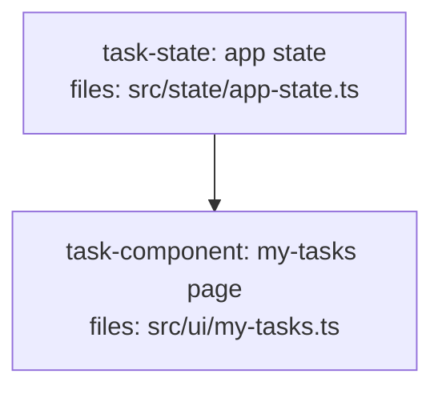

### Task 1: H10 missing-producer rule + stale cross-ref fix

**Files:**
- Modify: `skills/writing-dag-plans/plan-quality.md` (hard-rules table; §Detection algorithm; refusal-output example; fix stale `step 11.5` → `step 8` at line ~79)
- Create: `tests/fixtures/contracts/should-refuse/h10-missing-producer.md`
- Create: `tests/fixtures/contracts/should-pass/h10-renamed-but-wired.md`

**Interfaces:**
- Consumes: H9's definer/consumer index and file-classification (pre-existing / external / task-owned) from the existing `plan-quality.md` H9 row; H8's import-extraction.
- Produces: H10 detection contract and its refusal-text format (substring `task-<id> violates H10 (consumed capability has no producer)`), referenced by Task 4, Task 5, and the fixtures.

- [ ] **Step 1: Write the failing fixture (the myTasks hole)**

Create `tests/fixtures/contracts/should-refuse/h10-missing-producer.md`. Two tasks: a state-service task that exports a `state` object/class WITHOUT a `myTasks` member, and a component task that imports `state` (declaring the dependency so H9/H8 pass) and calls `state.myTasks()`. No producer defines `myTasks`.

```markdown
<!--
FIXTURE: h10-missing-producer
EXPECTED: refuse with H10
COVERS: negative case — task-component imports `state` from task-state (depends_on
  declared, so H8 + H9 both pass), then calls state.myTasks(). No task defines a
  `myTasks` member on the state object. H10 detects the member gap and refuses.
EXPECTED REFUSAL TEXT (substring match):
  task-component violates H10 (consumed capability has no producer)
    Capability: state.myTasks
    Owner:      task-state (produces state, file: src/state/app-state.ts)
    Issue:      task-component references state.myTasks but task-state defines no myTasks
ASSUMES: H8 + H9 pass (import resolves, no missing edge); H10 fires on the member gap.
-->

---
title: h10-missing-producer
created: 2026-06-24
---



## Context

Demonstrates H10: the my-tasks page consumes `state.myTasks()`, but the state
service defines no such member and no other task produces the capability. H8
passes (the `state` import resolves to task-state's file); H9 passes (`myTasks`
is not in the definer index, so no triple forms). H10 catches the member gap.

## Tasks

## Task: app state

```yaml
id: task-state
depends_on: []
files:
  - src/state/app-state.ts
status: pending
```

Exposes the application state object consumed across the UI.

## Implementation

```typescript
// src/state/app-state.ts
export class AppState {
  lists() { return this._lists; }
  refreshLists() { /* ... */ }
}
export const state = new AppState();
```

```typescript
// tests/state/app-state.test.ts
import { state } from "../../src/state/app-state.js";
it("exposes lists()", () => { expect(typeof state.lists).toBe("function"); });
```

## Acceptance criteria

- `state.lists()` returns the cached list array.
- `state.refreshLists()` re-fetches lists.

Test file: `tests/state/app-state.test.ts`.

## Task: my-tasks page

```yaml
id: task-component
depends_on: [task-state]
files:
  - src/ui/my-tasks.ts
status: pending
```

Default route. Renders the current user's tasks across all lists.

## Implementation

```typescript
// src/ui/my-tasks.ts
import { state } from "../state/app-state.js";

export function renderMyTasks() {
  const tasks = state.myTasks();      // <-- no producer defines myTasks
  state.refreshMyTasks();             // <-- nor refreshMyTasks
  return tasks.map((t) => t.title);
}
```

```typescript
// tests/ui/my-tasks.test.ts
import { renderMyTasks } from "../../src/ui/my-tasks.js";
it("renders task titles", () => { expect(renderMyTasks()).toBeInstanceOf(Array); });
```

## Acceptance criteria

- Renders one row per task returned by `state.myTasks()`.
- Calling the page triggers `state.refreshMyTasks()`.

Test file: `tests/ui/my-tasks.test.ts`.
```

- [ ] **Step 2: Verify the current skill does NOT catch it**

Trace the existing rules against the fixture:
- H8: `import { state } from "../state/app-state.js"` resolves to task-state's `files:` entry → passes.
- H9: builds definer index (task-state exports `state`, `AppState`); scans task-component for definer-index symbols; `state` IS in the index and task-component `depends_on: [task-state]` → edge present → passes. `myTasks` is NOT in the definer index → no triple → not a violation.

Expected: the fixture's hole survives all current rules. This confirms the gap H10 must close.

- [ ] **Step 3: Add the H10 row to the hard-rules table**

In `skills/writing-dag-plans/plan-quality.md`, append after the H9 row:

```markdown
| H10 | **Missing-producer — consumed member has no definer** | Extend H9's per-task defined-symbol index to include members/methods/fields within exported classes/objects (not just top-level exports). For each task, collect member/property/method accesses (and named imports) whose base symbol or import path is owned by ANOTHER task T (per H8's file-classification). For each accessed member `m`: if `m` is absent from T's defined-symbol set (top-level exports ∪ indexed members) → violation. Skip symbols/members resolving to a pre-existing file or external dependency (inherits H9/H8 skips — covers externally/dynamically-produced capabilities), and same-task references. A naming mismatch (consumed `myTasks` vs produced `tasksForUser`) fires by design — the named capability is not wired. **Partition with the prose sweep (step 8):** H10 owns references in code blocks; the prose sweep owns references appearing only in prose/acceptance text. A reference in both yields the H10 finding only. |
```

- [ ] **Step 4: Add H10 to the §Detection algorithm**

In the "Detection algorithm (run on every save)" section, change step 2 to run "hard rules H1-H11" and add an explicit note that H10 requires the member-level index extension over H9.

- [ ] **Step 5: Add the H10 refusal-output example**

In the "Refusal output format" code block, add after the H9 example:

```
  task-component violates H10 (consumed capability has no producer)
    Capability: state.myTasks
    Owner:      task-state (produces state, file: src/state/app-state.ts)
    Issue:      task-component references state.myTasks but task-state defines no myTasks
    Fix:        add a producer for myTasks (state method + its api-client/controller/
                repository data path) OR correct the reference if myTasks was renamed
```

- [ ] **Step 6: Fix the stale cross-reference (polish item 7)**

At `plan-quality.md` line ~79 (the §Detection algorithm step 4), change `see SKILL.md step 11.5` to `see SKILL.md step 8`.

- [ ] **Step 7: Write the renamed-but-wired pass fixture**

Create `tests/fixtures/contracts/should-pass/h10-renamed-but-wired.md`: a component consumes `state.tasksForUser()` and the state task DEFINES `tasksForUser()`. H10 must NOT fire (the member exists on the owner).

```markdown
<!--
FIXTURE: h10-renamed-but-wired
EXPECTED: pass
COVERS: positive case — consumer calls state.tasksForUser(); task-state defines a
  tasksForUser() member. H10 finds the member on the owner's defined-symbol set
  and does not fire. Guards against H10 over-firing on correctly-wired members.
-->
```

(Body mirrors the refuse fixture but task-state's `AppState` declares `tasksForUser() { ... }` and the component calls `state.tasksForUser()`.)

- [ ] **Step 8: Verify H10 fires on the hole and is silent on known-good (acceptance gate)**

Trace the new H10 detection:
- Against `should-refuse/h10-missing-producer.md`: member `myTasks` (and `refreshMyTasks`) accessed on `state` owned by task-state; task-state's defined-symbol set is `{lists, refreshLists}`; `myTasks` absent → **refuse**, text matches the EXPECTED substring.
- Against `should-pass/h10-renamed-but-wired.md`: `tasksForUser` present on owner → **pass**.
- **Acceptance gate:** trace H10 against EVERY existing `should-pass` fixture (`tests/fixtures/contracts/should-pass/*`, `tests/fixtures/tiers/should-pass/*`, `tests/fixtures/review-mode/should-pass/*`). Expected: **zero H10 findings**. If any fires, the member-index extension is too broad — tighten it (or, per the spec, degrade that case to soft) before proceeding.

- [ ] **Step 9: Commit**

```bash
git add skills/writing-dag-plans/plan-quality.md tests/fixtures/contracts/should-refuse/h10-missing-producer.md tests/fixtures/contracts/should-pass/h10-renamed-but-wired.md
git commit -m "feat(plan-quality): add H10 missing-producer rule + fix stale step ref

Co-Authored-By: Claude Opus 4.8 (1M context) <noreply@anthropic.com>"
```

---
