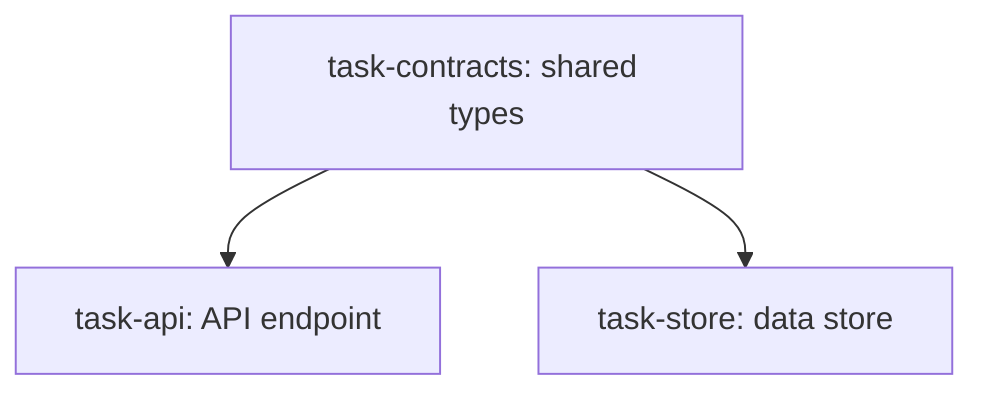

You are dispatched to review one DAG-plan task implementation against its spec.

Your job is bidirectional spec compliance:

- **Under-build:** spec requires X, implementation lacks X.
- **Over-build:** spec doesn't ask for Y, implementation includes Y.

Both are equally serious. Acceptance criteria in the task body ARE the spec.

Do NOT comment on code style, naming, performance, or maintainability — that is the quality reviewer's job. Spec compliance only.

## Output

Report exactly one of:

- **APPROVED** — all requirements met, no over-build.
- **ISSUES** — list each as: "Requirement: ... | Actual: ... | Fix: ...". Be specific enough that the implementer can act without asking clarifying questions.

## Task spec (binding)

ID: task-fixtures-pass
Files reviewed (read ONLY these):
  - tests/fixtures/contracts/should-pass/clean-explicit-contracts-task.md
  - tests/fixtures/contracts/should-pass/clean-implicit-sequencing.md
  - tests/fixtures/contracts/should-pass/clean-no-shared-contracts.md
  - tests/fixtures/contracts/should-pass/clean-pre-existing-contracts.md
  - tests/fixtures/contracts/should-pass/h9-transitive-ok.md
  - tests/fixtures/contracts/should-pass/s8-schema-file-exempt.md

### Body (the spec)

## Task: create should-pass fixtures

```yaml
id: task-fixtures-pass
depends_on: [task-quality-rules]
files:
  - tests/fixtures/contracts/should-pass/clean-explicit-contracts-task.md
  - tests/fixtures/contracts/should-pass/clean-implicit-sequencing.md
  - tests/fixtures/contracts/should-pass/clean-no-shared-contracts.md
  - tests/fixtures/contracts/should-pass/clean-pre-existing-contracts.md
  - tests/fixtures/contracts/should-pass/h9-transitive-ok.md
  - tests/fixtures/contracts/should-pass/s8-schema-file-exempt.md
status: done
```

Create six DAG plan fixtures that should pass both H9 and S8 validation per spec §Testing → Positive fixtures. Each fixture file is itself a small valid DAG plan demonstrating one positive case. Each fixture begins with an HTML comment block documenting its expected outcome and the case it covers, so the manual checklist can read expectations directly from the file. Depends on `task-quality-rules` because fixture expectations reference H9/S8 rule names that must exist in `plan-quality.md` first.

## Implementation

Each fixture file follows this canonical structure (example shown for `clean-explicit-contracts-task.md`):

```markdown
<!--
FIXTURE: clean-explicit-contracts-task
EXPECTED: pass (no H9 or S8 violations)
COVERS: positive case — plan with a dedicated task-contracts root that other tasks depends_on. Demonstrates the explicit contracts-task pattern with all consumers correctly sequenced.
ASSUMES: repo has a contracts/ dir (Branch A of S8 detection applies)
-->

---
title: clean-explicit-contracts-task
created: 2026-05-04
---



## Context

Positive fixture for H9 + S8. A dedicated contracts task defines `Claim`; both `task-api` and `task-store` import from it and `depends_on:` it.

## Tasks

## Task: shared types

`​`​`yaml
id: task-contracts
depends_on: []
files: [src/contracts/claim.ts]
status: pending
`​`​`

Defines the shared `Claim` type used by API and store layers.

## Implementation

`​`​`typescript
export interface Claim {
  id: string;
  amount: number;
  status: "pending" | "approved" | "denied";
}
`​`​`

`​`​`typescript
// (test imports Claim from the contracts file path declared in this task's files:)
it("Claim type can be constructed", () => {
  const c: Claim = { id: "x", amount: 0, status: "pending" };
  expect(c.id).toBe("x");
});
`​`​`

## Acceptance criteria

- `Claim` interface exported with the three fields shown.

Test file: `tests/contracts/claim.test.ts`.

[... continue with task-api and task-store, each importing from src/contracts/claim and depending on task-contracts ...]
```

Each of the six fixtures has this shape but varies what it demonstrates:

1. **`clean-explicit-contracts-task.md`** — explicit `task-contracts` root with two consumers `depends_on:` it. Both consumers import from `src/contracts/claim`.
2. **`clean-implicit-sequencing.md`** — consumer task directly `depends_on:` the definer task, no separate contracts root. Demonstrates that H9 doesn't *require* an explicit contracts task — implicit sequencing is fine.
3. **`clean-no-shared-contracts.md`** — three independent tasks, each defining its own internal types in its own files. No cross-task contract imports → H9 has nothing to check. S8 also doesn't fire (no co-location issue when there's no sharing).
4. **`clean-pre-existing-contracts.md`** — plan tasks import `Claim` from a file that already exists in the codebase (e.g., a hypothetical `src/legacy/types.ts` documented in the fixture's HTML comment as pre-existing). H9 skips per the pre-existing edge case.
5. **`h9-transitive-ok.md`** — three-task chain `task-c → task-b → task-a`. `task-c` imports a type defined in `task-a`. Direct `depends_on` is only [task-b], but transitive closure includes `task-a`, so H9 passes. Demonstrates that H9 honors transitive deps.
6. **`s8-schema-file-exempt.md`** — plan defines types in `api.proto` alongside RPC definitions in the same file. Branch B's mixed-concerns check is exempted for `.proto` files, so S8 doesn't fire.

Verification commands (each must exit 0 after the task — file existence + minimal content sanity check):

```bash
for f in clean-explicit-contracts-task.md clean-implicit-sequencing.md clean-no-shared-contracts.md clean-pre-existing-contracts.md h9-transitive-ok.md s8-schema-file-exempt.md; do
  test -f "tests/fixtures/contracts/should-pass/$f" || { echo "MISSING: $f"; exit 1; }
  grep -q "EXPECTED: pass" "tests/fixtures/contracts/should-pass/$f" || { echo "NO EXPECTED HEADER: $f"; exit 1; }
  grep -q "^## Tasks$" "tests/fixtures/contracts/should-pass/$f" || { echo "NO TASKS SECTION: $f"; exit 1; }
done
```

## Acceptance criteria

- All six fixture files exist at `tests/fixtures/contracts/should-pass/<name>.md`.
- Each fixture begins with an HTML comment block containing `FIXTURE:`, `EXPECTED: pass`, `COVERS:`, and `ASSUMES:` lines (the manual-checklist reads from these).
- Each fixture is a syntactically valid DAG plan per `plan-format.md`: YAML frontmatter, mermaid block, `## Context`, `## Tasks`, one or more `## Task:` blocks each with valid YAML frontmatter (`id`, `depends_on`, `files`, `status`) and either an `## Implementation` block + `## Acceptance criteria` + test file path OR `is_wiring_task: true`.
- Fixture-specific case demonstrated as documented in the COVERS line (verified by reading each fixture):
  - `clean-explicit-contracts-task.md` has a `task-contracts` root with ≥2 children that depend on it.
  - `clean-implicit-sequencing.md` has a consumer task with `depends_on: [<definer>]` and no separate contracts root.
  - `clean-no-shared-contracts.md` has tasks where no task imports symbols defined in another task.
  - `clean-pre-existing-contracts.md` has at least one task importing from a file path documented (in the HTML comment) as pre-existing.
  - `h9-transitive-ok.md` has a 3-task chain where the leaf imports from the root via a transitive `depends_on:` edge.
  - `s8-schema-file-exempt.md` defines types alongside RPC/non-type definitions in a single `.proto` file.
- The verification bash loop exits 0.

Test file: `tests/fixtures/contracts/should-pass/` (the directory; verification via the file-existence and content-sanity grep loop above).

## Implementation under review

Commit SHA: d887c0823fcaf775a029dfe6593ba5dab605038a

Inspect the diff with: `git show d887c0823fcaf775a029dfe6593ba5dab605038a -- tests/fixtures/contracts/should-pass/clean-explicit-contracts-task.md tests/fixtures/contracts/should-pass/clean-implicit-sequencing.md tests/fixtures/contracts/should-pass/clean-no-shared-contracts.md tests/fixtures/contracts/should-pass/clean-pre-existing-contracts.md tests/fixtures/contracts/should-pass/h9-transitive-ok.md tests/fixtures/contracts/should-pass/s8-schema-file-exempt.md`
