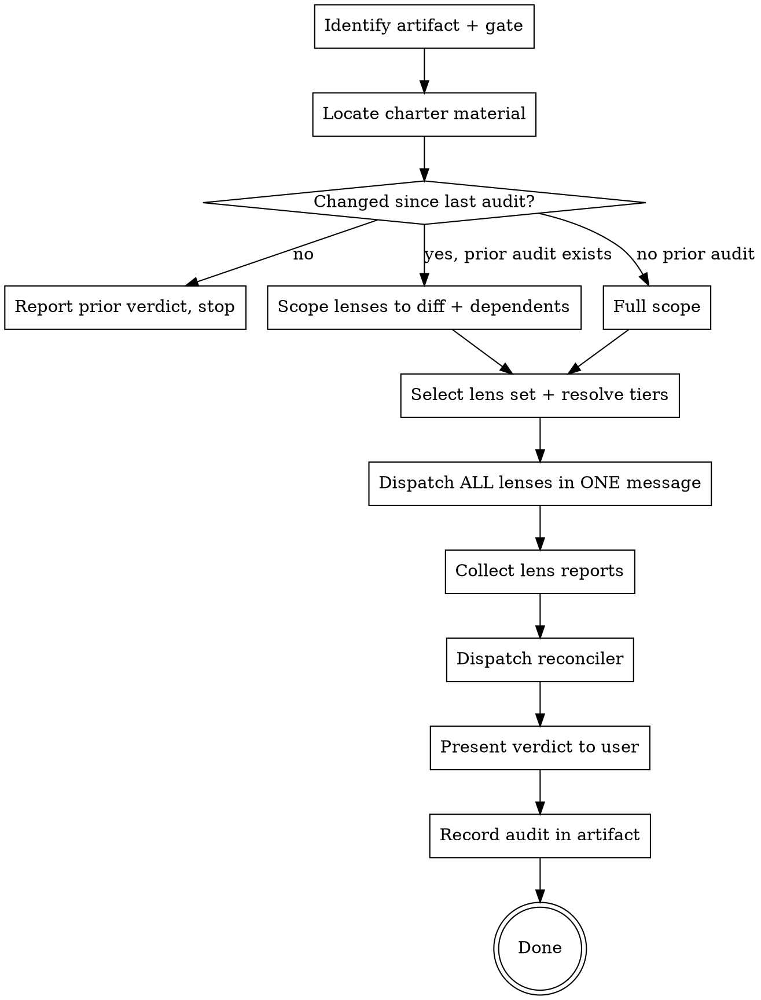

# Auditing specs and DAG plans

Audit an artifact by dispatching several **independent single-concern lenses**
concurrently, then reconciling their findings into one severity-classified set and
a ready/not-ready verdict.

```
                 ┌── lens 1 ──┐
   artifact ─────┼── lens 2 ──┼──► reconciler ──► verdict + classified findings
   + charter     ├── lens 3 ──┤
                 ├── … ───────┤
                 └── lens N ──┘
      (parallel, independent, each blind to the others)
```

## Why parallel, and why a reconciler

A broad "audit this" prompt draws **one** sample of which concern the auditor
happens to look hardest at. Which one is luck — so a later round finds real
material because it is a *new draw*, not a deeper look. Worse, each serial round
reads the artifact **as fixed by the previous round**, so the fresh-context
independence that makes auditing work decays with every round.

Parallel lenses convert that luck into coverage while keeping independence
maximal. The reconciler then resolves interacting findings **jointly**, which is
what stops a fix for finding A from becoming finding B next round.

## The two gates

```
brainstorm → spec → [gate 1: audit-spec] → writing-dag-plans → [gate 2: audit-plan] → executing-dag-plans
```

Gate 1 asks *is this spec sound and complete?* Gate 2 asks *does this plan honor
the approved spec, and will it execute safely?*

**Gate 2 may not reopen gate 1.** The spec is frozen once planning starts. Letting
the plan audit re-litigate spec design is a duplicated round and the most
expensive failure mode of a two-gate pipeline.

## Reference docs

- **`./lenses-spec.md`** — the 6 spec lenses, each with its concern, prompt
  fragment, and default tier.
- **`./lenses-plan.md`** — the 7 plan lenses, same.
- **`./auditor-prompt.md`** — dispatch template for `dag-auditor`.
- **`./reconciler-prompt.md`** — dispatch template for `dag-audit-reconciler`.
- **`./audit-charter-template.md`** — optional per-repo charter file.

## Process



### Step-by-step

1. **Identify the artifact and the gate.** A spec (gate 1) or a DAG plan (gate 2).
   For gate 2, locate the parent spec — if it cannot be found, say so and audit
   coverage against what the plan claims to deliver, noting the limitation.

   **If the artifact is a test fixture, run read-only: skip steps 6 and 9.** A
   fixture under `tests/fixtures/**` (or carrying a `FIXTURE:` header comment) is
   the thing under test. Writing an `## Audit record` into it rewrites the input —
   and some fixtures deliberately have one, to exercise step 3's short-circuit,
   while others deliberately do not. Dropping a `.audit/` tree into the fixture
   directory is likewise noise in the test tree. Report the verdict to the user and
   stop; keep the lens reports in the conversation instead of on disk.

   This matters because running the fixtures is how anyone smoke-tests this skill,
   so the default path must not corrupt them.

2. **Locate charter material.** Root and nested `CLAUDE.md`/`AGENTS.md`, the
   convention/boundary docs they point to, and `.claude/audit-charter.md` if
   present. Pass the list of paths to every lens; do not summarize it for them —
   they read it themselves.

2.5. **Locate downstream artifacts, and pass them to every lens.** An artifact is
   rarely audited in isolation — work may already be planned or landed. Find:

   - **Plans that consume this spec.** Do not assume one-spec-one-plan: a spec's
     tasks are often folded into a pre-existing plan under a different name.
     Search the plans directory for the spec's own task ids and symbols, not just
     for its filename.
   - **Task statuses** in any plan found — `done` / `running` / `pending`.
   - **Commits since the artifact was authored** that touch the files it names.

   Pass all of this to every lens. **This is not optional context — omitting it
   produces confident false blockers.** A lens reasoning from spec text alone will
   report a defect that a downstream plan already states correctly, or that landed
   code already solved, and will do so with the same confidence as a real finding.
   Observed: three of five proposed BLOCKING findings on a partly-implemented spec
   were exactly this, including two lenses converging on one — because they shared
   the blind spot rather than confirming each other.

   The rule the lenses apply: **a spec-text defect that a downstream artifact
   already states correctly is STALE or DEFERRED, never BLOCKING** — nothing will
   be built wrong. It is still worth reporting as a provenance correction.

3. **Check for a prior audit.** Look for an `## Audit record` section in the
   artifact.
   - Unchanged since the recorded revision → report that verdict and stop. Do not
     re-run.
   - Changed → **diff-scoped re-audit**: pass each lens the diff plus the sections
     depending on it, *and* the prior finding set so nothing already resolved or
     already accepted as DEFERRED is re-reported.
   - No prior audit → full scope.
   - `--full` overrides and forces a whole-artifact re-audit.

4. **Select the lens set and resolve tiers.** All lenses from the matching
   catalog, unless the user named a subset. Tier defaults come from the catalog;
   resolve to a model the same way the executor does.

5. **Dispatch every lens in ONE message** so they run concurrently. This is
   load-bearing: sequential dispatch reintroduces the anchoring the design exists
   to remove. Each lens gets the artifact path, its own fragment verbatim, the
   charter paths, the repo root, (gate 2) the spec path, and **the path it must
   write its own report to** (see step 6).

   **The audit directory** is `<artifact-dir>/.audit/<artifact-basename>/` — beside
   the artifact, so the reports travel with it and a re-audit can diff against
   them. Create it before dispatching. Each lens is told to write:

   ```
   <artifact-dir>/.audit/<artifact-basename>/lens-<name>.md
   ```

   If the repo would rather not track these, add `.audit/` to `.gitignore` — the
   `## Audit record` written in step 9 is the durable summary; these are working
   artifacts.

6. **Collect the report paths — the lenses write their own files.**

   **Each lens writes its own report and returns the path plus a one-line
   verdict.** You never handle report bodies. This is not a stylistic preference:
   a lens's report already exists in the lens's context, so having the orchestrator
   write it means reproducing tens of thousands of tokens it already holds — paying
   twice for zero information, and re-introducing exactly the pressure to summarize
   that "verbatim" exists to prevent. When the lens writes it, byte-identical is
   true *by construction* rather than by discipline.

   A lens that fails, returns nothing, or returns no path is reported as a **gap** —
   never silently dropped, because a missing lens is missing coverage, not a clean
   result. Verify each promised file actually exists before continuing; a lens that
   claims a path it did not write is the same gap.

   Do not read the report bodies yourself. You have no job that requires them:
   merging is the reconciler's, and skimming them on the way through is how a
   finding gets quietly lost before the downgrade log can record it.

7. **Dispatch the reconciler** with the lens-report **paths** (not their text), the
   artifact, and the repo root. One call. Do not pre-merge, pre-filter, or drop
   anything first — merging is its job, and quietly discarding a finding on the
   way in defeats the downgrade log. See `./reconciler-prompt.md` for the
   paths-vs-inline rule.

8. **Present the verdict** to the user: the one-line verdict, blocking findings,
   joint resolutions, contradictions, then the rest. Lead with the count.

9. **Record the audit in the artifact** — add or update `## Audit record`:

   ```markdown
   ## Audit record

   - **2026-07-29** · rev `<sha-or-hash>` · lenses: absence, ambiguity, grounding,
     charter, coherence, design · **NOT READY — 4 blocking**
     - Deferred, accepted: <one line each>
     - Empirical unknowns opened: <list, each with its probe task>
   ```

   This is what makes step 3 work, and what stops the next pass from re-deriving
   settled ground.

10. **Harvest charter entries from what just happened.** The charter is *grown from
    audit records*, never authored up front — an up-front charter duplicates the
    convention docs, goes stale, then contradicts the code, at which point lenses
    correctly report the contradiction and you have built a churn machine.

    After each audit, offer the author any entry this run earned:

    | What happened in this audit | Charter section it belongs in |
    |---|---|
    | A DEFERRED finding accepted for the second time | Frozen decisions |
    | The reconciler corrected a severity because enforcement was assumed, not read | Enforcement map |
    | A finding class that has now recurred across plans | Recurring bug classes |
    | A `charter`-lens complaint that a task named no reference file | Reference implementations |
    | A gate command that reported success after its checker died | Verification gotchas |

    Propose the specific lines; let the author accept or decline. Never write to
    `.claude/audit-charter.md` silently — a charter the author didn't agree to is
    one they won't maintain.

## Fixing findings

Findings are the author's to fix, not this skill's. Two rules when they are fixed:

- **Apply a cluster's joint resolution as one change**, not as per-finding patches.
  The reconciler grouped them because their fixes interact.
- **A fix that materially grows the artifact** — new tasks, newly in-scope files,
  new dependency edges — is a scope change. Surface it to the user rather than
  absorbing it silently. Accretion across audit rounds is what makes each round
  generate the next.

Then re-audit — which will be diff-scoped per step 3.

## Hard rules

- Lenses run in parallel, in one dispatch. Never sequentially.
- One concern per lens. Never merge two lenses to save a call.
- The reconciler assigns final severity. Lenses only propose.
- Never delete a finding. Downgrade and log it.
- Gate 2 never reopens a frozen spec decision.
- "READY, no blocking findings" is an expected, successful outcome. Report it and
  stop — do not go looking for something to justify the run.

## Anti-patterns

- ❌ Asking a lens for "DRY, SRP, SoC and best practices" alongside its concern —
  that criterion has no floor, so it always produces something and never
  terminates. It is one lens, and its findings are DEFERRED unless a concrete
  failure is named.
- ❌ Running the same broad audit twice and calling the second pass verification.
  Two draws of the same lens is not two lenses.
- ❌ Resolving a contradiction between lenses by majority. Adjudicate on evidence
  completeness, and read the code to do it.
- ❌ Re-reading the whole artifact after a partial edit — that is what reopens
  settled ground.
- ❌ Treating a lens's "no finding" as free. It is a claim; the reconciler checks
  it like any other.
