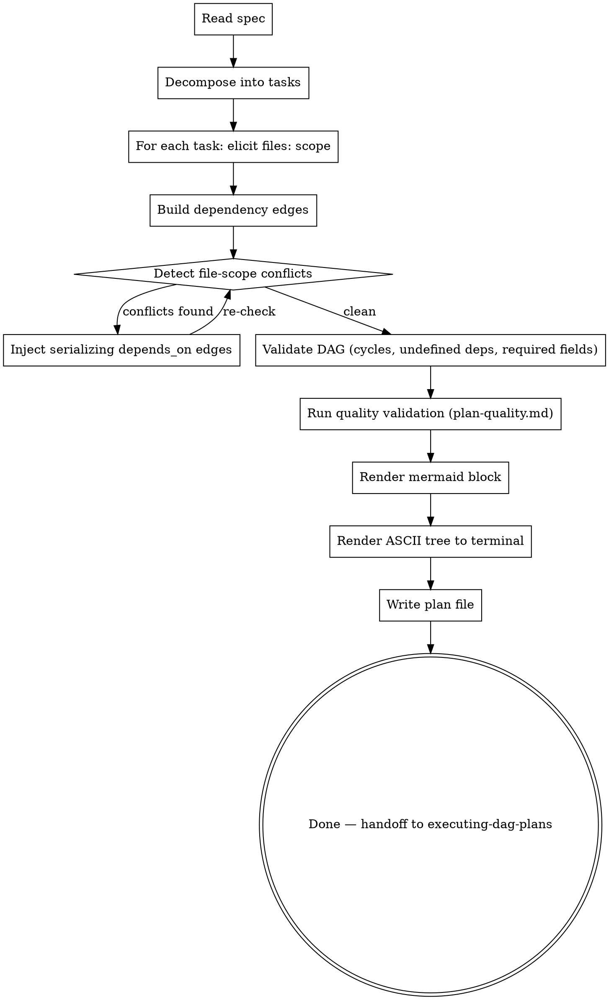

# Writing DAG Plans

Author an execution plan that explicitly encodes which tasks can run in parallel and which must serialize. The output is a markdown file that `executing-dag-plans` can dispatch against — multiple implementer subagents in flight simultaneously, dependencies serializing where they must.

## When to use

- Multi-task work where >=2 tasks are genuinely independent (different subsystems, different files).
- A spec from `superpowers:brainstorming` is in hand or available.
- You want continuous parallel dispatch during execution.

## When NOT to use

- Single-task work — overkill.
- All tasks must be sequential (each depends on the previous) — `superpowers:writing-plans` is simpler.
- You don't yet know the spec — go brainstorm first.

## Two reference docs you MUST read first

- **`./plan-format.md`** — canonical *structural* contract: top-of-file layout, per-task frontmatter schema (`id`, `depends_on`, `files`, `status`, `model_hint`, `single_threaded`, `is_wiring_task`), status semantics, structural validation rules, mermaid block spec, ASCII tree spec.
- **`./plan-quality.md`** — canonical *decomposition-quality* contract: hard rules (H1-H6, refuse on violation) and soft heuristics (S1-S6, warn and confirm). Enforces DRY, Single Responsibility per task, Separation of Concerns, and best-practice signals.

Every plan you author must pass BOTH structural validation AND quality validation. Structural validation catches "the file is malformed"; quality validation catches "the decomposition is sloppy."

## Process

### Step-by-step

1. **Read the spec.** Either invoked from a brainstorming session (spec content is in conversation context) or from a file (read it).

2. **Decompose into tasks** using the same heuristics as `superpowers:writing-plans`:
   - Each task is a unit of work with clear acceptance criteria.
   - Tasks are independently reviewable.
   - 1 task ≠ 1 file necessarily — but a task should have a focused, declarable file scope.

3. **For each task, elicit `files:` scope.** This is the load-bearing step. Ask the user (or reason from the spec) which files this task will create or modify. Be specific — paths, not directories. If the user is unsure, that signals the task is too vague and should be decomposed further.

4. **Build dependency edges.** Two sources:
   - **Logical:** task B requires task A's output (e.g., B uses a function A defined). User-declared.
   - **File-scope:** any two tasks sharing a `files:` entry MUST have a directed path between them. If the user-declared `depends_on:` doesn't already provide one, inject a serializing edge yourself.

5. **Detect file-scope conflicts.** For every pair of tasks sharing any file:
   - If they're connected by `depends_on:` (transitive path), fine — they serialize.
   - If not, this is a planner-level conflict. Either:
     a. Ask the user which task should depend on which, then add the edge.
     b. Suggest splitting one task's scope so they no longer share files.
   - Loop until the validation passes.

6. **Run structural validation** per `plan-format.md` rules 1-6:
   - Unique ids.
   - No cycles (DFS-based check).
   - All `depends_on:` references resolve to existing task ids.
   - Required fields present per task.
   - File-disjoint parallel branches.
   - Immutable history (only relevant for updates — N/A for fresh authoring).

   Any failure → refuse, explain, exit. Do NOT write the file.

7. **Run quality validation** per `plan-quality.md`:
   - Hard rules H1-H8 (compound titles, single acceptance group, single subsystem in `files:`, acceptance criteria present, no anti-pattern phrases, consistent id naming, `## Implementation` subsection presence, import resolution). Any failure → refuse, name the rule + task + fix, exit.
   - Soft heuristics S1-S7 (DRY across siblings, oversized tasks, undersized stubs, vague criteria, overly linear DAGs, premature abstraction signals, test-helper hoisting). Collect as warnings.

8. **Decomposition-principles audit (LLM-judgment pass).** Re-read the full plan with fresh eyes and check it against the four principles below. This step is judgment-driven — the mechanical rules in step 7 catch structural violations; this step catches *holistic* decomposition smells across the whole plan. Surface concerns as warnings (not refusals); the user confirms or revises.

   - **DRY across the whole plan.** Beyond S1's sibling-pair check: does any abstraction repeat across non-sibling tasks? Are there hidden shared assumptions (test helpers, mock factories, fixture data) that no task explicitly owns?
   - **Single Responsibility per task** (stricter than H2). Does any task bundle multiple distinct action paths or concerns under one acceptance group? If so, would splitting unlock parallelism, or is the bundling defensible by codebase convention? Flag the trade-off; do not auto-split.
   - **Separation of Concerns across files.** Does any task touch raw I/O (`fs.readFile`, `fs.writeFile`, `db.query`, network calls) when there's a store/repository/client abstraction in the plan that should mediate? Surface as a layering smell with the suggested fix (e.g., "have task X go through ClaimsStore instead of direct fs").
   - **Industry-standard hygiene.** Error handling at boundaries, atomic writes for state mutations, idempotency for tools that may run twice, type-safe input validation, mtime/version OCC where concurrent edits are possible. Surface anything missing.

   Output format: same as soft heuristics — list with principle, affected task ids, specific concern, suggested fix. After the list (combined with step 7's soft warnings if any): "save anyway? (y/N)" — default N.

9. **Render the mermaid block.** Per `plan-format.md`. Status defaults to `pending` for newly authored plans (no class applied). Status-driven coloring kicks in on update or during execution.

10. **Render the ASCII tree to terminal.** Print before writing the file so the user can sanity-check shape.

11. **Write the plan file** to `docs/superpowers/plans/YYYY-MM-DD-<topic>-dag.md` (override per project preference). The mermaid block goes at the top, followed by `## Context`, `## Tasks`, then the task blocks.

12. **Hand off** to `executing-dag-plans` (don't invoke it automatically — the user should review the plan first).

## Hard rules

- Every task MUST have `id`, `depends_on`, `files`, `status: pending`.
- Refuse to save the plan if any validation rule fails. Show the user the specific violation.
- Empty `files:` is rejected unless `single_threaded: true`.
- Do not fabricate file paths — if you can't determine a task's file scope, ask.
- The mermaid block at the top of the plan file is the authoritative visualization. Regenerate from scratch on every save — never edit it incrementally.

## Anti-patterns

- ❌ Inferring `files:` from task title alone — produces hallucinated paths. Ask or read the spec carefully.
- ❌ Putting `depends_on:` edges only on "logical" deps and ignoring file overlap — produces silent corruption at execution time.
- ❌ Hand-editing the mermaid block — it gets regenerated, your edits will be lost.
- ❌ Letting two tasks share an entry in `files:` without a `depends_on:` path — the executor's tripwire will fire and halt the run.

## Example output

See `./plan-format.md` for a worked example skeleton.
