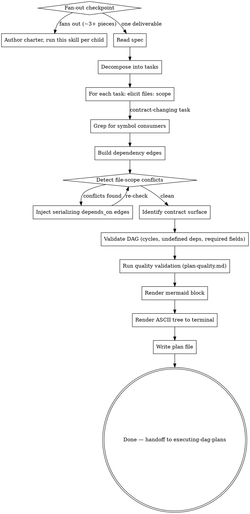

# Writing DAG Plans

Author an execution plan that explicitly encodes which tasks can run in parallel and which must serialize. The output is a markdown file that `executing-dag-plans` can dispatch against — multiple implementer subagents in flight simultaneously, dependencies serializing where they must.

## When to use

- Multi-task work where >=2 tasks are genuinely independent (different subsystems, different files).
- A spec from `superpowers:brainstorming` is in hand or available.
- You want continuous parallel dispatch during execution.

## When NOT to use

- Single-task work — overkill.
- All tasks must be sequential (each depends on the previous) — `superpowers:writing-plans` is simpler.
- You don't yet know the spec — go brainstorm first.

## First: the fan-out checkpoint (do this before decomposing)

Authoring ONE DAG plan is correct only when the spec is one deliverable. Many
specs fan out into **multiple independently-executed plans** — separate review
cadences and lifecycles, a hard build-order gate between them, and shared
invariants/contracts that no single plan owns. Cramming those into one DAG buries
the parallelism and orphans the cross-plan invariants.

**Decide explicitly, every time:** does this spec fan out into ~3+ interlocking
pieces with separable review/lifecycles (e.g. a shared library + its first
consumer; a core engine + N adapters)?

- **No** → one deliverable → author one DAG plan (continue below).
- **Yes** → author a **thin charter first**, then a child plan per piece:
  1. Write the charter from the `./superspec-charter.md` template. It owns ONLY
     the connective tissue no child plan can: the cross-plan **contract surface**
     (shared types/enums/tokens), the **shared invariants** every child must
     uphold, and the **build-order gate** between children.
  2. Run THIS skill once per child plan, passing the charter as shared context.
     Each child task's acceptance criteria must **inline the actual requirement**
     (the invariant text, the concrete contract), citing the charter section as
     provenance ("per Charter §3 I2: …") — never a bare pointer. The executor's
     spec/quality reviewers treat the task body AS the binding spec and never see
     the charter, so a bare "upholds Charter §3 I2" is unverifiable at review time.
  3. Pull children one at a time; don't start them all at once.

Judgment, not a hard gate — a two-piece spec with no shared invariants may not
need a charter. But make the call here, instead of defaulting to one plan.

## Two reference docs you MUST read first

- **`./plan-format.md`** — canonical *structural* contract: top-of-file layout, per-task frontmatter schema (`id`, `depends_on`, `files`, `status`, `model_hint`, `spec_reviewer_hint`, `quality_reviewer_hint`, `single_threaded`, `is_wiring_task`), plan-level defaults (`default_model_hint`, `default_spec_reviewer_hint`, `default_quality_reviewer_hint`), §Tier resolution, status semantics, structural validation rules, mermaid block spec, ASCII tree spec.
- **`./plan-quality.md`** — canonical *decomposition-quality* contract: hard rules (H1-H9, refuse on violation) and soft heuristics (S1-S9, warn and confirm). Enforces DRY, Single Responsibility per task, Separation of Concerns, and best-practice signals.

Every plan you author must pass BOTH structural validation AND quality validation. Structural validation catches "the file is malformed"; quality validation catches "the decomposition is sloppy."

## Process



### Step-by-step

> **Before step 1:** clear the [fan-out checkpoint](#first-the-fan-out-checkpoint-do-this-before-decomposing). If the spec fans out into multiple independently-executed plans, author the charter and run this skill once per child; the steps below then apply to each child plan. Otherwise continue straight through.

1. **Read the spec.** Either invoked from a brainstorming session (spec content is in conversation context) or from a file (read it).

2. **Decompose into tasks** using the same heuristics as `superpowers:writing-plans`:
   - Each task is a unit of work with clear acceptance criteria.
   - Tasks are independently reviewable.
   - 1 task ≠ 1 file necessarily — but a task should have a focused, declarable file scope.

3. **For each task, elicit `files:` scope.** This is the load-bearing step. Ask the user (or reason from the spec) which files this task will create or modify. Be specific — paths, not directories. If the user is unsure, that signals the task is too vague and should be decomposed further.

3.5. **Grep for symbol consumers when a task changes a contract.** If a task
modifies a public symbol (schema_version literal, exported type, parameter
name, baseline-set constant, etc.), every test or consumer asserting against
the old contract becomes test cascade fallout. Include each match in either
this task's `files:` list OR a sibling task with explicit `depends_on:`
ordering. Concrete pre-check:

   ```bash
   # For each symbol the task will change:
   grep -rn <symbol-name> src/ tests/
   ```

Skipping this produces mid-flight cleanup tasks: implementers correctly
stop at scope boundaries when they hit out-of-scope failures, the controller
files a cleanup task, the cleanup itself misses more files (Round 2), and
the cycle repeats. Three rounds isn't uncommon for symbol bumps that
permeate test fixtures. Pre-DAG grep kills the entire failure mode.

4. **Build dependency edges.** Two sources:
   - **Logical:** task B requires task A's output (e.g., B uses a function A defined). User-declared.
   - **File-scope:** any two tasks sharing a `files:` entry MUST have a directed path between them. If the user-declared `depends_on:` doesn't already provide one, inject a serializing edge yourself.

5. **Detect file-scope conflicts.** For every pair of tasks sharing any file:
   - If they're connected by `depends_on:` (transitive path), fine — they serialize.
   - If not, this is a planner-level conflict. Either:
     a. Ask the user which task should depend on which, then add the edge.
     b. Suggest splitting one task's scope so they no longer share files.
   - Loop until the validation passes.

6. **Run structural validation** per `plan-format.md` rules 1-8:
   - Unique ids.
   - No cycles (DFS-based check).
   - All `depends_on:` references resolve to existing task ids.
   - Required fields present per task.
   - File-disjoint parallel branches.
   - Immutable history (only relevant for updates — N/A for fresh authoring).
   - Per-task hint enum: `model_hint`, `spec_reviewer_hint`, `quality_reviewer_hint` must be `cheap | standard | opus` when present.
   - Plan-level default enum: `default_model_hint`, `default_spec_reviewer_hint`, `default_quality_reviewer_hint` must be `cheap | standard | opus` when present.

   Any failure → refuse, explain, exit. Do NOT write the file.

6.5. **Identify contract surface.** Walk each task's `## Implementation` block and extract defined contract symbols (interfaces, types, exported function signatures, schema definitions) per the H9 detection patterns in `plan-quality.md`. For each consumer task, identify which other tasks define symbols it imports or references. If any consumer task references a contract from a non-dependency, surface as a planner-level decision: either add the `depends_on:` edge or refactor to remove the cross-task reference. Loop until clean. (This is the planner-side mirror of H9 — catch the issue before it becomes a refusal at validation time.)

6.6. **Optional plan-level tier prompt.** After the plan is structurally valid, scan every task's title, body, and `files:` for complexity signals to decide whether to suggest a plan-level reviewer default.

   **Mechanical signals** (a task is mechanical if ANY of the following apply):
   - Title or body matches (case-insensitive) `\b(rename|format|move|copy|extract|inline|docs?[-_]only|test[-_]data|fixture[-_]only)\b`
   - Every entry in `files:` matches at least one of: `**/*.md`, `**/test/fixtures/**`, `**/tests/data/**`, `**/CHANGELOG*`, `**/README*`

   **Novelty signals** (a task is novel if ANY of the following apply):
   - Body matches (case-insensitive) `\b(algorithm|protocol|state machine|consensus|concurrency|race|lock|transaction|cryptograph|atomicity)\b`
   - Body contains a `## Why this abstraction` heading
   - Any entry in `files:` matches one of: `**/auth/**`, `**/security/**`, `**/crypto/**`, `**/payments/**`, `**/session*`

   Compute `mechanical_pct` = (number of mechanical tasks / total tasks) × 100, and `novelty_pct` = (number of novel tasks / total tasks) × 100.

   **Decision rule:**
   - If `mechanical_pct > 70%` AND `novelty_pct < 10%`: prompt the author — *"Most tasks in this plan look mechanical. Set plan-level reviewer default to `default_spec_reviewer_hint: cheap`? (y/N — default N)"*. Author confirms or skips; do NOT auto-write plan-level defaults silently.
   - Otherwise: skip the prompt. S9 in `plan-quality.md` handles per-task tier suggestions during quality validation (step 7).

   **Constraints:**
   - The skill never auto-writes plan-level defaults silently. Author confirms or skips.
   - Does not prompt per-task during decomposition — tier choice is a low-priority field.

7. **Run quality validation** per `plan-quality.md`:
   - Hard rules H1-H9 (compound titles, single acceptance group, single subsystem in `files:`, acceptance criteria present, no anti-pattern phrases, consistent id naming, `## Implementation` subsection presence, import resolution, contract-sequencing). Any failure → refuse, name the rule + task + fix, exit.
   - Soft heuristics S1-S9 (DRY across siblings, oversized tasks, undersized stubs, vague criteria, overly linear DAGs, premature abstraction signals, test-helper hoisting, contract co-location, tier-complexity mismatch). Collect as warnings.

8. **Decomposition-principles audit (LLM-judgment pass).** Re-read the full plan with fresh eyes and check it against the four principles below. This step is judgment-driven — the mechanical rules in step 7 catch structural violations; this step catches *holistic* decomposition smells across the whole plan. Surface concerns as warnings (not refusals); the user confirms or revises.

   - **DRY across the whole plan.** Beyond S1's sibling-pair check: does any abstraction repeat across non-sibling tasks? Are there hidden shared assumptions (test helpers, mock factories, fixture data) that no task explicitly owns?
   - **Single Responsibility per task** (stricter than H2). Does any task bundle multiple distinct action paths or concerns under one acceptance group? If so, would splitting unlock parallelism, or is the bundling defensible by codebase convention? Flag the trade-off; do not auto-split.
   - **Separation of Concerns across files.** Does any task touch raw I/O (`fs.readFile`, `fs.writeFile`, `db.query`, network calls) when there's a store/repository/client abstraction in the plan that should mediate? Surface as a layering smell with the suggested fix (e.g., "have task X go through ClaimsStore instead of direct fs").
   - **Industry-standard hygiene.** Error handling at boundaries, atomic writes for state mutations, idempotency for tools that may run twice, type-safe input validation, mtime/version OCC where concurrent edits are possible. Surface anything missing.
   - **Contract clarity.** Beyond H9/S8: are there contracts that *should* exist but don't? E.g., two tasks both define a `User` type independently — they should share one. Surface as a decomposition concern with the suggested fix (add a contracts-defining task that both depend on).

   Output format: same as soft heuristics — list with principle, affected task ids, specific concern, suggested fix. After the list (combined with step 7's soft warnings if any): "save anyway? (y/N)" — default N.

9. **Render the mermaid block.** Per `plan-format.md`. Status defaults to `pending` for newly authored plans (no class applied). Status-driven coloring kicks in on update or during execution.

10. **Render the ASCII tree to terminal.** Print before writing the file so the user can sanity-check shape.

11. **Write the plan file** to `docs/superpowers/plans/YYYY-MM-DD-<topic>-dag.md` (override per project preference). The mermaid block goes at the top, followed by `## Context`, `## Tasks`, then the task blocks.

12. **Hand off** to `executing-dag-plans` (don't invoke it automatically — the user should review the plan first).

## Hard rules

- Every task MUST have `id`, `depends_on`, `files`, `status: pending`.
- Refuse to save the plan if any validation rule fails. Show the user the specific violation.
- Empty `files:` is rejected unless `single_threaded: true`.
- Do not fabricate file paths — if you can't determine a task's file scope, ask.
- The mermaid block at the top of the plan file is the authoritative visualization. Regenerate from scratch on every save — never edit it incrementally.

## Anti-patterns

- ❌ Inferring `files:` from task title alone — produces hallucinated paths. Ask or read the spec carefully.
- ❌ Putting `depends_on:` edges only on "logical" deps and ignoring file overlap — produces silent corruption at execution time.
- ❌ Hand-editing the mermaid block — it gets regenerated, your edits will be lost.
- ❌ Letting two tasks share an entry in `files:` without a `depends_on:` path — the executor's tripwire will fire and halt the run.
- ❌ Burying type definitions inside business-logic files when the codebase has a dedicated `contracts/` or `types/` dir — produces silent drift between two parallel implementers' invented type shapes.
- ❌ Assigning `files:` scope to a task that changes a symbol without
  first grep'ing for that symbol's consumers — produces N-hop cascade
  fixup rounds at execution time.

## Example output

See `./plan-format.md` for a worked example skeleton.
