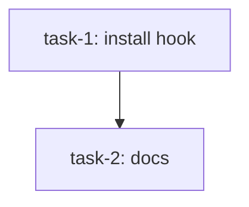

# DAG plan format reference

This is the canonical format for DAG-aware execution plans. Both `writing-dag-plans` (authoring) and `updating-dag-plans` (mid-flight mutation) validate plans against this contract.

## File location

Plans live at `docs/superpowers/plans/YYYY-MM-DD-<topic>-dag.md` by default. Override per project preference.

## Top-of-file structure

Every plan file has this structure (in order):

1. YAML frontmatter (title, created date).
2. A mermaid `flowchart TD` block — the DAG visualization, regenerated from scratch on every save.
3. A `## Context` section — why this plan exists, what spec drives it, scope notes.
4. A `## Tasks` heading.
5. One or more `## Task: <title>` sections, each with a YAML block followed by prose.

Example skeleton:

````markdown
---
title: my-feature
created: 2026-05-02
default_model_hint: standard            # OPTIONAL. cheap | standard | opus. Default `standard`. Implementer tier.
default_spec_reviewer_hint: standard    # OPTIONAL. cheap | standard | opus. Default `standard`.
default_quality_reviewer_hint: standard # OPTIONAL. cheap | standard | opus. Default `standard`.
---



## Context

[why this plan exists, what spec drives it]

## Tasks

## Task: install hook

```yaml
id: task-1
depends_on: []
files:
  - bin/install-hook.sh
  - .claude/settings.json
status: pending
```

[prose: implementation details, acceptance criteria, test plan]

## Task: docs

```yaml
id: task-2
depends_on: [task-1]
files:
  - docs/install.md
status: pending
```

[prose]
````

The mermaid block is REQUIRED at the top. It is regenerated from scratch on every save by `writing-dag-plans` or `updating-dag-plans` — never hand-edit it. The block reflects the current DAG including status-driven node coloring.

All three `default_model_hint` / `default_spec_reviewer_hint` / `default_quality_reviewer_hint` frontmatter keys are optional; omitting any (or all) keeps `standard` everywhere = today's behavior.

## Per-task frontmatter schema

Every `## Task: ...` heading is immediately followed by a YAML block:

```yaml
id: task-N             # REQUIRED. Stable identifier. Used in depends_on edges.
depends_on: []         # REQUIRED. List of task ids this task depends on. [] = root.
files:                 # REQUIRED. Files this task creates or modifies.
  - path/to/file.ts
status: pending        # REQUIRED. pending | ready | running | done | failed | skipped
implementer: dag-implementer  # OPTIONAL. subagent_type to dispatch for this task. Defaults to dag-implementer. Use to route specialized tasks to persona-typed subagents (e.g., profile-charmeleon for backend, profile-gastly for tests). The named subagent must be available in the harness's agent registry at dispatch time.
model_hint: cheap             # OPTIONAL. cheap | standard | opus. Implementer model selection hint. Falls back to `default_model_hint`, then `standard`.
spec_reviewer_hint: standard    # OPTIONAL. Spec reviewer tier. cheap | standard | opus. Falls back to default_spec_reviewer_hint, then `standard`.
quality_reviewer_hint: standard # OPTIONAL. Quality reviewer tier. cheap | standard | opus. Falls back to default_quality_reviewer_hint, then `standard`.
single_threaded: false # OPTIONAL. If true, task forces dispatch tick to itself. Use for scope-less/exploratory tasks.
is_wiring_task: false  # OPTIONAL. If true, plan-quality.md H3 (single-subsystem in files:) is bypassed. Use only for tasks whose explicit purpose is to wire two subsystems together; should depend_on the tasks producing each side.
```

### Mixing implementers in a single plan

When a plan has tasks for different specialized subagents, set `implementer:` per task. Example: a plan with backend tasks for `profile-charmeleon` and test-infrastructure tasks for `profile-gastly` declares each accordingly. The executor reads `implementer:` per dispatch and selects the subagent_type at runtime. Tasks without an `implementer:` field fall back to `dag-implementer`.

The spec and quality reviewers (`dag-spec-reviewer`, `dag-quality-reviewer`) are persona-agnostic — they review the diff against the task spec and code quality regardless of which implementer wrote it. There's no per-task review override.

## Tier resolution

The executor resolves the model tier for each role using the following logic:

```
resolve_tier(task, role) =
    task[role + "_hint"]                               if present
    else plan_frontmatter["default_" + role + "_hint"] if present
    else "standard"

resolve_model(tier) =
    "haiku"  if tier == "cheap"
    "sonnet" if tier == "standard"
    "opus"   if tier == "opus"
```

The three role values are:

- `model` — the implementer. Per-task field: `model_hint`. Plan-level default: `default_model_hint`. The resolver evaluates `task["model" + "_hint"]` = `task["model_hint"]` — the asymmetry is that the role name is `model` while the reviewer roles are `spec_reviewer` / `quality_reviewer`, but all three per-task fields end in `_hint` (`model_hint`, `spec_reviewer_hint`, `quality_reviewer_hint`). This is explicit and intentional.
- `spec_reviewer` — the spec reviewer. Per-task field: `spec_reviewer_hint`. Plan-level default: `default_spec_reviewer_hint`.
- `quality_reviewer` — the quality reviewer. Per-task field: `quality_reviewer_hint`. Plan-level default: `default_quality_reviewer_hint`.

A per-task hint inconsistent with the plan-level default is NOT an error — per-task overrides bypass plan-level defaults entirely.

## Per-task body structure

Every task body (the prose + code below the YAML block) follows this canonical structure unless `is_wiring_task: true` exempts the task:

1. **One short prose paragraph** (1-3 sentences) describing what this task accomplishes. Cite the driving spec section if relevant.

2. **`## Implementation` subsection.** At least two fenced code blocks for typical code tasks:
   - **Block 1 — minimum-viable impl:** the file being created or modified, showing the load-bearing shape (function signatures, types, key dispatch logic, schema definition). Need not be complete — the implementer subagent fills in helpers, error handling, and edge cases via TDD discipline. But the shape MUST be specific enough that two competent implementers would produce code with compatible interfaces.
   - **Block 2 — minimum-viable failing test:** at least one failing test case anchoring the acceptance criteria. The test should target a single observable behavior from the acceptance bullets. The implementer subagent expands this into a full test suite.
   - Additional blocks are allowed (e.g., CLI command examples, expected output snippets).

3. **`## Acceptance criteria` subsection.** Bulleted observable behaviors. Each bullet should be a concrete check that a reviewer (human or subagent) can verify with a specific test or runtime assertion. No vague bullets ("works", "passes"); see `plan-quality.md` S4.

4. **Test file path.** A single line naming the test file (e.g., `Test file: vault-mcp/tests/unit/foo.test.ts.`). Required so the implementer knows where the failing test from Block 2 lands.

### Wiring tasks (exempt from the `## Implementation` requirement)

Tasks with `is_wiring_task: true` skip the `## Implementation` subsection. Their purpose is registration / cross-subsystem assembly — the load-bearing artifact is the file structure itself, not a novel implementation. Wiring tasks still require:

- One short prose paragraph explaining what's being wired.
- `## Acceptance criteria` with observable behaviors (typically: "X is exposed via Y after this task lands").
- Test file path.

Wiring tasks MAY include a code block showing the import/registration shape but it is optional.

### Example task body (canonical structure)

````markdown
## Task: stable scope hash

```yaml
id: task-scope-hash-helper
depends_on: []
files: [vault-mcp/src/core/scope-hash.ts]
status: pending
```

Pure function. Stable across array order, sensitive to set membership, deterministic, dimension-collision-resistant. Drives identity-tuple computation per spec §5.3.

## Implementation

```typescript
import { createHash } from "node:crypto";

export function scopeHash(profile: string[], move: string[], scope_wiki: string[], tags: string[]): string {
  const dim = (label: string, values: string[]) => `${label}:${[...values].sort().join(",")}`;
  const canonical = [dim("p", profile), dim("m", move), dim("w", scope_wiki), dim("t", tags)].join("|");
  return createHash("sha256").update(canonical).digest("hex").slice(0, 16);
}
```

```typescript
import { scopeHash } from "../../src/core/scope-hash.js";

it("is stable across array order", () => {
  expect(scopeHash(["a","b"], [], [], [])).toBe(scopeHash(["b","a"], [], [], []));
});
```

## Acceptance criteria

- Stable across array order: `scopeHash(["a","b"], [], [], []) === scopeHash(["b","a"], [], [], [])`.
- Membership-sensitive: `scopeHash(["a","b"], [], [], []) !== scopeHash(["a"], [], [], [])`.

Test file: `vault-mcp/tests/unit/scope-hash.test.ts`.
````

## Status semantics

| Status | Meaning | Mutable by `updating-dag-plans`? |
|---|---|---|
| `pending` | Not yet ready (deps unresolved). | Yes |
| `ready` | All deps `done`. Awaiting next dispatch tick. | Yes |
| `running` | Implementer subagent is currently executing. | No |
| `done` | Implementer finished AND spec/quality reviewers approved. | No |
| `failed` | After auto-retry-once, still BLOCKED or repeatedly failed review. | No |
| `skipped` | Cascaded from a `failed` ancestor. Will not run. | No |

## Validation rules (enforced by writing-dag-plans + updating-dag-plans)

1. **Unique `id`** — no two tasks share an id.
2. **No cycles** — `depends_on:` graph must be a DAG.
3. **No undefined deps** — every entry in `depends_on:` must reference an existing task id.
4. **File-disjoint parallel branches** — if two tasks share an entry in `files:`, there MUST be a directed path between them in `depends_on:` (one transitively depends on the other). Otherwise reject with a clear conflict report naming both tasks and the overlapping file(s).
5. **Required fields** — `id`, `depends_on`, `files`, `status` per task. Empty `files:` is rejected unless `single_threaded: true`.
6. **Immutable history** — `updating-dag-plans` rejects mutations to any task whose status is `running`, `done`, `failed`, or `skipped`.
7. **Per-task hint enum** — `model_hint`, `spec_reviewer_hint`, `quality_reviewer_hint`, when present on any task, MUST be one of `cheap | standard | opus`. Any other value → refuse save with the offending task id, field name, and the bad value.
8. **Plan-level default enum** — `default_model_hint`, `default_spec_reviewer_hint`, `default_quality_reviewer_hint`, when present in frontmatter, MUST be one of `cheap | standard | opus`. Any other value → refuse with the field name and the bad value.

Rules #7 and #8 use the same refusal-message format as rules 1–6.

## Why `files:` is the load-bearing field

The executor uses `files:` to verify at runtime that no two parallel implementers will clobber each other. Authoring-time validation (writing-dag-plans) ensures parallel branches are file-disjoint **by construction**. Runtime validation (executing-dag-plans) is a tripwire — if it fires, the planner has a bug, not a race condition.

The contract is: declare your scope, and the system guarantees no parallel implementer touches your files. This is what makes continuous parallel dispatch safe.

## Mermaid block specification

The mermaid block uses `flowchart TD` (top-down) layout. Every task is a node:

```
task-id["task-id: short title<br/>files: <first-file>"]
```

If `files:` has more than 2 entries, summarize as `files: <first-file> +N more`.

Edges are drawn from `depends_on:` — each `depends_on: [parent-id]` becomes `parent-id --> task-id`.

Status drives node coloring via `classDef` and `:::class` syntax:

```
task-N["..."]:::done
task-M["..."]:::failed
```

The five `classDef`s at the bottom of the block:

```
classDef done fill:#90ee90,stroke:#333
classDef running fill:#87ceeb,stroke:#333
classDef ready fill:#fffacd,stroke:#333
classDef failed fill:#ffb6c1,stroke:#333
classDef skipped fill:#d3d3d3,stroke:#333,stroke-dasharray: 5 5
```

`pending` tasks get the default mermaid styling (no class).

## ASCII tree rendering (terminal output)

After every save, both writing/updating skills print an ASCII tree to the terminal. The format:

```
DAG: <N> tasks · <D> done · <F> failed · <S> skipped · <P> pending

[task-id] short title              <icon> <status>
   │
   └──→ [child-id] short title     <icon> <status>
```

Status icons:
- ✓ done
- ⟳ running
- · pending / ready
- ✗ failed
- ⊘ skipped

For DAGs more than 3 levels deep or wider than 8 leaves at any level, fall back to a flat status table sorted by id.
