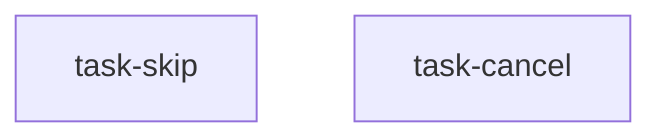

<!--
FIXTURE: s12-absence-no-positive-companion
RULE: S12 (crash-passing absence criterion)
EXPECTED: warn on task-skip; do NOT warn on task-cancel
COVERS: the suppressor, which is the load-bearing half of the rule.
  task-skip  — both bullets are negatives about the PATCH channel ("no PATCH is
               issued", "the record is unchanged"). Nothing in the task exercises
               that channel positively, so make the handler throw on its first
               statement and both bullets go green: nothing was called because
               nothing ran. WARN.
  task-cancel — same absence shape ("no DELETE is issued"), but the sibling bullet
               asserts the confirm path issues exactly one DELETE through the same
               spy. That positive is what proves the channel can observe anything.
               MUST NOT WARN.
EXPECTED WARNING TEXT (substring):
  S12
  task-skip
  positive
MUST NOT WARN: task-cancel (firing on the correct form is worse than not firing —
  it teaches authors to ignore S12).
NOTE: S15 does NOT fire on task-skip's "The record is unchanged" bullet, and this
  header said the opposite before the first run. S15's subject restriction limits it
  to claims about a FILE or path; "the record" is a runtime entity whose state a test
  reads back directly. Getting this backwards in the fixture header is the same error
  the restriction exists to prevent — S15 is about unobservable diff properties, not
  about the word "unchanged". Score S12 only.
-->

---
title: dialog skip and cancel paths
created: 2026-07-30
---



## Tasks

## Task: skip path writes nothing

```yaml
id: task-skip
depends_on: []
files:
  - src/app/pup-dialog.component.ts
  - test/app/pup-dialog.component.spec.ts
status: pending
```

Skipping the dialog must not persist anything.

## Implementation

```typescript
// src/app/pup-dialog.component.ts
export function onSkip(ref: DialogRef): void {
  ref.close(null); // no PATCH
}
```

## Acceptance criteria

- Clicking Skip closes the dialog and no PATCH is issued.
- The record is unchanged.

Test file: `test/app/pup-dialog.component.spec.ts`.

## Task: cancel path writes nothing

```yaml
id: task-cancel
depends_on: []
files:
  - src/app/delete-dialog.component.ts
  - test/app/delete-dialog.component.spec.ts
status: pending
```

Cancelling the delete dialog must not delete.

## Implementation

```typescript
// src/app/delete-dialog.component.ts
export function onCancel(ref: DialogRef): void {
  ref.close(null);
}
```

## Acceptance criteria

- Confirm issues exactly one DELETE through the http spy, and the row is gone.
- Cancel, asserted with the same spy in the same spec, issues no DELETE.

Test file: `test/app/delete-dialog.component.spec.ts`.
