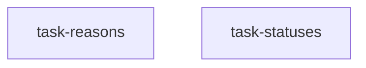

<!--
FIXTURE: s14-universal-claim-existential-assertion
RULE: S14 (quantifier mismatch)
EXPECTED: warn on task-reasons; do NOT warn on task-statuses
COVERS: universal claim vs existential assertion, and the suppressor.
  task-reasons  — AC says "EACH of the eight reject reasons lands in `unverified`"
                  and the stated assertion is `toContain('not-found')`, one value of
                  eight. `toContain` proves at-least-one and passes with spurious
                  extra entries; the seven unenumerated members are where it breaks.
                  WARN.
  task-statuses — same universal shape ("every status maps"), but the assertion
                  iterates the exported `RUN_STATUSES` array and asserts
                  count-equality against its length, so a newly added member fails
                  the test rather than being skipped. MUST NOT WARN.
EXPECTED WARNING TEXT (substring):
  S14
  task-reasons
  toContain
MUST NOT WARN: task-statuses — drawing the iteration set from the exported array is
  exactly the suppressor, and firing on it would train authors to ignore S14.
NOTE: task-reasons' AC also names a set size (eight) while describing one case, which
  is S14's second trigger. One warning, two reasons — do not double-report.
-->

---
title: reject-reason and status mapping
created: 2026-07-30
---



## Tasks

## Task: classify reject reasons

```yaml
id: task-reasons
depends_on: []
files:
  - src/read/classify.ts
  - test/read/classify.spec.ts
status: pending
```

Maps each vendor rejection to an internal reject reason.

## Implementation

```typescript
// src/read/classify.ts
import { REJECT_REASONS } from './reasons.js';

export function classify(err: unknown): (typeof REJECT_REASONS)[number] {
  // …eight branches…
}
```

## Acceptance criteria

- Each of the eight reject reasons lands in `unverified`, asserted with
  `expect(out.unverified.map((u) => u.reason)).toContain('not-found')`.
- A non-classified error propagates.

Test file: `test/read/classify.spec.ts`.

## Task: map run statuses

```yaml
id: task-statuses
depends_on: []
files:
  - src/read/status.ts
  - test/read/status.spec.ts
status: pending
```

Maps every run status to a display label.

## Implementation

```typescript
// src/read/status.ts
import { RUN_STATUSES } from './statuses.js';

export const STATUS_LABEL: Record<(typeof RUN_STATUSES)[number], string> = {
  // …one entry per status…
};
```

## Acceptance criteria

- Every status maps to a non-empty label: the test iterates `RUN_STATUSES` itself and
  asserts `Object.keys(STATUS_LABEL).length === RUN_STATUSES.length`, so a status
  added later fails rather than being silently unmapped.
- An unknown string is rejected at the type level, pinned by a `@ts-expect-error` case.

Test file: `test/read/status.spec.ts`.
