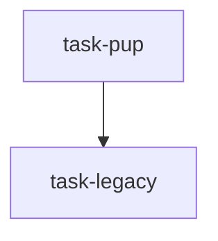

<!--
FIXTURE: s15-untouched-file-in-own-scope
RULE: S15 (diff-property criterion), ESCALATED form
EXPECTED: warn on task-legacy, escalated; do NOT warn on task-pup
COVERS: S15's escalation clause, which is the only fully mechanical check in the
  S12-S15 set — it cross-references the AC text against the task's own frontmatter.
  task-legacy — AC says `legacy-dialog.component.ts` is "untouched", and that exact
                path is in the task's own `files:`. Unenforceable from BOTH
                directions at once: a unit spec cannot observe whether a file was
                edited, and the executor's scope tripwire cannot fire because an
                implementer who edits it is INSIDE their declared scope. WARN, and
                say the file is self-scoped.
  task-pup    — asserts the same kind of absence in positive-with-control form (the
                control IS found in the new dialog, and absent from the legacy one),
                and does not declare the legacy file in `files:`. MUST NOT WARN.
EXPECTED WARNING TEXT (substring):
  S15
  task-legacy
  files:
MUST NOT WARN: task-pup.
ALSO EXPECTED (not scored here): S12 fires on task-legacy. "No new control appears in
  the legacy dialog" is a negative whose only sibling is the diff-property bullet, and
  the `toBeNull()` in its Implementation block is an S12 trigger token. That is
  correct — task-legacy IS crash-passing — it just belongs to S12, not S15.
WHY THIS ONE MATTERS: found by running an audit fixture, not by review — the
  contradiction between an AC and its own `files:` list was in a fixture its author
  wrote and never noticed. A rule catches it for free; a lens costs a dispatch.
FIRST RUN (2026-07-30) FIXED A STRUCTURAL DEFECT IN THIS FIXTURE. Both tasks were
  `depends_on: []` while both declared `test/app/legacy-dialog.component.spec.ts`, so
  step 1 of the detection algorithm would refuse the plan for non-disjoint parallel
  branches before S12-S15 ever ran — the fixture could not have exercised the rule it
  was written for. task-legacy now depends on task-pup, which orders the two writes.
-->

---
title: pup control placement
created: 2026-07-30
---



## Tasks

## Task: add the pup control to the current dialog

```yaml
id: task-pup
depends_on: []
files:
  - src/app/pup-dialog.component.html
  - test/app/pup-dialog.component.spec.ts
  - test/app/legacy-dialog.component.spec.ts
status: pending
```

The new control belongs only in the current dialog.

## Implementation

```html
<!-- src/app/pup-dialog.component.html -->
<ct-pup-control [(value)]="pupId" />
```

## Acceptance criteria

- Mounting the current dialog finds exactly one `ct-pup-control` in the DOM, queried
  by the selector imported from the component rather than retyped.
- Mounting the legacy dialog with the same query finds none — asserted in a spec that
  also finds a known-existing legacy control, proving the query works.

Test file: `test/app/pup-dialog.component.spec.ts`.

## Task: leave the legacy dialog alone

```yaml
id: task-legacy
depends_on: [task-pup]
files:
  - src/app/legacy-dialog.component.ts
  - test/app/legacy-dialog.component.spec.ts
status: pending
```

The legacy dialog must not gain the new control.

## Implementation

```typescript
// test/app/legacy-dialog.component.spec.ts
it('has no pup control', () => {
  expect(fixture.nativeElement.querySelector('ct-pup-control')).toBeNull();
});
```

## Acceptance criteria

- `src/app/legacy-dialog.component.ts` is untouched.
- No new control appears in the legacy dialog.

Test file: `test/app/legacy-dialog.component.spec.ts`.
