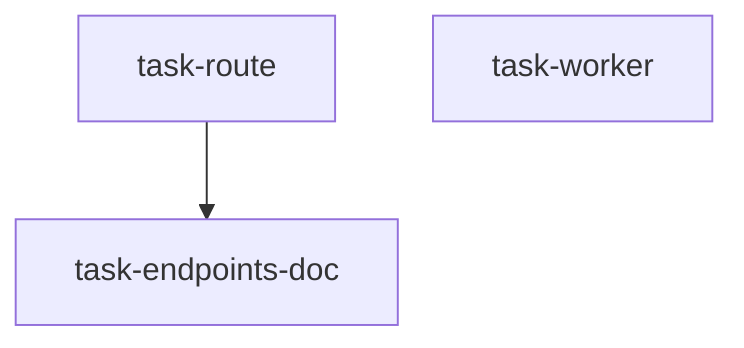

## Tasks

## Task: the recompute route

```yaml
id: task-route
depends_on: []
files:
  - apps/api/src/periods/recompute.controller.ts
  - apps/api/test/recompute.controller.spec.ts
status: pending
```

Adds `POST /api/periods/:id/recompute`, returning `202` with the job id, and the
dedupe check for an already-enqueued period.

## Acceptance criteria

- A first call returns `202` and a job id.
- A second call on the same period returns the **same** job id and enqueues nothing.

## Task: the recompute worker

```yaml
id: task-worker
depends_on: []
files:
  - workers/recompute/src/handler.ts
  - workers/recompute/test/handler.spec.ts
status: pending
```

Runs the enqueued job, honouring the attempt cap.

## Acceptance criteria

- A job that throws is retried up to the cap and then marked failed.

## Task: document the endpoint

```yaml
id: task-endpoints-doc
depends_on: [task-route]
files:
  - docs/reference/endpoints.md
status: pending
```

Adds the `POST /api/periods/:id/recompute` row: method, path, auth, response shape,
and the dedupe behaviour.

## Acceptance criteria

- The new row states the `202` response and the dedupe rule.
- No existing row is reworded.
