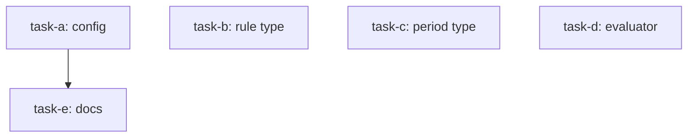

<!--
FIXTURE: dag-integrity-parallel-file-race
LENS: dag-integrity (plan)
EXPECTED: BLOCKING
COVERS: two defects.
  (1) task-b and task-c both declare `src/schema.ts` in `files:` and have no
      directed path between them (both are roots) — a parallel-write race.
  (2) task-d asserts against the `Rule` type that task-b defines, but task-d's
      depends_on omits task-b — a missing edge that fails one run in five.
  Also present, and correctly NOT blocking: task-e depends on task-a with no data
  dependency (a false edge — report as DEFERRED, it only costs wall-clock).
EXPECTED REPORT (substring match):
  src/schema.ts
  missing
MUST NOT REPORT: acceptance-criteria quality (that is `verifiability`) or whether
  the decomposition is well-factored (that is out of scope at this gate).

ALSO PRESENT, scoreable (found 2026-07-29 on the first run, undeclared until then):
  - THE MERMAID BLOCK UNDERSTATES ITS OWN GRAPH. It declares five nodes but exactly
    one edge (`task-a --> task-e`), so it depicts task-b, task-c, and task-d as
    unrelated roots and gives no hint that two of them write the same file. It
    technically matches the (buggy) YAML, which is what makes it misleading: a
    reviewer skimming the diagram sees independent work. Expected at DEFERRED — no
    execution consequence, but real, and it will need regenerating once the missing
    edge is added.
ASSUMES: nothing about the host repo.
-->

---
title: dag integrity fixture
created: 2026-07-29
---



## Context

A plan with a file-scope race between two roots and a missing contract edge.

## Tasks

## Task: config constants

```yaml
id: task-a
depends_on: []
files:
  - src/config.ts
status: pending
```

Adds the tunable thresholds.

## Acceptance criteria

- `MAX_RULES` is exported from `src/config.ts` and equals 100.

## Task: rule type

```yaml
id: task-b
depends_on: []
files:
  - src/schema.ts
status: pending
```

## Implementation

```typescript
// src/schema.ts
export interface Rule { id: string; expr: string; }
```

## Acceptance criteria

- `Rule` is exported from `src/schema.ts` with `id` and `expr`.

## Task: period type

```yaml
id: task-c
depends_on: []
files:
  - src/schema.ts
status: pending
```

## Implementation

```typescript
// src/schema.ts
export interface Period { start: string; end: string; }
```

## Acceptance criteria

- `Period` is exported from `src/schema.ts` with `start` and `end`.

## Task: evaluator

```yaml
id: task-d
depends_on: []
files:
  - src/evaluate.ts
status: pending
```

## Implementation

```typescript
// src/evaluate.ts
import type { Rule } from "./schema.js";

export function evaluate(rule: Rule): boolean {
  return rule.expr.length > 0;
}
```

## Acceptance criteria

- `evaluate` returns false for a `Rule` with an empty `expr`.

## Task: document the thresholds

```yaml
id: task-e
depends_on: [task-a]
files:
  - docs/thresholds.md
status: pending
```

Prose only; reads no code from task-a.

## Acceptance criteria

- `docs/thresholds.md` describes each threshold and its default.
