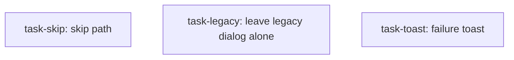

<!--
FIXTURE: verifiability-absence-passes-on-crash
LENS: verifiability (plan)
EXPECTED: BLOCKING
COVERS: three broken checks in one plan.
  task-skip:   "no PATCH is issued" is a pure absence assertion — it passes if the
               Skip handler throws on line 1. Needs a positive companion proving
               the spy can observe a call at all.
  task-legacy: "the legacy dialog is untouched" is a property of the diff, not of
               behavior. Needs positive-with-control.
  task-toast:  a MessageService spy cannot observe whether the toast actually
               renders; asserting the key against the constant the implementer
               just typed is tautological.
EXPECTED REPORT (substring match):
  threw
  positive
MUST NOT REPORT: DAG edges (that is `dag-integrity`) or spec coverage (that is
  `coverage`).
ASSUMES: nothing about the host repo.
-->

---
title: verifiability fixture
created: 2026-07-29
---



## Context

Three tasks whose acceptance criteria are each unfalsifiable in a different way.

## Tasks

## Task: skip path writes nothing

```yaml
id: task-skip
depends_on: []
files:
  - src/app/pup-dialog.component.ts
status: pending
```

Skipping the dialog must not persist anything.

## Acceptance criteria

- Clicking Skip closes the dialog and **no PATCH is issued**.
- The record remains in its prior state.

Test file: `src/app/pup-dialog.component.spec.ts`.

## Task: leave the legacy dialog alone

```yaml
id: task-legacy
depends_on: []
files:
  - src/app/legacy-dialog.component.ts
status: pending
```

The legacy dialog must not gain the new control.

## Acceptance criteria

- `legacy-dialog.component.ts` is **untouched**.
- No new control appears in the legacy dialog.

Test file: `src/app/legacy-dialog.component.spec.ts`.

## Task: failure toast

```yaml
id: task-toast
depends_on: []
files:
  - src/app/pup-launcher.service.ts
status: pending
```

A rejected write surfaces an error toast.

## Acceptance criteria

- On rejection, `messageService.add` is called with `key: NOTIFY_KEY`, severity
  `error`, and the server's message.

Test file: `src/app/pup-launcher.service.spec.ts`.
