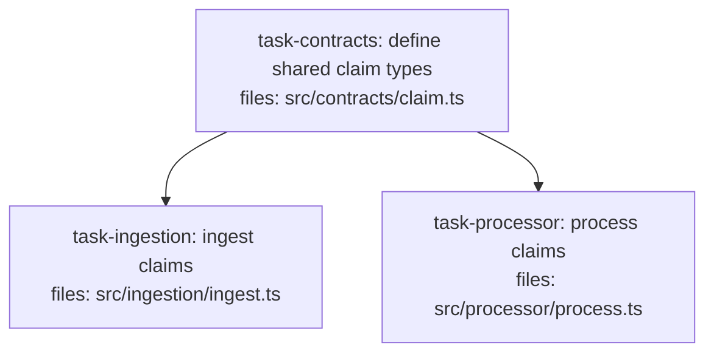

<!--
FIXTURE: clean-explicit-contracts-task
EXPECTED: pass (no H9 or S8 violations)
COVERS: positive case — plan with a dedicated task-contracts root that other tasks depends_on. Demonstrates the explicit contracts-task pattern with all consumers correctly sequenced. Both consumer tasks import ClaimRecord from src/contracts/claim.ts, which is owned by task-contracts. H9 passes because consumers transitively reach task-contracts. S8 passes under Branch A because src/contracts/ is a detected contracts dir.
ASSUMES: repo has a src/contracts/ dir (Branch A of S8 detection applies)
-->

---
title: clean-explicit-contracts-task
created: 2026-05-04
---



## Context

Demonstrates the explicit contracts-task pattern. A dedicated root task owns all shared contract types. Both consumer tasks declare `depends_on: [task-contracts]`, satisfying H9's requirement that consumers transitively reach the definer.

## Tasks

## Task: define shared claim types

```yaml
id: task-contracts
depends_on: []
files:
  - src/contracts/claim.ts
status: pending
```

Defines the canonical `ClaimRecord` interface consumed by all downstream tasks. Lives in `src/contracts/` so S8 Branch A is satisfied.

## Implementation

```typescript
// src/contracts/claim.ts
export interface ClaimRecord {
  id: string;
  amount: number;
  status: "pending" | "approved" | "rejected";
  submittedAt: Date;
}

export type ClaimStatus = ClaimRecord["status"];
```

```typescript
// tests/contracts/claim.test.ts
import type { ClaimRecord } from "../../src/contracts/claim.js";

it("ClaimRecord has required fields", () => {
  const record: ClaimRecord = {
    id: "CLM-001",
    amount: 500,
    status: "pending",
    submittedAt: new Date(),
  };
  expect(record.id).toBe("CLM-001");
});
```

## Acceptance criteria

- `ClaimRecord` interface is exported from `src/contracts/claim.ts`.
- `ClaimStatus` type alias is exported and equals the union `"pending" | "approved" | "rejected"`.

Test file: `tests/contracts/claim.test.ts`.

## Task: ingest claims

```yaml
id: task-ingestion
depends_on: [task-contracts]
files:
  - src/ingestion/ingest.ts
status: pending
```

Reads raw claim data and returns typed `ClaimRecord` objects. Imports from `src/contracts/claim.ts`; H9 passes because `task-contracts` is in `depends_on`.

## Implementation

```typescript
// src/ingestion/ingest.ts
import type { ClaimRecord } from "../contracts/claim.js";

export function parseClaim(raw: Record<string, unknown>): ClaimRecord {
  return {
    id: String(raw.id),
    amount: Number(raw.amount),
    status: "pending",
    submittedAt: new Date(String(raw.submittedAt)),
  };
}
```

```typescript
// tests/ingestion/ingest.test.ts
import { parseClaim } from "../../src/ingestion/ingest.js";

it("parses a raw claim into a ClaimRecord", () => {
  const raw = { id: "1", amount: "100", submittedAt: "2026-01-01" };
  const result = parseClaim(raw);
  expect(result.id).toBe("1");
  expect(result.amount).toBe(100);
});
```

## Acceptance criteria

- `parseClaim` returns a valid `ClaimRecord` given a raw object.
- `status` defaults to `"pending"` for newly ingested records.

Test file: `tests/ingestion/ingest.test.ts`.

## Task: process claims

```yaml
id: task-processor
depends_on: [task-contracts]
files:
  - src/processor/process.ts
status: pending
```

Applies business rules to a `ClaimRecord` and returns an updated status. Imports from `src/contracts/claim.ts`; H9 passes because `task-contracts` is in `depends_on`.

## Implementation

```typescript
// src/processor/process.ts
import type { ClaimRecord, ClaimStatus } from "../contracts/claim.js";

export function evaluateClaim(claim: ClaimRecord): ClaimStatus {
  if (claim.amount > 10_000) return "rejected";
  return "approved";
}
```

```typescript
// tests/processor/process.test.ts
import { evaluateClaim } from "../../src/processor/process.js";

it("rejects claims above 10000", () => {
  const claim = { id: "X", amount: 15_000, status: "pending" as const, submittedAt: new Date() };
  expect(evaluateClaim(claim)).toBe("rejected");
});
```

## Acceptance criteria

- Claims with `amount > 10000` are rejected.
- Claims with `amount <= 10000` are approved.

Test file: `tests/processor/process.test.ts`.
