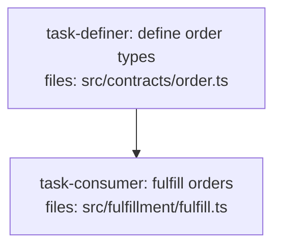

<!--
FIXTURE: clean-implicit-sequencing
EXPECTED: pass (no H9 or S8 violations)
COVERS: positive case — consumer task directly depends_on the definer task with no separate contracts root. H9 does not require a dedicated contracts task; it only requires that the consumer's transitive depends_on closure includes the definer. Direct sequencing is the simplest form of that. S8 passes under Branch A because src/contracts/ is a detected contracts dir.
ASSUMES: repo has a src/contracts/ dir (Branch A of S8 detection applies)
-->

---
title: clean-implicit-sequencing
created: 2026-05-04
---



## Context

Demonstrates implicit sequencing: a single consumer task imports a type from the definer task and declares `depends_on: [task-definer]` directly. No separate contracts-root indirection is needed. H9 is satisfied by the direct edge.

## Tasks

## Task: define order types

```yaml
id: task-definer
depends_on: []
files:
  - src/contracts/order.ts
status: pending
```

Defines the `Order` interface and `OrderStatus` type alias. Placed in `src/contracts/` to satisfy S8 Branch A.

## Implementation

```typescript
// src/contracts/order.ts
export interface Order {
  orderId: string;
  customerId: string;
  lineItems: LineItem[];
  total: number;
}

export interface LineItem {
  sku: string;
  quantity: number;
  unitPrice: number;
}

export type OrderStatus = "placed" | "fulfilled" | "cancelled";
```

```typescript
// tests/contracts/order.test.ts
import type { Order } from "../../src/contracts/order.js";

it("Order interface has orderId and total", () => {
  const order: Order = { orderId: "O-1", customerId: "C-1", lineItems: [], total: 0 };
  expect(order.orderId).toBe("O-1");
});
```

## Acceptance criteria

- `Order` interface is exported with `orderId`, `customerId`, `lineItems`, and `total` fields.
- `LineItem` interface is exported with `sku`, `quantity`, and `unitPrice` fields.
- `OrderStatus` type alias is exported.

Test file: `tests/contracts/order.test.ts`.

## Task: fulfill orders

```yaml
id: task-consumer
depends_on: [task-definer]
files:
  - src/fulfillment/fulfill.ts
status: pending
```

Processes an `Order` and emits a fulfillment event. Imports `Order` directly from `task-definer`'s file; H9 passes because `task-definer` is in `depends_on`.

## Implementation

```typescript
// src/fulfillment/fulfill.ts
import type { Order, OrderStatus } from "../contracts/order.js";

export function fulfillOrder(order: Order): OrderStatus {
  if (order.lineItems.length === 0) return "cancelled";
  return "fulfilled";
}
```

```typescript
// tests/fulfillment/fulfill.test.ts
import { fulfillOrder } from "../../src/fulfillment/fulfill.js";

it("cancels an order with no line items", () => {
  const order = { orderId: "O-2", customerId: "C-1", lineItems: [], total: 0 };
  expect(fulfillOrder(order)).toBe("cancelled");
});
```

## Acceptance criteria

- Orders with no `lineItems` are cancelled.
- Orders with at least one `lineItem` are fulfilled.

Test file: `tests/fulfillment/fulfill.test.ts`.
