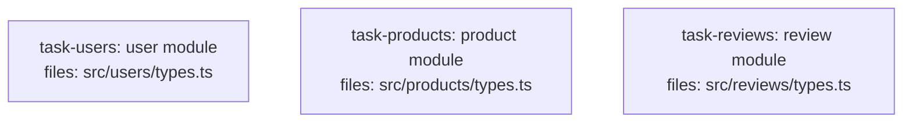

<!--
FIXTURE: clean-no-shared-contracts
EXPECTED: pass (no H9 or S8 violations)
COVERS: positive case — three independent tasks each defining internal types solely for their own use. No task imports a symbol defined in another task's files. H9 has nothing to check (no cross-task contract references exist). S8 also does not fire: each task defines types in its own isolated file, and since no sharing occurs there is no co-location concern either. All three tasks are DAG roots with depends_on: [].
ASSUMES: no shared contracts dir; repo uses per-module types (Branch B conditions could apply, but no mixed-concerns violations occur because no runtime side-effects appear alongside the type definitions)
-->

---
title: clean-no-shared-contracts
created: 2026-05-04
---



## Context

Three independent tasks define their own internal types with no cross-task sharing. H9 has no cross-task symbol references to check; S8 finds no co-location concern because each module owns its own types exclusively. All tasks are root tasks.

## Tasks

## Task: user module

```yaml
id: task-users
depends_on: []
files:
  - src/users/types.ts
status: pending
```

Defines the `User` type used exclusively within the users module. Not shared with any other task.

## Implementation

```typescript
// src/users/types.ts
export interface User {
  userId: string;
  email: string;
  displayName: string;
  createdAt: Date;
}

export type UserRole = "admin" | "member" | "viewer";
```

```typescript
// tests/users/types.test.ts
import type { User } from "../../src/users/types.js";

it("User interface has email field", () => {
  const user: User = { userId: "u1", email: "a@b.com", displayName: "Alice", createdAt: new Date() };
  expect(user.email).toBe("a@b.com");
});
```

## Acceptance criteria

- `User` interface is exported with `userId`, `email`, `displayName`, and `createdAt` fields.
- `UserRole` type alias is exported as the union `"admin" | "member" | "viewer"`.

Test file: `tests/users/types.test.ts`.

## Task: product module

```yaml
id: task-products
depends_on: []
files:
  - src/products/types.ts
status: pending
```

Defines the `Product` type used exclusively within the products module. Not shared with any other task.

## Implementation

```typescript
// src/products/types.ts
export interface Product {
  productId: string;
  name: string;
  priceCents: number;
  inStock: boolean;
}

export type ProductCategory = "electronics" | "clothing" | "food";
```

```typescript
// tests/products/types.test.ts
import type { Product } from "../../src/products/types.js";

it("Product interface has priceCents field", () => {
  const product: Product = { productId: "p1", name: "Widget", priceCents: 999, inStock: true };
  expect(product.priceCents).toBe(999);
});
```

## Acceptance criteria

- `Product` interface is exported with `productId`, `name`, `priceCents`, and `inStock` fields.
- `ProductCategory` type alias is exported.

Test file: `tests/products/types.test.ts`.

## Task: review module

```yaml
id: task-reviews
depends_on: []
files:
  - src/reviews/types.ts
status: pending
```

Defines the `Review` type used exclusively within the reviews module. Not shared with any other task.

## Implementation

```typescript
// src/reviews/types.ts
export interface Review {
  reviewId: string;
  authorId: string;
  rating: 1 | 2 | 3 | 4 | 5;
  body: string;
  postedAt: Date;
}
```

```typescript
// tests/reviews/types.test.ts
import type { Review } from "../../src/reviews/types.js";

it("Review interface has rating field constrained to 1-5", () => {
  const review: Review = { reviewId: "r1", authorId: "u1", rating: 4, body: "Good", postedAt: new Date() };
  expect(review.rating).toBe(4);
});
```

## Acceptance criteria

- `Review` interface is exported with `reviewId`, `authorId`, `rating` (1–5), `body`, and `postedAt` fields.
- No symbols from `task-users` or `task-products` are imported.

Test file: `tests/reviews/types.test.ts`.
