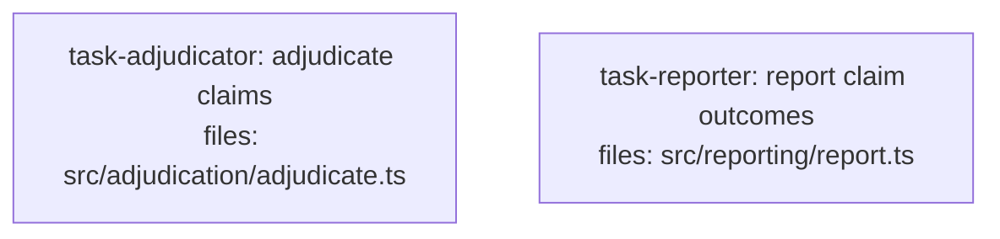

<!--
FIXTURE: clean-pre-existing-contracts
EXPECTED: pass (no H9 or S8 violations)
COVERS: positive case — plan tasks import Claim from a file that already exists in the codebase (src/legacy/types.ts, documented here as pre-existing). H9's detection algorithm skips pre-existing files per the H8 classification rule: if a file is pre-existing in the target codebase it is exempt from cross-task dependency checking. No task in this plan defines Claim — it comes from outside the plan entirely. S8 does not fire on consumer imports, only on definer sites.
ASSUMES: src/legacy/types.ts exists in the target codebase prior to plan execution (pre-existing file). Branch A may or may not apply; the key point is H9's pre-existing-file exemption.
-->

---
title: clean-pre-existing-contracts
created: 2026-05-04
---



## Context

Both tasks import `Claim` from `src/legacy/types.ts`, which pre-exists in the codebase and is not owned by any task in this plan. H9 skips pre-existing files entirely — no task in this plan defines `Claim`, so there is no definer to sequence against. The two plan tasks can run in parallel because they do not share any files.

## Tasks

## Task: adjudicate claims

```yaml
id: task-adjudicator
depends_on: []
files:
  - src/adjudication/adjudicate.ts
status: pending
```

Applies adjudication rules to incoming `Claim` objects imported from the pre-existing `src/legacy/types.ts`. H9 skips the `Claim` import because its source file predates this plan.

## Implementation

```typescript
// src/adjudication/adjudicate.ts
// NOTE: src/legacy/types.ts is a pre-existing file in the target codebase.
import type { Claim } from "../legacy/types.js";

export type AdjudicationResult = "approved" | "denied" | "escalated";

export function adjudicateClaim(claim: Claim): AdjudicationResult {
  if (claim.amount > 50_000) return "escalated";
  if (claim.fraudScore > 0.8) return "denied";
  return "approved";
}
```

```typescript
// tests/adjudication/adjudicate.test.ts
import { adjudicateClaim } from "../../src/adjudication/adjudicate.js";

it("escalates claims above 50000", () => {
  const claim = { id: "C1", amount: 75_000, fraudScore: 0.1 };
  expect(adjudicateClaim(claim as any)).toBe("escalated");
});
```

## Acceptance criteria

- Claims with `amount > 50000` are escalated.
- Claims with `fraudScore > 0.8` (and `amount <= 50000`) are denied.
- All other claims are approved.

Test file: `tests/adjudication/adjudicate.test.ts`.

## Task: report claim outcomes

```yaml
id: task-reporter
depends_on: []
files:
  - src/reporting/report.ts
status: pending
```

Generates a summary report from `Claim` objects imported from the pre-existing `src/legacy/types.ts`. Runs in parallel with `task-adjudicator` because it shares no files and both imports are from a pre-existing file (H9 exemption applies to both).

## Implementation

```typescript
// src/reporting/report.ts
// NOTE: src/legacy/types.ts is a pre-existing file in the target codebase.
import type { Claim } from "../legacy/types.js";

export interface ClaimSummary {
  total: number;
  totalAmount: number;
}

export function summarizeClaims(claims: Claim[]): ClaimSummary {
  return {
    total: claims.length,
    totalAmount: claims.reduce((sum, c) => sum + c.amount, 0),
  };
}
```

```typescript
// tests/reporting/report.test.ts
import { summarizeClaims } from "../../src/reporting/report.js";

it("sums amounts across all claims", () => {
  const claims = [{ id: "C1", amount: 100, fraudScore: 0 }, { id: "C2", amount: 200, fraudScore: 0 }];
  const summary = summarizeClaims(claims as any);
  expect(summary.totalAmount).toBe(300);
});
```

## Acceptance criteria

- `summarizeClaims` returns `{ total: N, totalAmount: M }` where N is claim count and M is the sum of `amount` fields.
- Function handles an empty array, returning `{ total: 0, totalAmount: 0 }`.

Test file: `tests/reporting/report.test.ts`.
