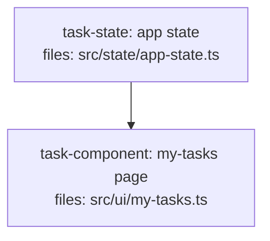

<!--
FIXTURE: h10-renamed-but-wired
EXPECTED: pass
COVERS: positive case — consumer calls state.tasksForUser(); task-state defines a
  tasksForUser() member. H10 finds the member on the owner's defined-symbol set
  and does not fire. Guards against H10 over-firing on correctly-wired members.
-->

---
title: h10-renamed-but-wired
created: 2026-06-24
---



## Context

Demonstrates H10 passing: the my-tasks page consumes `state.tasksForUser()`, and
the state service defines `tasksForUser()` as a member. H10 builds the
member-level index for task-state's `AppState` class (members: `tasksForUser`,
`refreshTasksForUser`, `lists`, `refreshLists`) and finds `tasksForUser` present.
No violation fires.

## Tasks

## Task: app state

```yaml
id: task-state
depends_on: []
files:
  - src/state/app-state.ts
status: pending
```

Exposes the application state object consumed across the UI, including
`tasksForUser()` for retrieving the current user's tasks.

## Implementation

```typescript
// src/state/app-state.ts
export class AppState {
  lists() { return this._lists; }
  refreshLists() { /* ... */ }
  tasksForUser() { return this._tasksForUser; }
  refreshTasksForUser() { /* ... */ }
}
export const state = new AppState();
```

```typescript
// tests/state/app-state.test.ts
import { state } from "../../src/state/app-state.js";
it("exposes tasksForUser()", () => { expect(typeof state.tasksForUser).toBe("function"); });
```

## Acceptance criteria

- `state.lists()` returns the cached list array.
- `state.refreshLists()` re-fetches lists.
- `state.tasksForUser()` returns the current user's tasks.
- `state.refreshTasksForUser()` re-fetches user tasks.

Test file: `tests/state/app-state.test.ts`.

## Task: my-tasks page

```yaml
id: task-component
depends_on: [task-state]
files:
  - src/ui/my-tasks.ts
status: pending
```

Default route. Renders the current user's tasks across all lists.

## Implementation

```typescript
// src/ui/my-tasks.ts
import { state } from "../state/app-state.js";

export function renderMyTasks() {
  const tasks = state.tasksForUser();    // <-- producer (task-state) defines tasksForUser
  state.refreshTasksForUser();           // <-- producer defines refreshTasksForUser
  return tasks.map((t) => t.title);
}
```

```typescript
// tests/ui/my-tasks.test.ts
import { renderMyTasks } from "../../src/ui/my-tasks.js";
it("renders task titles", () => { expect(renderMyTasks()).toBeInstanceOf(Array); });
```

## Acceptance criteria

- Renders one row per task returned by `state.tasksForUser()`.
- Calling the page triggers `state.refreshTasksForUser()`.

Test file: `tests/ui/my-tasks.test.ts`.
