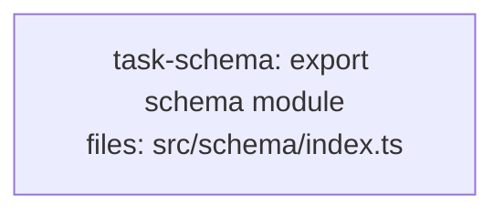

<!--
FIXTURE: h11-checksum-criteria
EXPECTED: pass
COVERS: positive case — criterion carries a countable checksum (11 schema files)
  plus a provenance cite (§5.1). H11 does not fire. Guards against over-refusal
  when the section is cited as provenance alongside real content.
-->

---
title: h11-checksum-criteria
created: 2026-06-24
---



## Context

Demonstrates H11 passing: the acceptance-criteria bullet carries a countable
checksum ("11 schema files") and a breakdown ("4 entity + 5 input + 2 query")
alongside the provenance cite (§5.1). H11 sees a verifiable number and does not
fire. Guards against over-refusal when the spec section is cited as provenance
alongside real content.

## Tasks

## Task: export schema module

```yaml
id: task-schema
depends_on: []
files:
  - src/schema/index.ts
status: pending
```

Implements the public schema module re-exported from `src/schema/index.ts`.
Must re-export all 11 schema files as required by the data-layer contract.

## Implementation

```typescript
// src/schema/index.ts
export { UserSchema } from "./entity/user.js";
export { OrderSchema } from "./entity/order.js";
export { ProductSchema } from "./entity/product.js";
export { InvoiceSchema } from "./entity/invoice.js";
export { CreateUserInput } from "./input/create-user.js";
export { UpdateUserInput } from "./input/update-user.js";
export { CreateOrderInput } from "./input/create-order.js";
export { UpdateOrderInput } from "./input/update-order.js";
export { DeleteOrderInput } from "./input/delete-order.js";
export { UserQuery } from "./query/user-query.js";
export { OrderQuery } from "./query/order-query.js";
```

```typescript
// tests/schema/index.test.ts
import * as schema from "../../src/schema/index.js";

it("re-exports all 11 schema files", () => {
  expect(Object.keys(schema)).toHaveLength(11);
});
```

## Acceptance criteria

- Re-exports all 11 schema files (4 entity + 5 input + 2 query) per spec §5.1.
- Each named export is a Zod schema object with a `.parse()` method.

Test file: `tests/schema/index.test.ts`.
