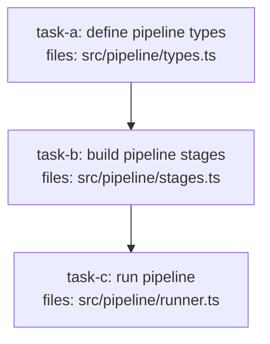

<!--
FIXTURE: h9-transitive-ok
EXPECTED: pass (no H9 or S8 violations)
COVERS: positive case — three-task chain task-c -> task-b -> task-a. task-c imports a type (Pipeline) defined by task-a. task-c's direct depends_on is only [task-b], but the transitive closure of task-c's depends_on includes task-b and then task-a (since task-b depends_on task-a). H9's algorithm performs a DFS transitive closure, so task-a is in the closure and no violation fires. Demonstrates that H9 honors transitive deps, not just direct depends_on edges.
ASSUMES: repo has a src/contracts/ or src/pipeline/ dir; S8 Branch A or B may apply. No S8 violation occurs because pipeline types are defined in dedicated type-only files.
-->

---
title: h9-transitive-ok
created: 2026-05-04
---



## Context

Three-task linear chain. `task-a` defines the `Pipeline` interface. `task-b` extends it with stage logic and depends on `task-a`. `task-c` imports `Pipeline` (defined by `task-a`) but only lists `[task-b]` in its `depends_on`. H9 computes the transitive closure of `task-c`'s deps: {task-b, task-a}. Since `task-a` is in the closure, no violation fires.

## Tasks

## Task: define pipeline types

```yaml
id: task-a
depends_on: []
files:
  - src/pipeline/types.ts
status: pending
```

Defines the foundational `Pipeline` and `Stage` interfaces. All downstream pipeline tasks depend on these types.

## Implementation

```typescript
// src/pipeline/types.ts
export interface Stage {
  name: string;
  handler: (input: unknown) => Promise<unknown>;
}

export interface Pipeline {
  id: string;
  stages: Stage[];
  timeoutMs: number;
}
```

```typescript
// tests/pipeline/types.test.ts
import type { Pipeline } from "../../src/pipeline/types.js";

it("Pipeline interface has id and stages", () => {
  const p: Pipeline = { id: "p1", stages: [], timeoutMs: 5000 };
  expect(p.id).toBe("p1");
  expect(Array.isArray(p.stages)).toBe(true);
});
```

## Acceptance criteria

- `Stage` interface exported with `name` and `handler` fields.
- `Pipeline` interface exported with `id`, `stages`, and `timeoutMs` fields.

Test file: `tests/pipeline/types.test.ts`.

## Task: build pipeline stages

```yaml
id: task-b
depends_on: [task-a]
files:
  - src/pipeline/stages.ts
status: pending
```

Implements built-in stage factory functions. Imports `Stage` from `task-a`; H9 passes because `task-a` is in direct `depends_on`.

## Implementation

```typescript
// src/pipeline/stages.ts
import type { Stage } from "./types.js";

export function logStage(label: string): Stage {
  return {
    name: `log:${label}`,
    handler: async (input) => {
      console.log(`[${label}]`, input);
      return input;
    },
  };
}

export function transformStage(fn: (x: unknown) => unknown): Stage {
  return {
    name: "transform",
    handler: async (input) => fn(input),
  };
}
```

```typescript
// tests/pipeline/stages.test.ts
import { logStage, transformStage } from "../../src/pipeline/stages.js";

it("logStage returns a Stage with correct name", () => {
  const stage = logStage("debug");
  expect(stage.name).toBe("log:debug");
});
```

## Acceptance criteria

- `logStage(label)` returns a `Stage` that passes input through unchanged.
- `transformStage(fn)` returns a `Stage` that applies `fn` to its input.

Test file: `tests/pipeline/stages.test.ts`.

## Task: run pipeline

```yaml
id: task-c
depends_on: [task-b]
files:
  - src/pipeline/runner.ts
status: pending
```

Executes a `Pipeline` by running each `Stage` in sequence. Imports `Pipeline` (defined by `task-a`) transitively through `task-b`. H9 computes the transitive closure {task-b, task-a} and finds `task-a` — no violation. Direct `depends_on` is [task-b] only.

## Implementation

```typescript
// src/pipeline/runner.ts
import type { Pipeline } from "./types.js";

export async function runPipeline(pipeline: Pipeline, initialInput: unknown): Promise<unknown> {
  let result = initialInput;
  for (const stage of pipeline.stages) {
    result = await stage.handler(result);
  }
  return result;
}
```

```typescript
// tests/pipeline/runner.test.ts
import { runPipeline } from "../../src/pipeline/runner.js";

it("runs each stage in sequence", async () => {
  const log: string[] = [];
  const pipeline = {
    id: "p1",
    stages: [
      { name: "a", handler: async (x: unknown) => { log.push("a"); return x; } },
      { name: "b", handler: async (x: unknown) => { log.push("b"); return x; } },
    ],
    timeoutMs: 1000,
  };
  await runPipeline(pipeline, null);
  expect(log).toEqual(["a", "b"]);
});
```

## Acceptance criteria

- `runPipeline` executes stages in order, passing each stage's output as the next stage's input.
- Returns the final stage's output.
- Works correctly with zero stages (returns `initialInput` unchanged).

Test file: `tests/pipeline/runner.test.ts`.
