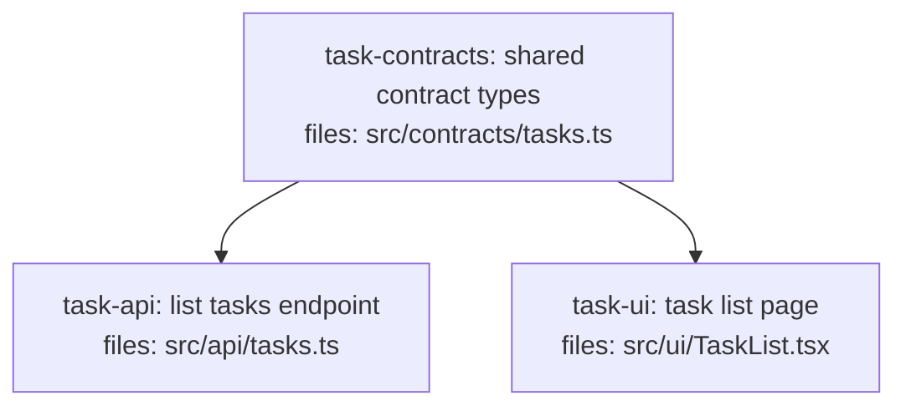

<!--
FIXTURE: s11-shared-named-schema
EXPECTED: pass
COVERS: the cut-crossing envelope is a shared named type (TaskListPage) defined by
  task-contracts; both api and ui depend on it. S11's suppressor fires — silent.
  Guards against S11 warning when the contract IS anchored.
-->

---
title: s11-shared-named-schema
created: 2026-06-24
---



## Context

Demonstrates S11's suppressor: a dedicated `task-contracts` root task defines the
named type `TaskListPage` in `src/contracts/tasks.ts`. Both `task-api` (`src/api/`)
and `task-ui` (`src/ui/`) import and use `TaskListPage`, and both declare
`depends_on: [task-contracts]`. Because the crossing envelope is a **named** shared
type that both sides depend on, S11's suppressor fires and S11 is silent.

H9 is satisfied: both consumers (`task-api`, `task-ui`) directly `depends_on`
`task-contracts` (the definer). H10 is satisfied: all members referenced are defined
on `TaskListPage`. All other hard rules (H1-H11) pass.

## Tasks

## Task: shared contract types

```yaml
id: task-contracts
depends_on: []
files:
  - src/contracts/tasks.ts
status: pending
```

Defines the canonical `TaskListPage` response envelope and the `Task` item type.
These named types are the single source of truth for the API-to-UI contract.

## Implementation

```typescript
// src/contracts/tasks.ts
export interface Task {
  id: string;
  title: string;
  done: boolean;
}

export interface TaskListPage {
  items: Task[];
  nextCursor: string | null;
}
```

```typescript
// tests/contracts/tasks.test.ts
import type { TaskListPage } from "../../src/contracts/tasks.js";

it("TaskListPage has items and nextCursor fields", () => {
  const page: TaskListPage = { items: [], nextCursor: null };
  expect(Array.isArray(page.items)).toBe(true);
  expect(page.nextCursor).toBeNull();
});
```

## Acceptance criteria

- `Task` interface exported with `id` (string), `title` (string), and `done` (boolean).
- `TaskListPage` interface exported with `items: Task[]` and `nextCursor: string | null`.

Test file: `tests/contracts/tasks.test.ts`.

## Task: list tasks endpoint

```yaml
id: task-api
depends_on: [task-contracts]
files:
  - src/api/tasks.ts
status: pending
```

Implements `GET /api/tasks` and returns a `TaskListPage` envelope. Uses the named
shared type imported from `src/contracts/tasks.ts`.

## Implementation

```typescript
// src/api/tasks.ts
import type { TaskListPage } from "../contracts/tasks.js";

export async function listTasks(req: Request): Promise<Response> {
  const items = await db.tasks.findAll();
  const page: TaskListPage = { items, nextCursor: null };
  return Response.json(page);
}
```

```typescript
// tests/api/tasks.test.ts
import { listTasks } from "../../src/api/tasks.js";

it("returns 200 with TaskListPage envelope", async () => {
  const res = await listTasks(makeReq({}));
  expect(res.status).toBe(200);
  const body = await res.json();
  expect(Array.isArray(body.items)).toBe(true);
  expect("nextCursor" in body).toBe(true);
});
```

## Acceptance criteria

- `GET /api/tasks` returns `200` with a `TaskListPage`-shaped body (`{ items, nextCursor }`).
- Uses the `TaskListPage` type from `src/contracts/tasks.ts` — no local redefinition.

Test file: `tests/api/tasks.test.ts`.

## Task: task list page

```yaml
id: task-ui
depends_on: [task-contracts]
files:
  - src/ui/TaskList.tsx
status: pending
```

Renders the task list. Imports `TaskListPage` from the shared contracts module and
uses the named type in its fetch handler. Because the envelope is named and both
sides share the same type definition, S11 does not fire.

## Implementation

```typescript
// src/ui/TaskList.tsx
import React, { useEffect, useState } from "react";
import type { TaskListPage, Task } from "../contracts/tasks.js";

export function TaskList() {
  const [items, setItems] = useState<Task[]>([]);
  const [nextCursor, setNextCursor] = useState<string | null>(null);

  useEffect(() => {
    fetch("/api/tasks")
      .then((r) => r.json() as Promise<TaskListPage>)
      .then((page) => {
        setItems(page.items);
        setNextCursor(page.nextCursor);
      });
  }, []);

  return (
    <ul>
      {items.map((t) => (
        <li key={t.id}>{t.title}</li>
      ))}
    </ul>
  );
}
```

```typescript
// tests/ui/TaskList.test.tsx
import { render, screen } from "@testing-library/react";
import { TaskList } from "../../src/ui/TaskList.js";
import type { TaskListPage } from "../../src/contracts/tasks.js";

it("renders task titles after fetch", async () => {
  const page: TaskListPage = {
    items: [{ id: "1", title: "Write tests", done: false }],
    nextCursor: null,
  };
  global.fetch = async () => new Response(JSON.stringify(page));
  render(<TaskList />);
  expect(await screen.findByText("Write tests")).toBeInTheDocument();
});
```

## Acceptance criteria

- Fetches `/api/tasks` on mount, types the response as `TaskListPage`, and renders each task title.
- Uses `TaskListPage` from `src/contracts/tasks.ts` — no anonymous inline shape assertion.
- Renders an empty list when `items` is empty.

Test file: `tests/ui/TaskList.test.tsx`.
