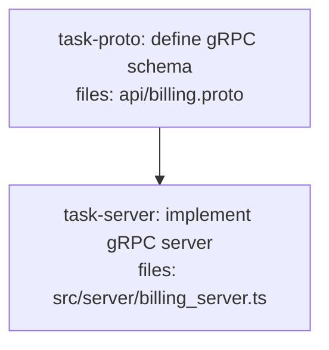

<!--
FIXTURE: s8-schema-file-exempt
EXPECTED: pass (no H9 or S8 violations)
COVERS: positive case — plan defines message types alongside RPC service definitions in a single api.proto file. Under S8 Branch B, the mixed-concerns check (types alongside non-type code such as service/rpc definitions) would normally warn. However, .proto files are explicitly exempted from S8 Branch B detection. The fixture demonstrates that co-locating message types and service definitions in one .proto file passes validation without any S8 warning.
ASSUMES: repo has no pre-existing contracts/ dir so Branch B detection is active; the .proto file extension triggers the schema-as-code exemption listed in S8's Branch B rule.
-->

---
title: s8-schema-file-exempt
created: 2026-05-04
---



## Context

`task-proto` defines both `Invoice` and `LineItem` message types AND the `BillingService` RPC service in the same `api/billing.proto` file. Under S8 Branch B this would be a mixed-concerns warning (type definitions alongside service definitions that have side-effectful semantics). However `.proto` files are schema-as-code files explicitly exempted from S8 Branch B. No warning fires.

## Tasks

## Task: define gRPC schema

```yaml
id: task-proto
depends_on: []
files:
  - api/billing.proto
status: pending
```

Defines the `Invoice` and `LineItem` message types and the `BillingService` service in a single protobuf schema file. The `.proto` extension exempts this file from S8's mixed-concerns check, so co-locating message types and RPC definitions does not trigger a warning.

## Implementation

```protobuf
// api/billing.proto
syntax = "proto3";

package billing;

message LineItem {
  string sku = 1;
  int32 quantity = 2;
  int64 unit_price_cents = 3;
}

message Invoice {
  string invoice_id = 1;
  string customer_id = 2;
  repeated LineItem line_items = 3;
  int64 total_cents = 4;
}

message CreateInvoiceRequest {
  string customer_id = 1;
  repeated LineItem line_items = 2;
}

message CreateInvoiceResponse {
  Invoice invoice = 1;
}

service BillingService {
  rpc CreateInvoice(CreateInvoiceRequest) returns (CreateInvoiceResponse);
}
```

```bash
# Verify proto file parses correctly
protoc --proto_path=api api/billing.proto --descriptor_set_out=/dev/null
```

## Acceptance criteria

- `api/billing.proto` defines `Invoice` and `LineItem` message types.
- `api/billing.proto` defines `BillingService` with a `CreateInvoice` RPC.
- Proto file is syntactically valid (parseable by `protoc`).

Test file: `tests/proto/billing.proto.test.sh`.

## Task: implement gRPC server

```yaml
id: task-server
depends_on: [task-proto]
files:
  - src/server/billing_server.ts
status: pending
```

Implements the `BillingService` server handler using generated TypeScript stubs from `api/billing.proto`. H9 passes because `task-proto` is in `depends_on`. S8 does not fire on consumers — only on definer sites.

## Implementation

```typescript
// src/server/billing_server.ts
// Generated types come from the protobuf compilation of api/billing.proto (task-proto).
import type { Invoice, LineItem, CreateInvoiceRequest, CreateInvoiceResponse } from "../../generated/billing.js";

export function createInvoice(req: CreateInvoiceRequest): CreateInvoiceResponse {
  const totalCents = req.line_items.reduce(
    (sum: number, item: LineItem) => sum + item.quantity * item.unit_price_cents,
    0
  );
  const invoice: Invoice = {
    invoice_id: `INV-${Date.now()}`,
    customer_id: req.customer_id,
    line_items: req.line_items,
    total_cents: totalCents,
  };
  return { invoice };
}
```

```typescript
// tests/server/billing_server.test.ts
import { createInvoice } from "../../src/server/billing_server.js";

it("computes total_cents from line items", () => {
  const req = {
    customer_id: "cust-1",
    line_items: [{ sku: "WIDGET", quantity: 2, unit_price_cents: 500 }],
  };
  const response = createInvoice(req as any);
  expect(response.invoice.total_cents).toBe(1000);
});
```

## Acceptance criteria

- `createInvoice` returns an `Invoice` with `total_cents` equal to the sum of `quantity * unit_price_cents` across all line items.
- `invoice_id` is a non-empty string.
- `customer_id` on the response invoice matches the request's `customer_id`.

Test file: `tests/server/billing_server.test.ts`.
