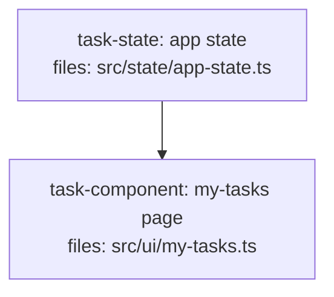

<!--
FIXTURE: h10-missing-producer
EXPECTED: refuse with H10
COVERS: negative case — task-component imports `state` from task-state (depends_on
  declared, so H8 + H9 both pass), then calls state.myTasks(). No task defines a
  `myTasks` member on the state object. H10 detects the member gap and refuses.
EXPECTED REFUSAL TEXT (substring match):
  task-component violates H10 (consumed capability has no producer)
    Capability: state.myTasks
    Owner:      task-state (produces state, file: src/state/app-state.ts)
    Issue:      task-component references state.myTasks but task-state defines no myTasks
ASSUMES: H8 + H9 pass (import resolves, no missing edge); H10 fires on the member gap.
-->

---
title: h10-missing-producer
created: 2026-06-24
---



## Context

Demonstrates H10: the my-tasks page consumes `state.myTasks()`, but the state
service defines no such member and no other task produces the capability. H8
passes (the `state` import resolves to task-state's file); H9 passes (`myTasks`
is not in the definer index, so no triple forms). H10 catches the member gap.

## Tasks

## Task: app state

```yaml
id: task-state
depends_on: []
files:
  - src/state/app-state.ts
status: pending
```

Exposes the application state object consumed across the UI.

## Implementation

```typescript
// src/state/app-state.ts
export class AppState {
  lists() { return this._lists; }
  refreshLists() { /* ... */ }
}
export const state = new AppState();
```

```typescript
// tests/state/app-state.test.ts
import { state } from "../../src/state/app-state.js";
it("exposes lists()", () => { expect(typeof state.lists).toBe("function"); });
```

## Acceptance criteria

- `state.lists()` returns the cached list array.
- `state.refreshLists()` re-fetches lists.

Test file: `tests/state/app-state.test.ts`.

## Task: my-tasks page

```yaml
id: task-component
depends_on: [task-state]
files:
  - src/ui/my-tasks.ts
status: pending
```

Default route. Renders the current user's tasks across all lists.

## Implementation

```typescript
// src/ui/my-tasks.ts
import { state } from "../state/app-state.js";

export function renderMyTasks() {
  const tasks = state.myTasks();      // <-- no producer defines myTasks
  state.refreshMyTasks();             // <-- nor refreshMyTasks
  return tasks.map((t) => t.title);
}
```

```typescript
// tests/ui/my-tasks.test.ts
import { renderMyTasks } from "../../src/ui/my-tasks.js";
it("renders task titles", () => { expect(renderMyTasks()).toBeInstanceOf(Array); });
```

## Acceptance criteria

- Renders one row per task returned by `state.myTasks()`.
- Calling the page triggers `state.refreshMyTasks()`.

Test file: `tests/ui/my-tasks.test.ts`.
