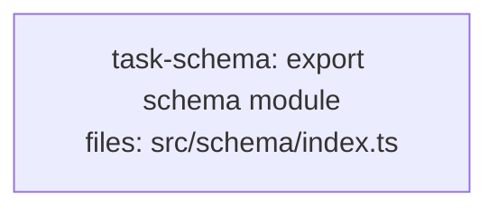

<!--
FIXTURE: h11-bare-spec-pointer
EXPECTED: refuse with H11
COVERS: negative case — acceptance criterion defers to spec §5.1 with no inlined
  requirement text and no countable checksum. The executor's reviewers never see
  the spec, so the bullet is unverifiable. H11 refuses.
EXPECTED REFUSAL TEXT (substring match):
  task-schema violates H11 (bare spec pointer in acceptance criteria)
    Bullet: "Match the schema exactly per spec §5.1."
ASSUMES: H1-H10 pass; the only defect is the bare pointer.
-->

---
title: h11-bare-spec-pointer
created: 2026-06-24
---



## Context

Demonstrates H11 violation: the sole acceptance-criteria bullet is a bare spec
pointer with no inlined requirement and no countable checksum. The reviewer has
no access to §5.1, so the criterion is unverifiable.

## Tasks

## Task: export schema module

```yaml
id: task-schema
depends_on: []
files:
  - src/schema/index.ts
status: pending
```

Implements the public schema module re-exported from `src/schema/index.ts`.

## Implementation

```typescript
// src/schema/index.ts
export { UserSchema } from "./user.js";
export { OrderSchema } from "./order.js";
```

```typescript
// tests/schema/index.test.ts
import * as schema from "../../src/schema/index.js";

it("exports UserSchema", () => {
  expect(schema.UserSchema).toBeDefined();
});
```

## Acceptance criteria

- Match the schema exactly per spec §5.1.

Test file: `tests/schema/index.test.ts`.
