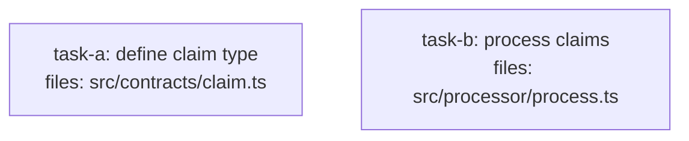

<!--
FIXTURE: h9-missing-edge
EXPECTED: refuse with H9
COVERS: negative case — task-b imports a type defined by task-a but task-b.depends_on is empty (no path to task-a). H9 detects that the consumer's transitive depends_on closure does not include the definer and refuses.
EXPECTED REFUSAL TEXT (substring match):
  task-b violates H9 (missing contract dependency)
    Symbol: Claim
    Defined by: task-a
    Issue: task-b references Claim but does not depends_on task-a (transitively)
    Fix:   add "task-a" to task-b.depends_on
ASSUMES: repo with a contracts/ dir; H9 check fires before S8.
-->

---
title: h9-missing-edge
created: 2026-05-04
---



## Context

Demonstrates H9 violation: task-b consumes the `Claim` interface exported by task-a, but task-b declares `depends_on: []`. The H9 check builds the definer index (task-a defines `Claim` in `src/contracts/claim.ts`), scans task-b's code blocks for usages, computes task-b's transitive closure ({} — no deps), and finds task-a is absent. Plan is refused before saving.

## Tasks

## Task: define claim type

```yaml
id: task-a
depends_on: []
files:
  - src/contracts/claim.ts
status: pending
```

Exports the canonical `Claim` interface used across the system. All downstream tasks that reference `Claim` must declare `depends_on: [task-a]`.

## Implementation

```typescript
// src/contracts/claim.ts
export interface Claim {
  id: string;
  amount: number;
  status: "pending" | "approved" | "rejected";
}
```

```typescript
// tests/contracts/claim.test.ts
import type { Claim } from "../../src/contracts/claim.js";

it("Claim has required fields", () => {
  const c: Claim = { id: "C-1", amount: 100, status: "pending" };
  expect(c.id).toBe("C-1");
});
```

## Acceptance criteria

- `Claim` interface is exported from `src/contracts/claim.ts`.
- Interface has fields `id` (string), `amount` (number), `status` (union literal).

Test file: `tests/contracts/claim.test.ts`.

## Task: process claims

```yaml
id: task-b
depends_on: []
files:
  - src/processor/process.ts
status: pending
```

Applies business rules to a `Claim` and returns whether it is approved. Imports `Claim` from `src/contracts/claim.ts` but intentionally omits `task-a` from `depends_on`, triggering an H9 violation.

## Implementation

```typescript
// src/processor/process.ts
import type { Claim } from "../contracts/claim.js";

export function evaluate(claim: Claim): boolean {
  return claim.amount <= 10_000;
}
```

```typescript
// tests/processor/process.test.ts
import { evaluate } from "../../src/processor/process.js";

it("approves claims at or below 10000", () => {
  const claim = { id: "C-2", amount: 5_000, status: "pending" as const };
  expect(evaluate(claim)).toBe(true);
});
```

## Acceptance criteria

- `evaluate` returns `true` for claims with `amount <= 10000`.
- `evaluate` returns `false` for claims with `amount > 10000`.

Test file: `tests/processor/process.test.ts`.
