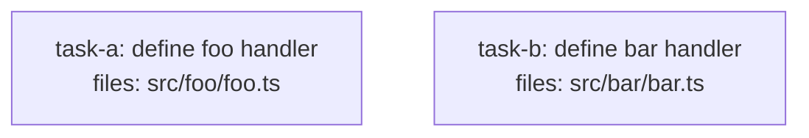

<!--
FIXTURE: h9-mutual-reference
EXPECTED: refuse with H9
COVERS: negative case — task-a defines Foo and uses Bar (defined by task-b); task-b defines Bar and uses Foo (defined by task-a). Adding both required depends_on edges would create a cycle (task-a → task-b → task-a), violating DAG structural constraints. H9 detects both consumer→definer pairs and refuses with a suggestion to extract the shared symbols into a third task that both depend on.
EXPECTED REFUSAL TEXT (substring match):
  task-a violates H9 (missing contract dependency)
    Symbol: Bar
    Defined by: task-b
    Issue: task-a references Bar but does not depends_on task-b (transitively)
    Fix:   adding "task-b" to task-a.depends_on would create a cycle; extract Bar (and Foo) into a shared task that both task-a and task-b depend on
  task-b violates H9 (missing contract dependency)
    Symbol: Foo
    Defined by: task-a
    Issue: task-b references Foo but does not depends_on task-a (transitively)
    Fix:   adding "task-a" to task-b.depends_on would create a cycle; extract Foo (and Bar) into a shared task that both task-a and task-b depend on
ASSUMES: no pre-existing contracts/ dir (Branch B of S8 applies); H9 check fires before S8.
-->

---
title: h9-mutual-reference
created: 2026-05-04
---



## Context

Demonstrates an H9 mutual-reference violation. task-a exports `Foo` but imports `Bar` from task-b's file; task-b exports `Bar` but imports `Foo` from task-a's file. Neither task lists the other in `depends_on`. Adding both edges would produce the cycle task-a → task-b → task-a, which the DAG structural validation would catch. H9 reports both violations and recommends extracting the shared symbols into a new root task (e.g., `task-shared-types`) that both task-a and task-b depend on.

## Tasks

## Task: define foo handler

```yaml
id: task-a
depends_on: []
files:
  - src/foo/foo.ts
status: pending
```

Exports the `Foo` class and imports `Bar` from `src/bar/bar.ts` to compose responses. `task-a.depends_on` intentionally omits `task-b`, and `task-b.depends_on` intentionally omits `task-a`, creating mutual H9 violations.

## Implementation

```typescript
// src/foo/foo.ts
import type { Bar } from "../bar/bar.js";

export class Foo {
  constructor(private bar: Bar) {}

  handle(): string {
    return `Foo handled via ${this.bar.name}`;
  }
}
```

```typescript
// tests/foo/foo.test.ts
import { Foo } from "../../src/foo/foo.js";

it("Foo.handle returns a string containing bar name", () => {
  const bar = { name: "test-bar" };
  const foo = new Foo(bar as any);
  expect(foo.handle()).toContain("test-bar");
});
```

## Acceptance criteria

- `Foo` class is exported from `src/foo/foo.ts`.
- `Foo.handle()` returns a string that incorporates the injected `Bar` instance's `name`.

Test file: `tests/foo/foo.test.ts`.

## Task: define bar handler

```yaml
id: task-b
depends_on: []
files:
  - src/bar/bar.ts
status: pending
```

Exports the `Bar` class and imports `Foo` from `src/foo/foo.ts` to compose responses. `task-b.depends_on` intentionally omits `task-a`, creating the second half of the mutual H9 violation.

## Implementation

```typescript
// src/bar/bar.ts
import type { Foo } from "../foo/foo.js";

export class Bar {
  name = "bar";

  wrap(foo: Foo): string {
    return `Bar wrapping ${foo.handle()}`;
  }
}
```

```typescript
// tests/bar/bar.test.ts
import { Bar } from "../../src/bar/bar.js";

it("Bar.wrap returns a string containing foo output", () => {
  const foo = { handle: () => "foo-result" };
  const bar = new Bar();
  expect(bar.wrap(foo as any)).toContain("foo-result");
});
```

## Acceptance criteria

- `Bar` class is exported from `src/bar/bar.ts` with a `name` property of `"bar"`.
- `Bar.wrap(foo)` returns a string that incorporates the result of `foo.handle()`.

Test file: `tests/bar/bar.test.ts`.
