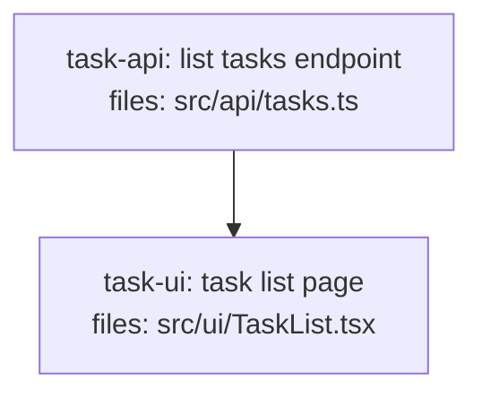

<!--
FIXTURE: s11-unanchored-contract
EXPECTED: warn with S11
COVERS: a composite { items, nextCursor } envelope crosses src/api ⇄ src/ui with
  no shared schema both sides depend on. S11 warns (composite + unnamed +
  cut-crossing). Author may save anyway.
EXPECTED WARNING TEXT (substring match):
  S11 — task-ui / task-api unanchored cross-cut contract
    Shape:   { items, nextCursor } crossing src/api ⇄ src/ui
ASSUMES: no shared contract artifact; the shape is composite and unnamed.
-->

---
title: s11-unanchored-contract
created: 2026-06-24
---



## Context

Demonstrates S11: `task-api` (in `src/api/`) returns a bare array of tasks. `task-ui`
(in `src/ui/`) pins a composite envelope `{ items, nextCursor }` in its fetch logic.
The two tasks span distinct top-level subsystem prefixes (`src/api/` vs `src/ui/`)
and no shared schema task exists that both sides `depends_on`. The envelope has ≥2
fields (`items` and `nextCursor`) and is unnamed — no named type is shared between
the two tasks. S11 warns.

All hard rules H1-H11 pass: each task is single-concern (one subsystem each), one
acceptance group each, implementation subsections present, no anti-pattern phrases,
no bare spec pointers, consistent `task-<slug>` naming. `task-ui` depends on
`task-api`, satisfying H9 (consumer depends on producer). No missing-producer
violations (H10).

## Tasks

## Task: list tasks endpoint

```yaml
id: task-api
depends_on: []
files:
  - src/api/tasks.ts
status: pending
```

Implements `GET /api/tasks` and returns a flat array of task objects. The shape
returned is a bare `Task[]` — no pagination envelope is defined or exported.

## Implementation

```typescript
// src/api/tasks.ts
export interface Task {
  id: string;
  title: string;
  done: boolean;
}

export async function listTasks(req: Request): Promise<Response> {
  const tasks: Task[] = await db.tasks.findAll();
  return Response.json(tasks);
}
```

```typescript
// tests/api/tasks.test.ts
import { listTasks } from "../../src/api/tasks.js";

it("returns 200 with array of tasks", async () => {
  const res = await listTasks(makeReq({}));
  expect(res.status).toBe(200);
  const body = await res.json();
  expect(Array.isArray(body)).toBe(true);
});
```

## Acceptance criteria

- `GET /api/tasks` returns `200` with a JSON array of `Task` objects.
- Each element has `id` (string), `title` (string), and `done` (boolean).

Test file: `tests/api/tasks.test.ts`.

## Task: task list page

```yaml
id: task-ui
depends_on: [task-api]
files:
  - src/ui/TaskList.tsx
status: pending
```

Renders the task list. Fetches from `/api/tasks` and locally assumes the response
is an envelope `{ items, nextCursor }` — the UI unpacks `items` for rendering and
stores `nextCursor` for pagination. This shape is nowhere declared as a shared
named type; `task-api` does not produce it.

## Implementation

```typescript
// src/ui/TaskList.tsx
import React, { useEffect, useState } from "react";

export function TaskList() {
  const [items, setItems] = useState<{ id: string; title: string; done: boolean }[]>([]);
  const [nextCursor, setNextCursor] = useState<string | null>(null);

  useEffect(() => {
    fetch("/api/tasks")
      .then((r) => r.json())
      .then((data: { items: typeof items; nextCursor: string | null }) => {
        setItems(data.items);
        setNextCursor(data.nextCursor);
      });
  }, []);

  return (
    <ul>
      {items.map((t) => (
        <li key={t.id}>{t.title}</li>
      ))}
    </ul>
  );
}
```

```typescript
// tests/ui/TaskList.test.tsx
import { render, screen } from "@testing-library/react";
import { TaskList } from "../../src/ui/TaskList.js";

it("renders task titles after fetch", async () => {
  global.fetch = async () =>
    new Response(
      JSON.stringify({ items: [{ id: "1", title: "Write tests", done: false }], nextCursor: null })
    );
  render(<TaskList />);
  expect(await screen.findByText("Write tests")).toBeInTheDocument();
});
```

## Acceptance criteria

- Fetches `/api/tasks` on mount and renders each task title in a list.
- Stores `nextCursor` in state for future pagination use.
- Renders an empty list when the API returns no items.

Test file: `tests/ui/TaskList.test.tsx`.
