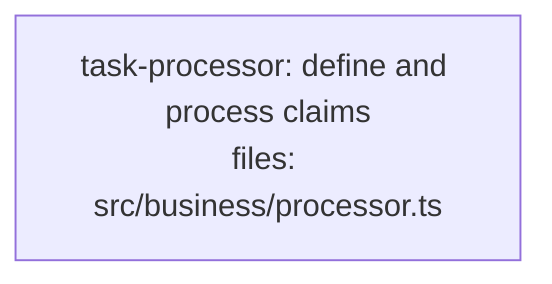

<!--
FIXTURE: s8-convention-exists-violated
EXPECTED: warn with S8 (Branch A)
COVERS: convention dir present in repo but task defines contract symbol outside it.
EXPECTED WARNING TEXT (substring match):
  S8 — task-processor contract co-location
    Symbol: ClaimRecord
    File:   src/business/processor.ts
    Concern: project uses src/contracts/ for shared types, but ClaimRecord is defined here
    Suggestion: move ClaimRecord to src/contracts/claim.ts
ASSUMES: repo has src/contracts/ dir with ≥3 files (detected_dirs non-empty → Branch A applies).
-->

---
title: s8-convention-exists-violated
created: 2026-05-04
---



## Context

Demonstrates S8 Branch A: the repo already has a `src/contracts/` directory with at least three files, establishing a co-location convention. This plan defines the `ClaimRecord` interface inside `src/business/processor.ts` rather than in the established convention directory. S8 Branch A fires because `detected_dirs` is non-empty and `ClaimRecord`'s file path does not start with one of the detected dirs.

All hard rules H1-H9 pass: single task, single subsystem (`src/business/`), one acceptance group, implementation subsection present, no anti-pattern phrases, no cross-task contract consumption.

## Tasks

## Task: define and process claims

```yaml
id: task-processor
depends_on: []
files:
  - src/business/processor.ts
status: pending
```

Defines the `ClaimRecord` interface and the `evaluateClaim` function in the same file. The interface lives outside the project's established `src/contracts/` convention directory, triggering S8 Branch A. Hard rules H1-H9 all pass because this is a self-contained single-task plan.

## Implementation

```typescript
// src/business/processor.ts

export interface ClaimRecord {
  id: string;
  amount: number;
  status: "pending" | "approved" | "rejected";
  submittedAt: Date;
}

export function evaluateClaim(claim: ClaimRecord): ClaimRecord["status"] {
  if (claim.amount > 10_000) return "rejected";
  return "approved";
}
```

```typescript
// tests/business/processor.test.ts
import { evaluateClaim } from "../../src/business/processor.js";

it("rejects claims above 10000", () => {
  const claim = {
    id: "X",
    amount: 15_000,
    status: "pending" as const,
    submittedAt: new Date(),
  };
  expect(evaluateClaim(claim)).toBe("rejected");
});
```

## Acceptance criteria

- `ClaimRecord` interface is exported from `src/business/processor.ts`.
- `evaluateClaim` returns `"rejected"` for amounts above 10,000.
- `evaluateClaim` returns `"approved"` for amounts at or below 10,000.

Test file: `tests/business/processor.test.ts`.
