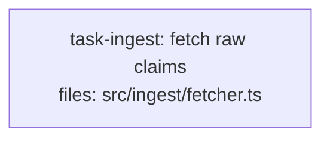

<!--
FIXTURE: s8-no-convention-mixed-concerns
EXPECTED: warn with S8 (Branch B)
COVERS: greenfield repo with no convention dir; plan defines a type alongside a function with fetch() calls in the same file.
EXPECTED WARNING TEXT (substring match):
  S8 — task-ingest contract co-location
    Symbol: RawClaimPayload
    File:   src/ingest/fetcher.ts
    Concern: RawClaimPayload is defined alongside non-contract code (fetch calls, side effects) in the same file
    Suggestion: extract RawClaimPayload to a dedicated types file, e.g. src/ingest/types.ts
ASSUMES: repo has no src/contracts/, src/types/, src/schemas/, or similar dir with ≥3 files (detected_dirs empty → Branch B applies).
-->

---
title: s8-no-convention-mixed-concerns
created: 2026-05-04
---



## Context

Demonstrates S8 Branch B: the repo is greenfield with no established contracts/types convention directory (`detected_dirs` is empty). This plan defines the `RawClaimPayload` interface in `src/ingest/fetcher.ts`, the same file that contains `fetch()` network calls and a side-effecting ingestion function. S8 Branch B fires because a contract symbol lives alongside non-contract code (runtime expressions with `fetch`).

All hard rules H1-H9 pass: single task, single subsystem (`src/ingest/`), one acceptance group, implementation subsection present, no anti-pattern phrases, consistent naming.

## Tasks

## Task: fetch raw claims

```yaml
id: task-ingest
depends_on: []
files:
  - src/ingest/fetcher.ts
status: pending
```

Defines the `RawClaimPayload` interface and the `fetchClaims` function in the same file. `fetchClaims` makes a `fetch()` network call to retrieve claim data from an external API. S8 Branch B fires because `RawClaimPayload` shares a file with side-effecting code.

## Implementation

```typescript
// src/ingest/fetcher.ts

export interface RawClaimPayload {
  claim_id: string;
  amount_cents: number;
  submitted_at: string;
}

export async function fetchClaims(apiUrl: string): Promise<RawClaimPayload[]> {
  const response = await fetch(`${apiUrl}/claims`);
  if (!response.ok) {
    throw new Error(`Failed to fetch claims: ${response.status}`);
  }
  return response.json() as Promise<RawClaimPayload[]>;
}
```

```typescript
// tests/ingest/fetcher.test.ts
import { fetchClaims } from "../../src/ingest/fetcher.js";

it("throws when the API returns a non-OK status", async () => {
  globalThis.fetch = async () =>
    new Response(null, { status: 503, statusText: "Service Unavailable" });

  await expect(fetchClaims("https://api.example.com")).rejects.toThrow(
    "Failed to fetch claims: 503"
  );
});
```

## Acceptance criteria

- `RawClaimPayload` interface is exported from `src/ingest/fetcher.ts`.
- `fetchClaims` calls `fetch(<apiUrl>/claims)` and returns the parsed JSON body as `RawClaimPayload[]`.
- `fetchClaims` throws an error containing the HTTP status code when the response is not OK.

Test file: `tests/ingest/fetcher.test.ts`.
