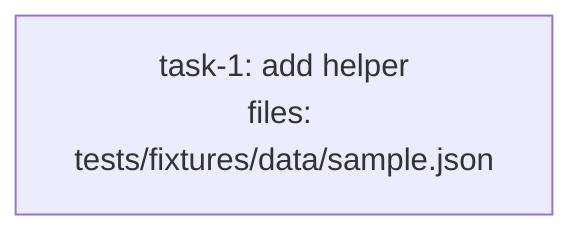

<!-- EXPECTED: WARN S10 — fixture-only files, no risk signal, resolves to split. Suggest review_mode: merged. -->

---
title: review-mode-fixture
created: 2026-06-22
---



## Context

Fixture for S10 review-mode suggestion. Single fixture-data-only task; structurally valid. The file `tests/fixtures/data/sample.json` matches the fixture/test-data glob (`**/tests/data/**` / `**/test/fixtures/**`), body is under 200 words, no risk signals present, and no `review_mode` is set (resolves to `split`). S10 fires: a clearly-mechanical fixture-data update with no risk signals needs no two-call split review; suggest `review_mode: merged`. Hard rules H1-H9 all pass.

## Tasks

## Task: add helper

```yaml
id: task-1
depends_on: []
files: [tests/fixtures/data/sample.json]
status: pending
```

Add a sample JSON fixture representing a minimal valid input for the clamp utility. Used by unit tests to exercise boundary conditions without constructing objects inline.

## Implementation

```json
// tests/fixtures/data/sample.json
{
  "clamp": {
    "above_max": { "n": 10, "lo": 0, "hi": 5, "expected": 5 },
    "below_min": { "n": -3, "lo": 0, "hi": 5, "expected": 0 },
    "within_range": { "n": 3, "lo": 0, "hi": 5, "expected": 3 }
  }
}
```

```markdown
<!-- no code test; fixture file is the artifact under test -->
<!-- verify: tests/fixtures/data/sample.json exists and parses as valid JSON after this task -->
```

## Acceptance criteria

- `tests/fixtures/data/sample.json` exists and is valid JSON.
- The file contains the three clamp test cases: `above_max`, `below_min`, `within_range`.
- Each case includes `n`, `lo`, `hi`, and `expected` fields.

Test file: `tests/fixtures/data/sample.json`.
