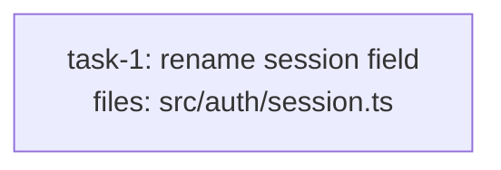

<!-- EXPECTED: no S10 suggestion (security risk signal suppresses S10). S9 may independently warn (security path → tier upshift); the assertion here is specifically that NO review_mode: merged suggestion appears. -->

---
title: review-mode-fixture
created: 2026-06-22
---



## Context

Fixture for S10 review-mode suppression. The task title is mechanical ("rename session field") and matches S10's mechanical-signal keyword `rename`, but the file `src/auth/session.ts` hits S9's security-path glob (`**/auth/**`). S10 requires that NO risk signal is present — the security path is a risk signal that suppresses the merged-review suggestion. S9 may independently warn about tier (security path reviewed below opus); that is expected and acceptable. The assertion here is that S10 produces NO `review_mode: merged` suggestion. Hard rules H1-H9 all pass.

## Tasks

## Task: rename session field

```yaml
id: task-1
depends_on: []
files: [src/auth/session.ts]
status: pending
```

Rename the internal field `tok` to `token` in the session object for clarity. This is a mechanical identifier rename with no logic change.

## Implementation

```typescript
// src/auth/session.ts
import { randomBytes } from "node:crypto";

export interface Session {
  token: string;
  expiresAt: number;
}

export function generateSessionToken(): string {
  return randomBytes(32).toString("hex");
}

export function validateSessionToken(token: string, stored: string): boolean {
  return token.length === 64 && token === stored;
}
```

```typescript
// tests/unit/session.test.ts
import { generateSessionToken, validateSessionToken } from "../../src/auth/session.js";
it("generates a 64-char hex token", () => {
  expect(generateSessionToken()).toHaveLength(64);
});
it("rejects a mismatched token", () => {
  expect(validateSessionToken("abc", "xyz")).toBe(false);
});
```

## Acceptance criteria

- `src/auth/session.ts` uses `token` (not `tok`) as the field name in the `Session` interface.
- All existing tests pass after the rename.
- No logic change — only the identifier name differs.

Test file: `tests/unit/session.test.ts`.
