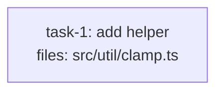

<!-- EXPECTED: REFUSE — but NOT at rule #12 (plan-format.md; authoring only requires `default_implementer` to be a non-empty string). default_implementer: "dag-implementor" IS a non-empty string, so the authoring check (writing-dag-plans SKILL.md step 6) accepts it cleanly. The refusal fires only at the EXECUTOR PRE-FLIGHT (executing-dag-plans SKILL.md step 4), which resolves `default_implementer` against the agent registry and finds "dag-implementor" unregistered — the registered subagent is "dag-implementer", one letter apart. A fixture asserting authoring-side refusal here would test behaviour that does not exist; one rebuilt around an empty string would mistest the exact case this fixture exists to cover. -->

---
title: schema-fixture-default-implementer-typo
created: 2026-08-28
default_implementer: dag-implementor
---



## Context

Fixture for plan-level `default_implementer:` validation — specifically the
split between where this key is checked. Single mechanical task, structurally
valid on its own. `default_implementer: dag-implementor` is a typo of the
registered `dag-implementer` subagent, but it is still a non-empty string, so
`plan-format.md` rule #12 (the only authoring-side check) passes it. The
refusal only exists at the executor pre-flight, which resolves the value
against the live agent registry before the first dispatch tick.

## Tasks

## Task: add helper

```yaml
id: task-1
depends_on: []
files: [src/util/clamp.ts]
status: pending
```

Pure clamp helper. Bounds a number to an inclusive range.

## Implementation

```typescript
// src/util/clamp.ts
export function clamp(n: number, lo: number, hi: number): number {
  return Math.min(hi, Math.max(lo, n));
}
```

```typescript
// tests/unit/clamp.test.ts
import { clamp } from "../../src/util/clamp.js";
it("clamps above the max", () => { expect(clamp(10, 0, 5)).toBe(5); });
```

## Acceptance criteria

- `clamp(10, 0, 5) === 5`.
- `clamp(-3, 0, 5) === 0`.

Test file: `tests/unit/clamp.test.ts`.
