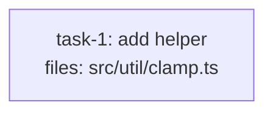

<!-- EXPECTED: REFUSE — rule #11 (plan-level `spec:` file validity, plan-format.md). spec: "docs/superpowers/specs/2026-01-01-does-not-exist-design.md" does not resolve to a readable single file. Enforced identically on both sides: the authoring check (writing-dag-plans SKILL.md step 6) and the executor pre-flight (executing-dag-plans SKILL.md step 4) both refuse on this value — no silent fallback, and no split between the two like `bad-default-implementer-typo.md` below. -->

---
title: schema-fixture-spec-unresolvable
created: 2026-08-28
spec: docs/superpowers/specs/2026-01-01-does-not-exist-design.md
---



## Context

Fixture for plan-level `spec:` validation. Single mechanical task, structurally
valid on its own — the only defect is the plan-level `spec:` frontmatter key,
which names a file that does not exist anywhere in the repo. Both the
authoring check and the executor pre-flight resolve `spec:` the same way, so
this fixture has no side-of-enforcement subtlety (contrast with
`bad-default-implementer-typo.md`).

## Tasks

## Task: add helper

```yaml
id: task-1
depends_on: []
files: [src/util/clamp.ts]
status: pending
```

Pure clamp helper. Bounds a number to an inclusive range.

## Implementation

```typescript
// src/util/clamp.ts
export function clamp(n: number, lo: number, hi: number): number {
  return Math.min(hi, Math.max(lo, n));
}
```

```typescript
// tests/unit/clamp.test.ts
import { clamp } from "../../src/util/clamp.js";
it("clamps above the max", () => { expect(clamp(10, 0, 5)).toBe(5); });
```

## Acceptance criteria

- `clamp(10, 0, 5) === 5`.
- `clamp(-3, 0, 5) === 0`.

Test file: `tests/unit/clamp.test.ts`.
