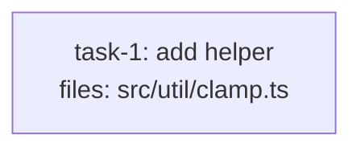

<!-- EXPECTED: PASS — per-task model_hint=cheap overrides default_model_hint=standard. -->

---
title: tier-fixture
created: 2026-06-22
default_model_hint: standard
---



## Context

Fixture for tier-hint validation. Single mechanical task; structurally valid.

## Tasks

## Task: add helper

```yaml
id: task-1
depends_on: []
files: [src/util/clamp.ts]
status: pending
model_hint: cheap
```

Pure clamp helper. Bounds a number to an inclusive range.

## Implementation

```typescript
// src/util/clamp.ts
export function clamp(n: number, lo: number, hi: number): number {
  return Math.min(hi, Math.max(lo, n));
}
```

```typescript
// tests/unit/clamp.test.ts
import { clamp } from "../../src/util/clamp.js";
it("clamps above the max", () => { expect(clamp(10, 0, 5)).toBe(5); });
```

## Acceptance criteria

- `clamp(10, 0, 5) === 5`.
- `clamp(-3, 0, 5) === 0`.

Test file: `tests/unit/clamp.test.ts`.
