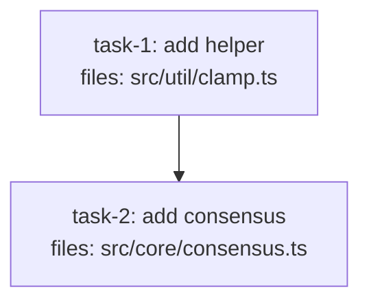

<!-- EXPECTED: PASS — mechanical task at cheap, complex task at opus, realistic mix. -->

---
title: tier-fixture
created: 2026-06-22
---



## Context

Fixture for tier-hint validation. Two tasks — mechanical helper at cheap tier, complex consensus logic at opus tier.

## Tasks

## Task: add helper

```yaml
id: task-1
depends_on: []
files: [src/util/clamp.ts]
status: pending
model_hint: cheap
```

Pure clamp helper. Bounds a number to an inclusive range.

## Implementation

```typescript
// src/util/clamp.ts
export function clamp(n: number, lo: number, hi: number): number {
  return Math.min(hi, Math.max(lo, n));
}
```

```typescript
// tests/unit/clamp.test.ts
import { clamp } from "../../src/util/clamp.js";
it("clamps above the max", () => { expect(clamp(10, 0, 5)).toBe(5); });
```

## Acceptance criteria

- `clamp(10, 0, 5) === 5`.
- `clamp(-3, 0, 5) === 0`.

Test file: `tests/unit/clamp.test.ts`.

## Task: add consensus

```yaml
id: task-2
depends_on: [task-1]
files: [src/core/consensus.ts]
status: pending
model_hint: opus
quality_reviewer_hint: opus
```

Consensus function. Applies majority-vote logic over a set of numeric votes, using `clamp` to bound the result to the valid range.

## Implementation

```typescript
// src/core/consensus.ts
import { clamp } from "../util/clamp.js";

export function consensus(votes: number[], lo: number, hi: number): number {
  const sum = votes.reduce((a, b) => a + b, 0);
  const avg = votes.length > 0 ? sum / votes.length : lo;
  return clamp(Math.round(avg), lo, hi);
}
```

```typescript
// tests/unit/consensus.test.ts
import { consensus } from "../../src/core/consensus.js";
it("clamps consensus result to valid range", () => {
  expect(consensus([10, 10, 10], 0, 5)).toBe(5);
});
```

## Acceptance criteria

- `consensus([10, 10, 10], 0, 5) === 5` (clamped at max).
- `consensus([0, 0, 0], 0, 5) === 0` (clamped at min).
- `consensus([3, 4, 5], 0, 10) === 4` (rounded average).

Test file: `tests/unit/consensus.test.ts`.
