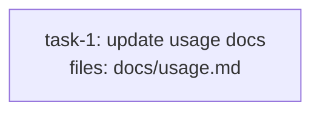

<!-- EXPECTED: WARN S9 — files all docs-only, body <200 words, model_hint resolves to standard. Suggest model_hint: cheap. -->

---
title: tier-fixture
created: 2026-06-22
---



## Context

Fixture for S9 tier-complexity mismatch. Single docs-only task; structurally valid. All files are under `docs/`, body is under 200 words, and no `model_hint` is set (resolves to `standard`). S9 fires: a docs-only edit dispatched at `standard` (sonnet) is over-tiered; `cheap` (haiku) is sufficient. Hard rules H1-H9 all pass.

## Tasks

## Task: update usage docs

```yaml
id: task-1
depends_on: []
files: [docs/usage.md]
status: pending
```

Update the usage documentation to reflect the new `--verbose` flag added in the last release. The flag controls whether progress output is shown during plan execution.

## Implementation

```markdown
<!-- docs/usage.md excerpt -->
## Flags

- `--verbose` — print per-task progress lines during execution. Omit for silent mode.
```

```markdown
<!-- no code test; doc fixture uses a prose diff block as the second fenced block -->
<!-- verify: docs/usage.md contains the --verbose flag entry after this task -->
```

## Acceptance criteria

- `docs/usage.md` documents the `--verbose` flag with a one-line description.
- The description matches the flag's actual behavior (progress output on/off).

Test file: `tests/fixtures/docs/usage-verbose-check.md`.
