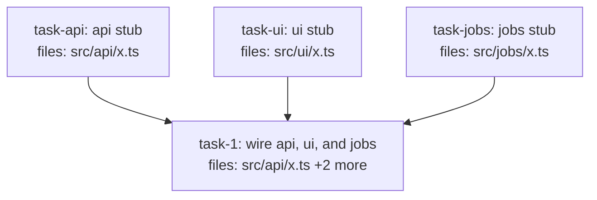

<!-- EXPECTED: WARN S9 — is_wiring_task spanning >2 subsystem prefixes, quality_reviewer_hint resolves below opus. Suggest quality_reviewer_hint: opus. -->

---
title: tier-fixture
created: 2026-06-22
---



## Context

Fixture for S9 tier-complexity mismatch. A wiring task spanning three subsystem prefixes (`src/api/`, `src/ui/`, `src/jobs/`); structurally valid. `is_wiring_task: true` exempts the task from H3 (SoC) and H7 (Implementation subsection). No `quality_reviewer_hint` is set (resolves to `standard`, which is below `opus`). S9 fires: a wiring task spanning >2 subsystems is a high-integration-risk task; reviewing below `opus` may miss subtle cross-subsystem regressions. Suggest `quality_reviewer_hint: opus`. Hard rules H1-H9 all pass (wiring task exemptions apply for H3 and H7).

## Tasks

## Task: api stub

```yaml
id: task-api
depends_on: []
files: [src/api/x.ts]
status: pending
```

Stub API endpoint for cross-subsystem wiring fixture.

## Implementation

```typescript
// src/api/x.ts
export function apiHandler(): string { return "api"; }
```

```typescript
// tests/unit/api-x.test.ts
import { apiHandler } from "../../src/api/x.js";
it("returns api", () => { expect(apiHandler()).toBe("api"); });
```

## Acceptance criteria

- `apiHandler()` returns `"api"`.

Test file: `tests/unit/api-x.test.ts`.

## Task: ui stub

```yaml
id: task-ui
depends_on: []
files: [src/ui/x.ts]
status: pending
```

Stub UI component for cross-subsystem wiring fixture.

## Implementation

```typescript
// src/ui/x.ts
export function uiComponent(): string { return "ui"; }
```

```typescript
// tests/unit/ui-x.test.ts
import { uiComponent } from "../../src/ui/x.js";
it("returns ui", () => { expect(uiComponent()).toBe("ui"); });
```

## Acceptance criteria

- `uiComponent()` returns `"ui"`.

Test file: `tests/unit/ui-x.test.ts`.

## Task: jobs stub

```yaml
id: task-jobs
depends_on: []
files: [src/jobs/x.ts]
status: pending
```

Stub background job for cross-subsystem wiring fixture.

## Implementation

```typescript
// src/jobs/x.ts
export function jobRunner(): string { return "jobs"; }
```

```typescript
// tests/unit/jobs-x.test.ts
import { jobRunner } from "../../src/jobs/x.js";
it("returns jobs", () => { expect(jobRunner()).toBe("jobs"); });
```

## Acceptance criteria

- `jobRunner()` returns `"jobs"`.

Test file: `tests/unit/jobs-x.test.ts`.

## Task: wire api, ui, and jobs

```yaml
id: task-1
depends_on: [task-api, task-ui, task-jobs]
files: [src/api/x.ts, src/ui/x.ts, src/jobs/x.ts]
status: pending
is_wiring_task: true
```

Wire the API handler, UI component, and background job together into the unified feature entry point. Registers each subsystem in the shared application registry so all three are activated on startup.

## Acceptance criteria

- After this task, importing from `src/api/x.ts`, `src/ui/x.ts`, and `src/jobs/x.ts` exposes the wired entry points.
- Integration smoke test confirms all three subsystems respond to a ping.

Test file: `tests/integration/wire-x.test.ts`.
