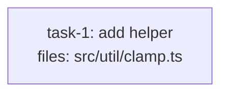

<!-- EXPECTED: WARN S9 — novelty-signal regex matches ("consensus algorithm"), model_hint resolves to standard. Suggest model_hint: opus AND quality_reviewer_hint: opus. -->

---
title: tier-fixture
created: 2026-06-22
---



## Context

Fixture for S9 tier-complexity mismatch. Single task with a novelty-signal phrase in the body; structurally valid. The body mentions "consensus algorithm", which matches the novelty-signal regex. No `model_hint` or `quality_reviewer_hint` is set (both resolve to `standard`). S9 fires: novelty-heavy work dispatched at `standard` risks shallow reasoning; suggest upshifting both implementer and reviewer to `opus`. Hard rules H1-H9 all pass.

## Tasks

## Task: add helper

```yaml
id: task-1
depends_on: []
files: [src/util/clamp.ts]
status: pending
```

Implement a distributed commit coordinator using a consensus algorithm to ensure all peers agree before writing. The coordinator must tolerate one follower failure and preserve linearizability.

## Implementation

```typescript
// src/util/clamp.ts
export function clamp(n: number, lo: number, hi: number): number {
  return Math.min(hi, Math.max(lo, n));
}
```

```typescript
// tests/unit/clamp.test.ts
import { clamp } from "../../src/util/clamp.js";
it("clamps above the max", () => { expect(clamp(10, 0, 5)).toBe(5); });
```

## Acceptance criteria

- `clamp(10, 0, 5) === 5`.
- `clamp(-3, 0, 5) === 0`.

Test file: `tests/unit/clamp.test.ts`.
