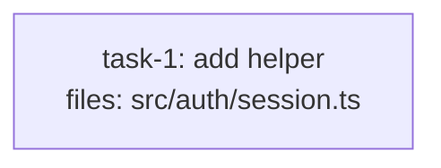

<!-- EXPECTED: WARN S9 — files overlap security path globs, quality_reviewer_hint resolves below opus. Suggest quality_reviewer_hint: opus. -->

---
title: tier-fixture
created: 2026-06-22
---



## Context

Fixture for S9 tier-complexity mismatch. Single auth/session task; structurally valid. The file `src/auth/session.ts` overlaps the security path glob (`**/auth/**`), but no `quality_reviewer_hint` is set (resolves to `standard`, which is below `opus`). S9 fires: security-sensitive code reviewed below opus risks missing subtle vulnerabilities. Suggest `quality_reviewer_hint: opus`. Hard rules H1-H9 all pass.

## Tasks

## Task: add helper

```yaml
id: task-1
depends_on: []
files: [src/auth/session.ts]
status: pending
```

Implement session token generation and validation. Produces a securely random token using a system entropy source, stores it, and validates it on incoming requests.

## Implementation

```typescript
// src/auth/session.ts
import { randomBytes } from "node:crypto";

export function generateSessionToken(): string {
  return randomBytes(32).toString("hex");
}

export function validateSessionToken(token: string, stored: string): boolean {
  return token.length === 64 && token === stored;
}
```

```typescript
// tests/unit/session.test.ts
import { generateSessionToken, validateSessionToken } from "../../src/auth/session.js";
it("generates a 64-char hex token", () => {
  expect(generateSessionToken()).toHaveLength(64);
});
it("rejects a mismatched token", () => {
  expect(validateSessionToken("abc", "xyz")).toBe(false);
});
```

## Acceptance criteria

- `generateSessionToken()` returns a 64-character lowercase hex string.
- `validateSessionToken(token, stored)` returns `false` when tokens differ.
- `validateSessionToken(token, stored)` returns `true` when tokens match.

Test file: `tests/unit/session.test.ts`.
