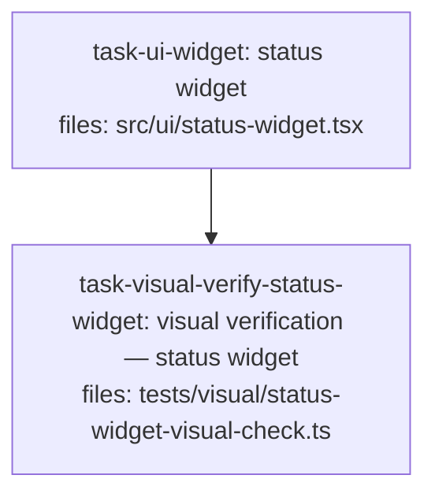

<!--
RULE: S16 (soft — warn and confirm)
EXPECTED: PASS
EXPECTED OUTPUT: no S16 warning — task-visual-verify-status-widget owns visual verification
PAIRED WITH: ../should-warn/s16-ui-task-no-owner.md — identical but for the owning task
-->

---
title: s16-fixture
created: 2026-08-28
---



## Context

Fixture for S16 validation. A single task defines a rendered-surface
component (`.tsx`), and one task owns visual verification — S16 must not
warn.

## Tasks

## Task: status widget

```yaml
id: task-ui-widget
depends_on: []
files: [src/ui/status-widget.tsx]
status: pending
```

Renders a small status widget showing whether a background job is idle,
running, or failed, driven by a `status` prop.

## Implementation

```typescript
// src/ui/status-widget.tsx
export function StatusWidget(props: { status: "idle" | "running" | "failed" }) {
  const label =
    props.status === "idle" ? "Idle" : props.status === "running" ? "Running" : "Failed";
  return `<span class="status-widget status-widget--${props.status}">${label}</span>`;
}
```

```typescript
// tests/ui/status-widget.test.ts
import { StatusWidget } from "../../src/ui/status-widget.js";

it("labels the running state", () => {
  expect(StatusWidget({ status: "running" })).toContain("Running");
});
```

## Acceptance criteria

- `StatusWidget({ status: "idle" })` contains the text `"Idle"`.
- `StatusWidget({ status: "failed" })` contains the text `"Failed"`.

Test file: `tests/ui/status-widget.test.ts`.

## Task: visual verification — status widget

```yaml
id: task-visual-verify-status-widget
depends_on: [task-ui-widget]
files: [tests/visual/status-widget-visual-check.ts]
status: pending
```

Owns visual verification of the rendered status widget across all three
states before the plan is considered complete.

## Implementation

```typescript
// tests/visual/status-widget-visual-check.ts
export interface VisualCheckEntry {
  state: "idle" | "running" | "failed";
  verifiedBy: string;
  matchesDesign: boolean;
}

export const statusWidgetVisualCheck: VisualCheckEntry[] = [
  { state: "idle", verifiedBy: "@qa-owner", matchesDesign: true },
  { state: "running", verifiedBy: "@qa-owner", matchesDesign: true },
  { state: "failed", verifiedBy: "@qa-owner", matchesDesign: true },
];
```

```typescript
// tests/visual/status-widget-visual-check.test.ts
import { statusWidgetVisualCheck } from "./status-widget-visual-check.js";

it("every rendered state was visually verified against the design", () => {
  expect(statusWidgetVisualCheck.every((entry) => entry.matchesDesign)).toBe(true);
});
```

## Acceptance criteria

- Every entry in `statusWidgetVisualCheck` has `matchesDesign === true`: the
  rendered widget was visually checked against the design at each state by
  `@qa-owner`.
- `statusWidgetVisualCheck.length === 3` — one verified entry per rendered
  state (`idle`, `running`, `failed`).

Test file: `tests/visual/status-widget-visual-check.test.ts`.
