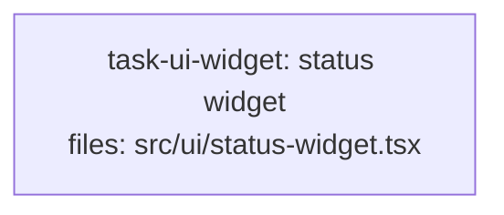

<!--
RULE: S16 (soft — warn and confirm)
EXPECTED: WARN
EXPECTED OUTPUT (substring match): "no task owns visual verification"
PAIRED WITH: ../should-pass/s16-ui-task-with-owner.md — identical but for the owning task
-->

---
title: s16-fixture
created: 2026-08-28
---



## Context

Fixture for S16 validation. A single task defines a rendered-surface
component (`.tsx`), and no task owns visual verification — S16 must warn
once, stating that no task owns visual verification.

## Tasks

## Task: status widget

```yaml
id: task-ui-widget
depends_on: []
files: [src/ui/status-widget.tsx]
status: pending
```

Renders a small status widget showing whether a background job is idle,
running, or failed, driven by a `status` prop.

## Implementation

```typescript
// src/ui/status-widget.tsx
export function StatusWidget(props: { status: "idle" | "running" | "failed" }) {
  const label =
    props.status === "idle" ? "Idle" : props.status === "running" ? "Running" : "Failed";
  return `<span class="status-widget status-widget--${props.status}">${label}</span>`;
}
```

```typescript
// tests/ui/status-widget.test.ts
import { StatusWidget } from "../../src/ui/status-widget.js";

it("labels the running state", () => {
  expect(StatusWidget({ status: "running" })).toContain("Running");
});
```

## Acceptance criteria

- `StatusWidget({ status: "idle" })` contains the text `"Idle"`.
- `StatusWidget({ status: "failed" })` contains the text `"Failed"`.

Test file: `tests/ui/status-widget.test.ts`.
